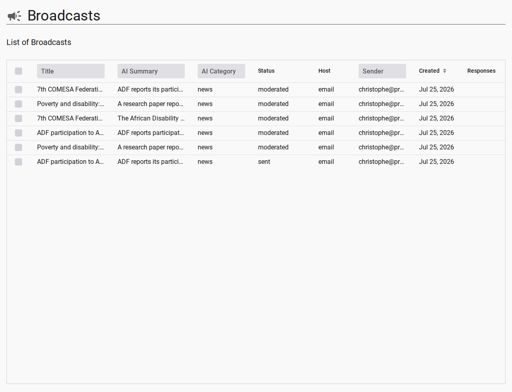

# Broadcast Responses & Threaded Discussions

When a subscriber replies to a broadcast email, the Listserv application captures the response, threads it under the original broadcast, and can automatically re-distribute it to the channel. This enables **flat threaded discussions** where subscribers engage directly with announcements from their email client.

---

## 1. How Responses Are Correlated

Every broadcast email is dispatched with two identifiers that tie replies back to the originating broadcast:

- **`Reply-To` header**: `{channelId}+{broadcastId}@mg.a11ydata.com` — ensures subscriber replies are routed back through the Mailgun inbound pipeline.
- **`Message-ID` header**: `<{broadcastId}@mg.a11ydata.com>` — provides email threading across multiple responses.

```text
From: "Channel Admin" <listserv@domain>
To: channel-1@mg.a11ydata.com
Reply-To: channel-1+abc123@mg.a11ydata.com
Message-ID: <abc123@mg.a11ydata.com>
Subject: [Announcement] Upcoming Regional Workshop
```

When a subscriber hits **Reply** in their email client, the reply is forwarded to `channel-1+abc123@mg.a11ydata.com`. The Mailgun inbound route extracts `channelId` and `rootBroadcastId` from the subaddress, and the response is stored as a new document in `app/listserv/broadcast` with `ref.rootBroadcastId` pointing to the parent.

---

## 2. Response Document Model

Responses share the same Firestore collection as broadcasts, discriminated by `metaData.type`:

| Field | Broadcast | Response |
| --- | --- | --- |
| `metaData.type` | `'broadcast'` | `'broadcast-response'` |
| `ref.rootBroadcastId` | *(absent)* | ID of the parent broadcast |
| `origin` | `'admin'` or `'user'` | `'subscriber'` |
| `content` | Full multilingual body | Stripped plain-text body (quoted content and signatures removed via Mailgun `stripped-text`) |

---

## 3. Lightweight Auto-Moderation

Unlike community submissions (which go through full AI moderation via `gpt-4o-mini`), broadcast responses follow a **lightweight spam check**:

1. Mailgun attaches spam assessment headers (`X-Mailgun-Spam-Score`) to each inbound email.
2. The response handler reads these headers directly — **no AI model invocation**.
3. If the spam score is low (`recommendedAction === 'approve'`), the lifecycle auto-transitions from `moderated` to `sending` and the response is **re-broadcast to the channel without manual review**.
4. If the score is ambiguous or high, the response is held in `moderated` for admin review.

---

## 4. Flat Threading in the Admin UI

Responses are displayed **threaded under their root broadcast** in the admin broadcast list grid:

<figure>
  
  <figcaption>Admin Broadcasts grid showing response count and expandable thread details</figcaption>
</figure>

- The root broadcast row carries a denormalized **`responseCount`** column.
- Expanding a row reveals the flat thread: all subscriber responses attached to that broadcast.
- Replies to responses also thread back to the root (flat thread — no nested sub-threads).

The admin can view, moderate, or delete individual responses from the grid row details panel.

---

## 5. Digest Subscribers Cannot Respond

Subscribers who have enabled **Weekly Digest Mode** receive a single compiled summary email once a week. Digest emails are assembled by the `ScheduledJob` digest handler and sent to the digest mailing list (`{channelId}-digest@mg.a11ydata.com`).

::: warning Digest Mode Restriction
Digest emails are **read-only summaries**. They do not carry a per-broadcast `Reply-To` subaddress and cannot be used to start or participate in a threaded discussion. Replying to a digest email does not create a broadcast response or re-distribute the message to the channel.
:::

**Rationale**: Each digest email contains multiple compiled broadcasts. Tracking which specific broadcast a subscriber is replying to from an aggregated message is technically ambiguous. Real-time subscribers receive individual emails with precise `Reply-To` addresses, enabling accurate response threading.

To participate in discussions, subscribers can switch from digest to real-time delivery mode at any time.

---

## Related Content

- [Mailing List & Digest Engine Architecture](./mailing-list-and-digest-architecture.md)
- [Broadcast Lifecycle & AI Moderation](./broadcast-lifecycle-and-moderation.md)
- [Analyzing Broadcast Performance How-To](../how-to/analyzing-broadcast-performance.md)
