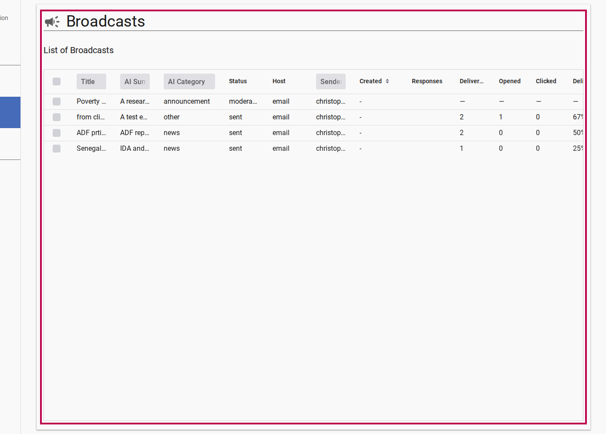
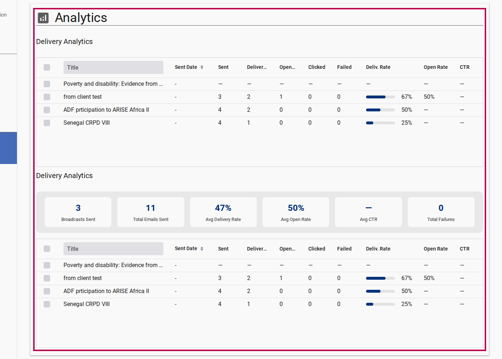

# Analyzing Broadcast Performance

Per-broadcast analytics enable channel administrators to track subscriber engagement, verify delivery health, and compare language segment performance.

---

## Step 1: Open Broadcast Analytics

1. Navigate to **Admin** > **Broadcasts**.
2. Locate a broadcast with status `sent`.
3. Click the broadcast row to expand its details and analytics panel.

<figure>
  
  <figcaption>Broadcast Grid showing sent status and response metrics</figcaption>
</figure>

---

## Step 2: Key Performance Indicators (KPIs)

The performance dashboard reports real-time metrics updated via Mailgun webhooks:

<figure>
  
  <figcaption>Aggregate channel analytics dashboard displaying delivery rates and campaign performance metrics</figcaption>
</figure>

- **Total Recipients**: Total subscriber accounts included in the send list
- **Delivery Rate (%)**: Percentage of emails successfully delivered to subscriber mailboxes
- **Open Rate (%)**: Percentage of delivered messages opened by recipients
- **Click-Through Rate (%)**: Percentage of opened emails where links were clicked
- **Bounces / Failures**: Total permanently or temporarily rejected email addresses
- **Response Count**: Number of threaded subscriber replies attached to this broadcast. Expanding the grid row reveals the full flat response thread.

---

## Step 3: Segment Analytics by Language

To compare engagement across different language communities:

1. In the broadcast analytics view, locate the **Language Breakdown** tab.
2. Select a target language (e.g. `English`, `French`, `Portuguese`, `Arabic`).
3. View the specific delivery and open rates calculated for subscribers who received that translation version.

---

## Related Content

- [Creating & Sending Broadcasts](./creating-and-sending-broadcasts.md)
- [Mailing List & Digest Engine Explanation](../explanation/mailing-list-and-digest-architecture.md)
- [Broadcast Responses & Threading Explanation](../explanation/broadcast-responses-threading.md)
