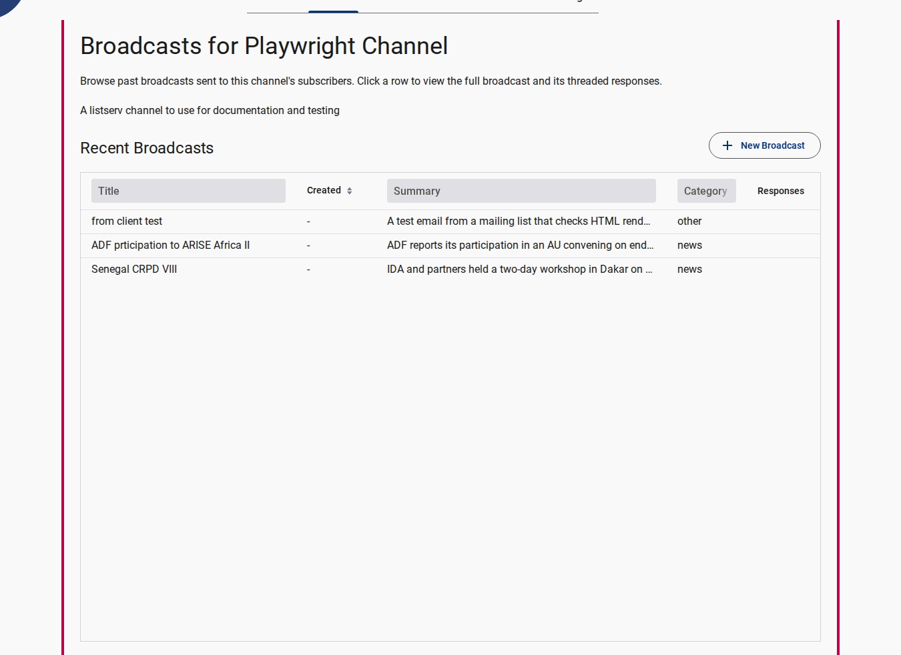

# Browsing & Searching Public Archives

The public broadcast archive allows subscribers, community members, and public stakeholders to explore past sent broadcasts, read announcements in multiple languages, and access attached reports.

---

## Accessing the Public Archive

1. Navigate to the Listserv application home page (e.g., `/broadcast`).
2. The page displays a feed of all sent broadcasts for the active channel.

<figure>
  
  <figcaption>Public Broadcast Archive Page showing published announcements</figcaption>
</figure>

---

## Searching and Filtering Announcements

<figure>
  
  <figcaption>Filtering and searching broadcast archives by title and keywords</figcaption>
</figure>

### By Keyword

- Use the search field at the top of the feed to search broadcast titles, subject lines, or content body text.

### By Language

- Filter broadcasts using the language selector. If a broadcast was dispatched with localized translations (e.g. English, French, Portuguese, Arabic), you can toggle between language versions using the language chips on each broadcast card.

### By Date

- Broadcasts are listed in reverse chronological order (newest first).

---

## Public Privacy Notices

::: warning Public Indexing Notice
All messages dispatched to public listserv channels become part of a permanent public archive that is indexed and searchable. Avoid posting confidential information, personal credentials, or sensitive data.
:::

---

## Related Content

- [Subscribing & Preferences](./subscribing-and-managing-preferences.md)
- [Creating & Sending Broadcasts](./creating-and-sending-broadcasts.md)
- [Public Reference Page](../reference/public/index.md)
