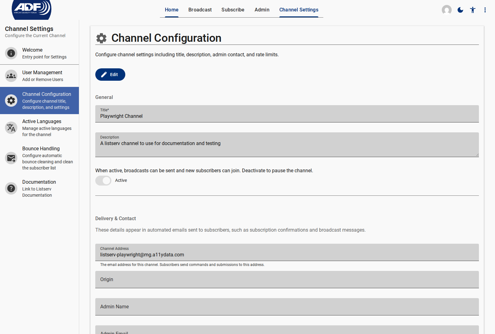
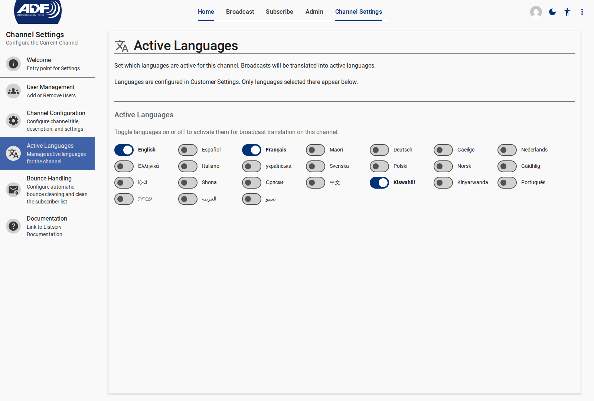
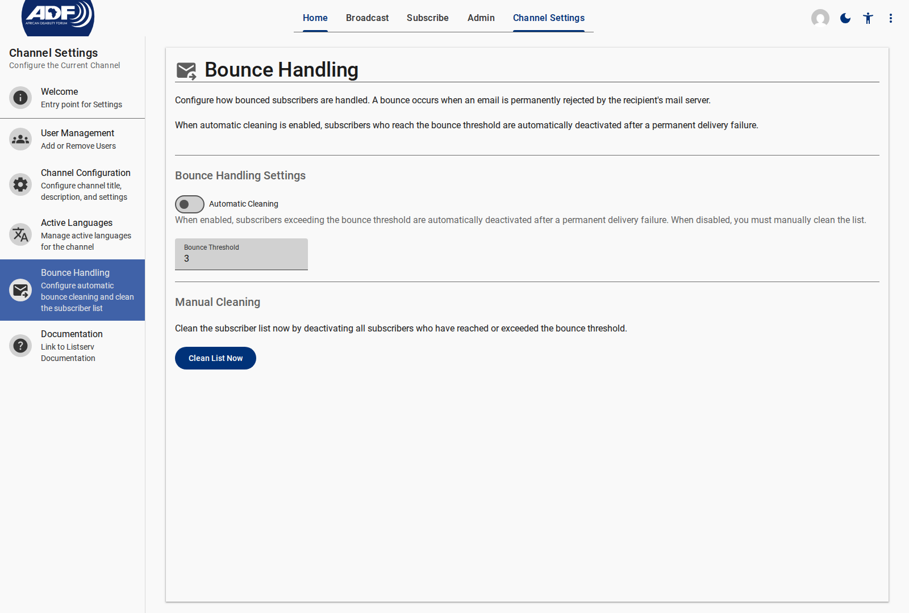
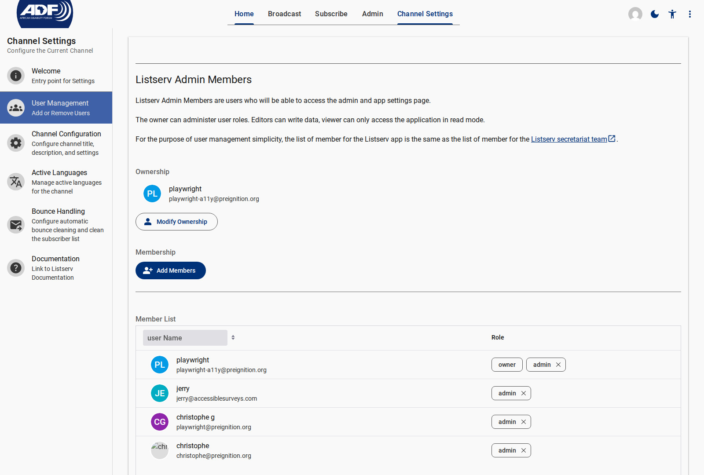

# Configuring Channel Settings

Channel settings allow channel owners and editors to configure metadata, active translation languages, automated bounce handling, submission rate limits, and user access permissions.

---

## 1. Channel Configuration

1. In the top navigation bar, click **Channel Settings**.
2. Select **Channel Configuration** from the left drawer menu.
3. Edit channel fields:
   - **Channel Title**: Display name shown on forms and email footers
   - **Description**: Public overview of the channel purpose
   - **Admin Contact Info**: Support email and name included in outgoing automated mail headers/footers
   - **Rate Limits**: Maximum community submissions allowed per subscriber per hour (default: 5/hour)

<figure>
  
  <figcaption>Channel Configuration panel for title, description, and admin contact settings</figcaption>
</figure>

---

## 2. Active Translation Languages

The listserv automatically translates approved broadcasts into active languages before delivery.

1. Click **Active Languages** in the Channel Settings drawer.
2. Toggle the switch for each language you wish to activate for this channel (e.g. `English`, `French`, `Portuguese`, `Arabic`).
3. Click **Save**.

<figure>
  
  <figcaption>Managing Active Languages for automated broadcast translation</figcaption>
</figure>

---

## 3. Bounce Handling & List Cleaning

1. Click **Bounce Handling** in the Channel Settings drawer.
2. Enable **Automatic Bounce Cleaning**.
3. Set the **Bounce Threshold** (e.g. `3` permanent bounce failures).
4. Click **Clean List** to immediately run a manual list cleanup and deactivate bouncing subscriber accounts.

<figure>
  
  <figcaption>Configuring automatic bounce thresholds and list cleaning</figcaption>
</figure>

---

## 4. User Access Management

1. Click **User Management** in the Channel Settings drawer.
2. View current team members and assigned roles:
   - **Owner**: Full control over channel settings, roles, and broadcasts
   - **Editor**: Can create drafts, edit, moderate submissions, and send broadcasts
   - **Guest / Viewer**: Read-only access to analytics and archives
3. Click **Add Members** to grant listserv access to new team users.

<figure>
  
  <figcaption>User access management for channel owners, editors, and guests</figcaption>
</figure>

---

## Related Content

- [Creating & Sending Broadcasts](./creating-and-sending-broadcasts.md)
- [Settings Reference Specification](../reference/settings/index.md)
