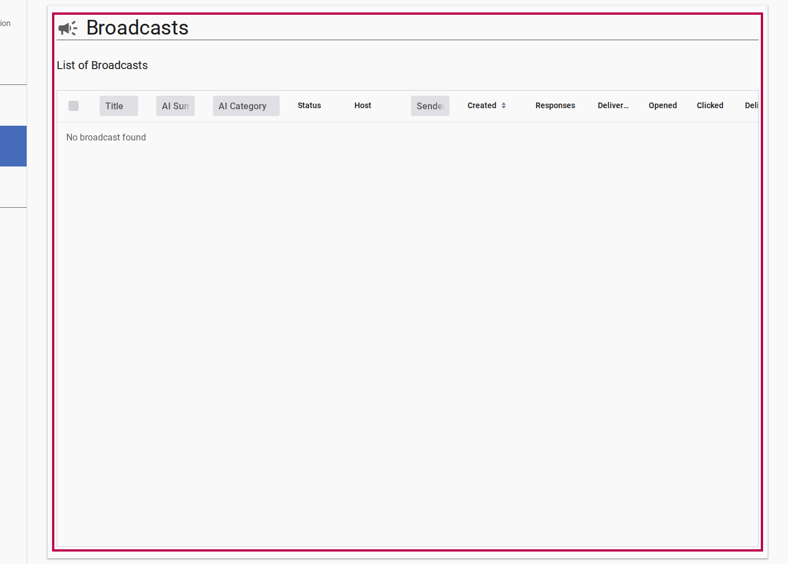

# Creating & Sending Email Broadcasts

Channel administrators and editors can compose accessible, multilingual email broadcasts using pre-defined accessible templates, rich text editing, and file attachment scanning.

---

## Step 1: Open the Broadcast Manager

1. Sign into the Listserv application with channel `owner` or `editor` permissions.
2. Click **Admin** in the top navigation.
3. Select **Broadcasts** from the left drawer menu to view the broadcast table.

<figure>
  
  <figcaption>Admin Broadcasts List View showing draft and sent messages</figcaption>
</figure>

---

## Step 2: Create a New Draft

1. Click the **New Broadcast** floating action button or header button.
2. The broadcast detail editor opens in `draft` state.

---

## Step 3: Select Template and Compose Content

1. Choose a layout template from the **Template** drop-down:
   - **Newsletter**: Layout suited for long-form updates, multiple sections, and reports.
   - **Data Alert**: High-priority alert format with callout banners for findings and statistics.
2. Enter the **Title / Subject** line.
3. Compose the broadcast message body using **Markdown** formatting. Standard syntax is supported: headings (`# Title`), bold (`**text**`), links (`[label](url)`), lists, and blockquotes. The preview panel renders content in real-time, showing how it will appear in subscriber email clients.
4. Select the **Primary Language** (e.g. English).

::: tip WCAG 2.1 AA Accessibility Defaults
All email templates generate semantic HTML with contrast ratios meeting WCAG 2.1 AA requirements and fallback text styles for legacy email clients.
:::

---

## Step 4: Manage File Attachments

1. In the **Attachments** section, click **Attach File**.
2. Select files from your system (e.g. PDF reports, image charts).
3. For image attachments, provide descriptive **Alt-Text** for screen reader users.

::: info Security Scanning
All uploaded attachments undergo automatic virus and malware scanning. Files marked `infected` are automatically rejected and cannot be dispatched to subscribers.
:::

---

## Step 5: Send or Submit for Moderation

1. Once composition is complete, click **Send Broadcast** (or **Submit** if channel rules require moderation).
2. The broadcast lifecycle state updates:
   - `draft` → `submitted` → `approved` → `sending` → `sent`
3. During `sending`, the background engine dispatches localized versions to channel subscribers via Mailgun mailing lists.

---

## Related Content

- [Moderating Community Submissions](./moderating-community-submissions.md)
- [Analyzing Broadcast Performance](./analyzing-broadcast-performance.md)
- [Broadcast Lifecycle & AI Moderation Explanation](../explanation/broadcast-lifecycle-and-moderation.md)
- [Markdown Content Format Explanation](../explanation/markdown-content-format.md)
