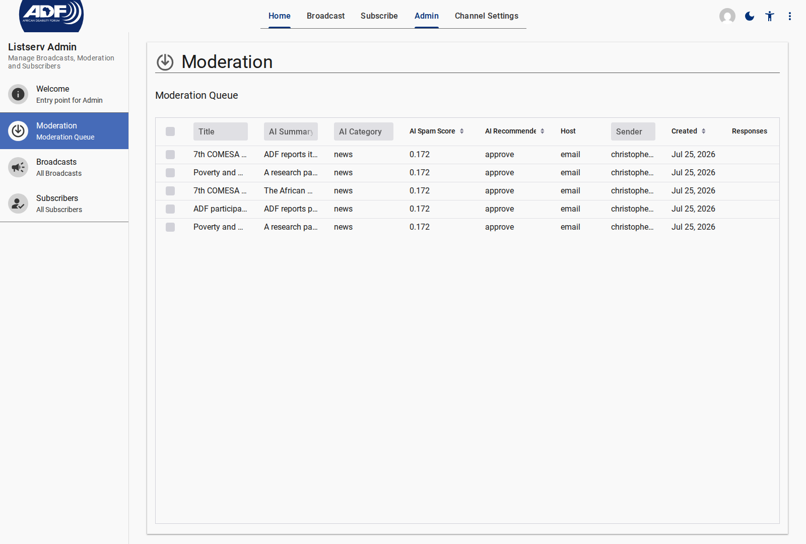

# Moderating Community Submissions

The **Moderation Queue** allows channel administrators and moderators to review posts submitted by subscribers via email or web before they are broadcast to the full mailing list.

---

## Step 1: Open the Moderation Queue

1. In the top navigation, click **Admin**.
2. Click **Moderation** in the drawer menu.
3. The queue displays all broadcasts currently in the `moderated` (submitted) lifecycle state.

<figure>
  
  <figcaption>Moderation Queue displaying pending community submissions</figcaption>
</figure>

---

## Step 2: Review Content and AI Recommendations

Click on a pending submission to open its detail view. The platform automatically displays AI-driven analysis generated by the moderation agent (`gpt-4o-mini`):

| AI Field | Description |
| --- | --- |
| **Category Badge** | Classification tag (`news`, `event`, `announcement`, `question`, `promotional`) |
| **Summary** | Concise 1-2 sentence overview of the submission |
| **Spam Score** | Indicator rating risk from `0.0` (clean) to `1.0` (high spam probability) |
| **Recommended Action** | Suggested decision: `approve`, `flag`, or `reject` |

::: info Automated AI Moderation
Submissions with extremely low spam scores may be automatically pre-classified as `approve`. Submissions flagged by AI require manual administrator review.
:::

---

## Step 3: Take Action on a Submission

Use the action buttons rendered by the actor controls:

### Option A: Approve

Click **Approve**. The broadcast state transitions to `approved`, triggering automated translation into active channel languages and subsequent dispatch to subscribers.

### Option B: Edit & Approve

If the submission requires grammar corrections, styling, or attachment formatting, edit the text directly in the detail view before clicking **Approve**.

### Option C: Reject

Click **Reject**. A dialog prompts you for a **Rejection Reason**. Enter the explanation (which is emailed back to the original author) and confirm rejection.

---

## Related Content

- [Creating & Sending Broadcasts](./creating-and-sending-broadcasts.md)
- [Broadcast Lifecycle & AI Moderation Explanation](../explanation/broadcast-lifecycle-and-moderation.md)
- [Admin Reference Specification](../reference/admin/index.md)
