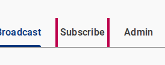
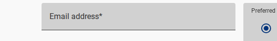
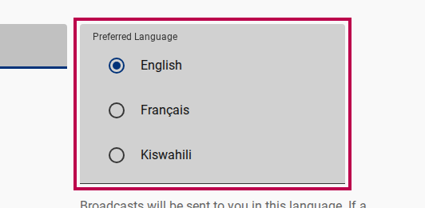
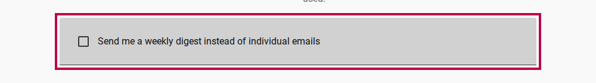
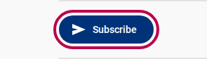

# Subscribing & Managing Delivery Preferences

This guide explains how users subscribe to a channel using either email commands or the web application, select language preferences, toggle weekly digest mode, and pause delivery via vacation mode.

---

## Method 1: Email Commands (Low-Connectivity Route)

Users in low-bandwidth or offline environments can manage subscriptions by sending simple email commands to the channel address (e.g. `channel-1@mg.a11ydata.com`). No web browser or password required.

### Supported Email Commands

Send an email to `{channel-id}@mg.a11ydata.com` with one of the following command keywords in the **subject line** or the **first line of the body**:

| Desired Action | English | French | Portuguese | Arabic |
| --- | --- | --- | --- | --- |
| **Subscribe** | `SUBSCRIBE` / `SUB` | `ABONNE` / `ABONNER` | `INSCREVER` | `اشتراك` |
| **Unsubscribe** | `UNSUBSCRIBE` / `UNSUB` / `SIGNOFF` | `DESABONNE` | `CANCELAR` | `إلغاء الاشتراك` |
| **Help & Guidelines** | `HELP` | `AIDE` | `AJUDA` | `مساعدة` |

```text
From: subscriber@example.com
To: channel-1@mg.a11ydata.com
Subject: SUBSCRIBE
```

::: tip Immediate Email Activation
Email commands originating directly from the user's mail address serve as proof of email ownership. Therefore, email command subscriptions are activated immediately without requiring a double opt-in click.
:::

---

## Method 2: Web Subscription (With Double Opt-In)

The web subscription form allows users to select preferred languages and delivery modes directly.

<figure>
  
  <figcaption>Public Subscription Form in the Listserv Web Application</figcaption>
</figure>

### Steps to Subscribe on the Web

1. Open the Listserv web application and click **Subscribe** in the top navigation.
2. Enter your email address in the **Email address** text field.

   <figure>
     
     <figcaption>Entering the subscriber's email address</figcaption>
   </figure>

3. Under **Preferred Language**, choose your primary language (e.g. English, French, Portuguese, Arabic).

   <figure>
     
     <figcaption>Choosing preferred delivery language</figcaption>
   </figure>

4. *(Optional)* Select **Send me a weekly digest instead of individual emails** if you prefer a single summary email per week.

   <figure>
     
     <figcaption>Toggling weekly digest mode option</figcaption>
   </figure>

5. Click **Subscribe**.

   <figure>
     
     <figcaption>Submitting the web subscription form</figcaption>
   </figure>

6. Check your inbox for a confirmation email containing a double opt-in link.
7. Click the confirmation link to activate your subscription.

::: info Double Opt-In Security
Unconfirmed subscriptions remain in `pending` status. Unverified accounts cannot receive broadcasts, preventing unauthorized spam signups.
:::

---

## Managing Delivery Preferences

### Real-Time vs. Weekly Digest Mode

- **Individual Emails (Real-Time)**: Each broadcast arrives as a separate email immediately after approval. You can reply directly to any broadcast email to contribute to threaded discussions.
- **Weekly Digest Mode**: Broadcasts are held and compiled into a single consolidated summary email dispatched once a week by the automated scheduler. Digest emails are read-only; you cannot reply to start a threaded discussion.

<figure>
  
  <figcaption>Choosing between Individual Real-Time Emails and Weekly Digest Summaries</figcaption>
</figure>

### Unsubscribing

You can unsubscribe at any time using any of these 3 options:

1. Click the **1-Click Unsubscribe** link located in the footer of any broadcast email.
2. Reply to any broadcast email with `UNSUBSCRIBE` in the subject line.
3. Access your subscriber profile in the web app and set status to `unsubscribed`.

---

## Related Content

- [Browsing & Searching Archives](./browsing-and-searching-archives.md)
- [Dual-Route Architecture Explanation](../explanation/dual-route-architecture.md)
- [Subscriber Identity & Auth Explanation](../explanation/subscriber-identity-and-auth.md)
