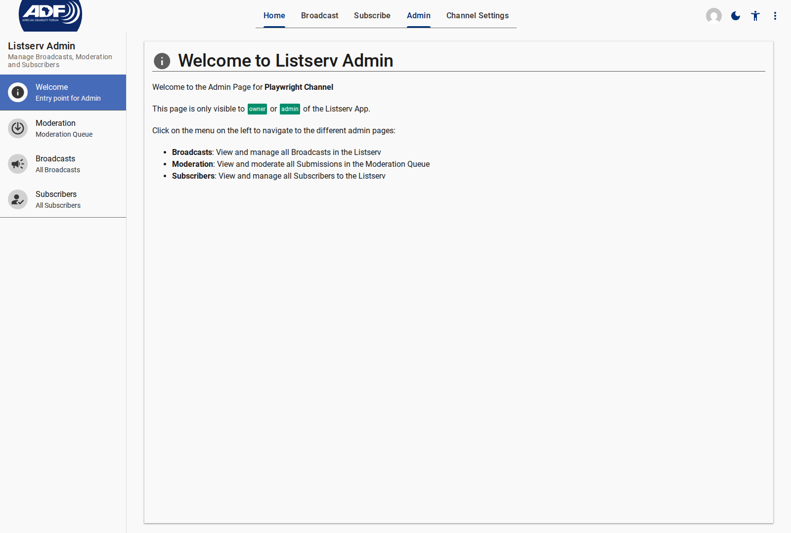
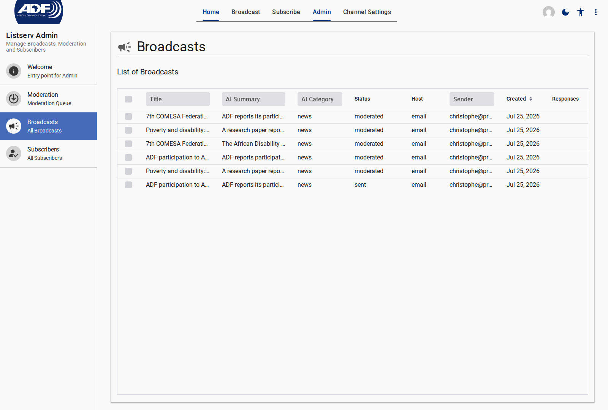
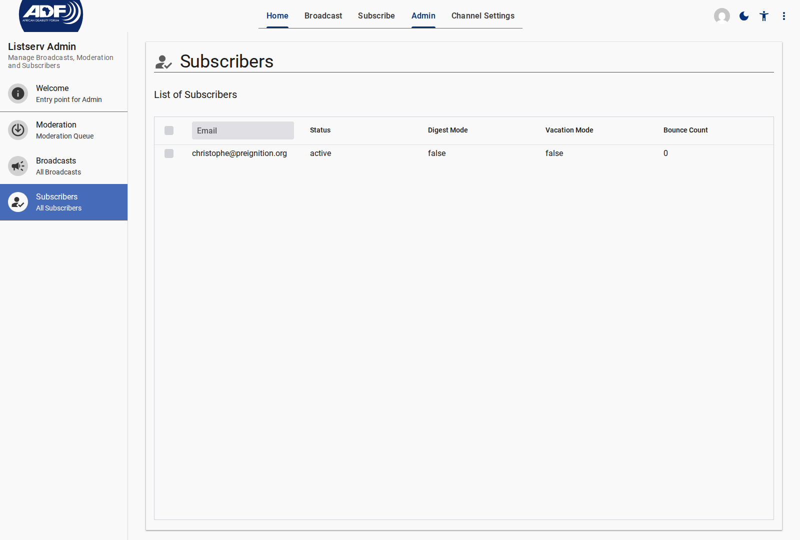

# Admin Pages Specification

Admin pages are drawer-based interfaces guarded by authentication and channel team access roles (`owner`, `editor`, or `moderator`).

---

## 1. Admin Welcome Page (`/admin/welcome`)

- **Component Tag**: `<listserv-admin-welcome>`
- **Route Path**: `/admin/welcome`
- **Access Level**: Signed-in channel Team Member

<figure>
  
  <figcaption>Admin Welcome Screen introducing admin sections</figcaption>
</figure>

### Section Overview

Provides high-level descriptions and navigation links to the main administrative tools:

- **Broadcasts**: Campaign drafting, editing, and analytics
- **Moderation**: Community post review interface
- **Subscribers**: Subscriber membership directory

---

## 2. Moderation Queue (`/admin/moderation`)

- **Component Tag**: `<listserv-admin-moderation>`
- **Route Path**: `/admin/moderation`
- **Access Level**: Owner, Editor, or Moderator

<figure>
  
  <figcaption>Moderation Queue displaying pending community submissions</figcaption>
</figure>

### Grid Columns & Controls

| Column / Control | Data Field | Description |
| --- | --- | --- |
| **Sender** | `sender` / `From` | Email address of the submission author |
| **Subject** | `content.en.subject` | Title / Subject line of the submitted post |
| **Submitted At** | `metaData.createdAt` | Timestamp of receipt via email or web API |
| **AI Category** | `moderation.aiCategory` | Classification tag (`news`, `event`, `announcement`, `question`, `spam`) |
| **AI Spam Score** | `moderation.aiSpamScore` | Numerical indicator from `0.0` to `1.0` |
| **Actions** | `<actor-actions>` | Interactive buttons: `Approve`, `Edit & Approve`, `Reject` |

---

## 3. Broadcasts Management (`/admin/broadcast`)

- **Component Tag**: `<listserv-admin-broadcast>`
- **Route Path**: `/admin/broadcast`
- **Access Level**: Owner or Editor

<figure>
  
  <figcaption>Admin Broadcasts List with status chips and response threading</figcaption>
</figure>

### Grid Columns & Detail Views

| Field / Column | Type | Description |
| --- | --- | --- |
| **Title / Subject** | String | Main subject line of the broadcast |
| **Status Chip** | State Tag | Lifecycle state: `draft`, `submitted`, `approved`, `sending`, `sent`, `rejected` |
| **Origin** | String | Source: `admin` (manual broadcast) or `user` (community submission) |
| **Sent Date** | Timestamp | Date and time email dispatch was executed |
| **Response Count** | Number | Number of threaded subscriber email replies attached |
| **Row Details** | Expanded View | Renders detail editor (`<listserv-broadcast-detail>`) and performance KPIs |

---

## 4. Subscribers Management (`/admin/subscriber`)

- **Component Tag**: `<listserv-admin-subscriber>`
- **Route Path**: `/admin/subscriber`
- **Access Level**: Owner or Editor

<figure>
  
  <figcaption>Subscriber Directory showing active subscribers and delivery lists</figcaption>
</figure>

### Grid Fields

| Field | Type | Description |
| --- | --- | --- |
| **Subscriber UID** | Branded String | Firebase Auth UID backing the subscriber identity |
| **Email Address** | String | Recipient mail address |
| **Status** | Enum | Membership status: `pending`, `confirmed`, `active`, `unsubscribed` |
| **Delivery Mode** | Boolean | `digestMode: false` (Real-time list) vs `digestMode: true` (Digest list) |
| **Vacation Mode** | Boolean | Delivery pause flag |
| **Languages** | Array | ISO 639-1 language choices for translation dispatch |

---

## Related Content

- [Public Pages Specification](../public/index.md)
- [Channel Settings Specification](../settings/index.md)
- [Broadcast Lifecycle Explanation](../../explanation/broadcast-lifecycle-and-moderation.md)
- [Broadcast Responses & Threading Explanation](../../explanation/broadcast-responses-threading.md)
