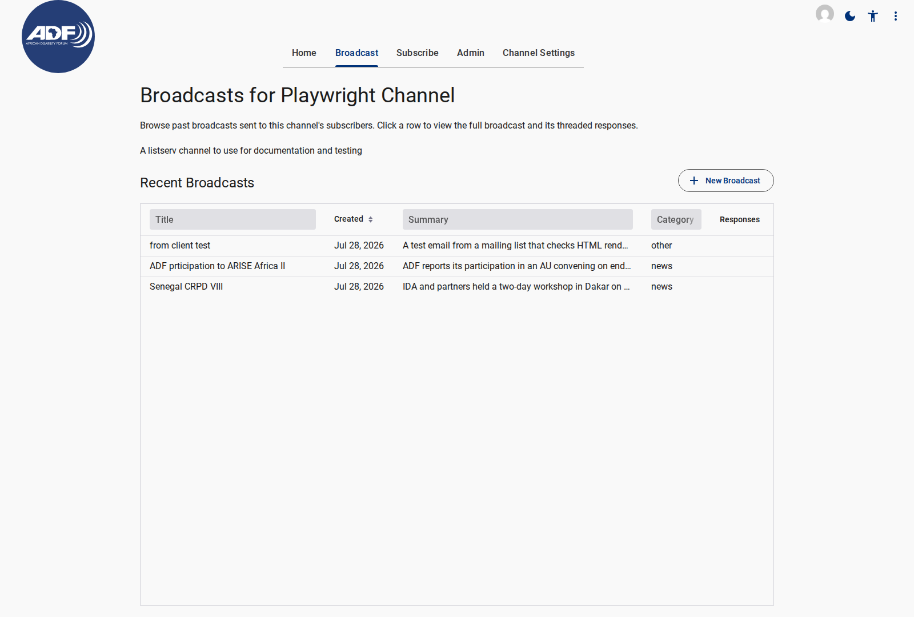
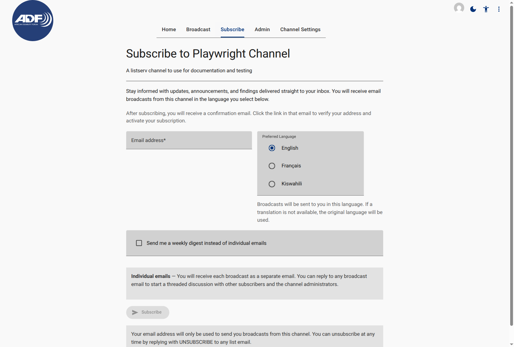
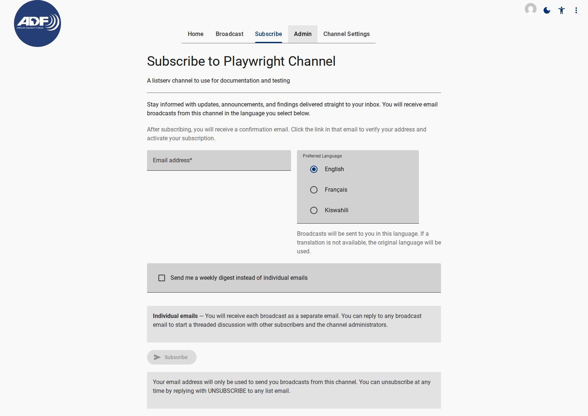

# Public Pages Specification

Public pages are accessible without authentication to allow stakeholders to view sent announcements and subscribe to channel updates.

---

## 1. Broadcast Archive Page (`/broadcast`)

- **Component Tag**: `<a11y-listserv-broadcast>`
- **Route Path**: `/broadcast` (Default fallback route)
- **Access Level**: Public (unauthenticated)

<figure>
  
  <figcaption>Public Broadcast Archive Page showing sent announcements feed</figcaption>
</figure>

### UI Elements & Fields

| Element / Field | Type | Description |
| --- | --- | --- |
| **Header Title** | Heading | Name of the active listserv channel |
| **Privacy Banner** | Alert Box | Privacy disclosure stating messages are public and searchable |
| **Broadcast Feed** | Card List | Reverse-chronological list of sent broadcasts (`status === 'sent'`) |
| **Broadcast Card** | `<vaadin-card>` | Displays subject, sent date, primary language, excerpt, and attachments |
| **Language Filter** | Selector | Filters displayed broadcasts by active channel language |
| **Subscribe Link** | Navigation | Top-bar prominent link navigating to `/subscribe` |

---

## 2. Public Subscription Page (`/subscribe`)

- **Component Tag**: `<a11y-listserv-subscribe>`
- **Route Path**: `/subscribe`
- **Access Level**: Public (unauthenticated)

<figure>
  
  <figcaption>Public Subscription Page with email and language controls</figcaption>
</figure>

<figure>
  
  <figcaption>Full Subscription Page showing delivery mode options and privacy disclaimer</figcaption>
</figure>

### UI Form Fields

| Field Name | Component | Required | Validation / Description |
| --- | --- | --- | --- |
| **Email Address** | `<lapp-text-field>` | Yes | Valid email string; triggers double opt-in confirmation message |
| **Preferred Language** | `<lapp-choice-radio>` | Yes | ISO 639-1 code selection from channel's `activeLanguages` list |
| **Weekly Digest Toggle** | `<lapp-checkbox-field>` | No | Boolean flag (`digestMode`). Default: `false` (real-time delivery) |
| **Subscribe Button** | `<md-filled-button>` | — | Invokes `SubscriptionService.subscribe` cloud endpoint |
| **Privacy Warning** | Static Text | — | Legal notice on archiving, indexing, and unsubscription options |

---

## Related Content

- [Admin Pages Specification](../admin/index.md)
- [Channel Settings Specification](../settings/index.md)
- [Subscribing & Preferences How-To](../../how-to/subscribing-and-managing-preferences.md)
