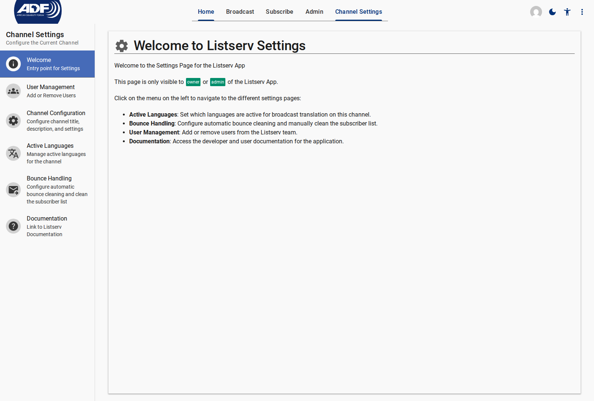
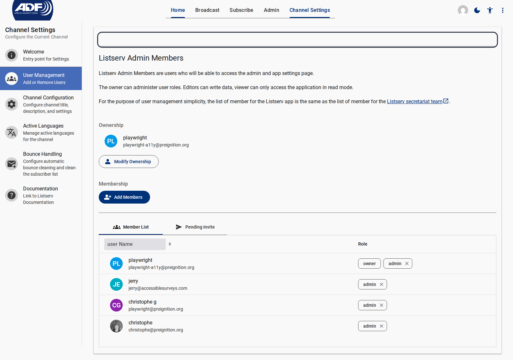

# Channel Settings Specification

Channel Settings allow channel owners and editors to configure metadata, translation settings, bounce cleaning rules, and access control.

---

## 1. Channel Welcome Page (`/settings/welcome`)

- **Component Tag**: `<listserv-settings-welcome>`
- **Route Path**: `/settings/welcome`

<figure>
  
  <figcaption>Channel Settings Welcome Overview</figcaption>
</figure>

---

## 2. Channel Configuration (`/settings/channel`)

- **Component Tag**: `<listserv-settings-channel>`
- **Route Path**: `/settings/channel`

<figure>
  
  <figcaption>Channel Configuration panel for metadata, contact info, and rate limits</figcaption>
</figure>

### Schema Fields (`ChannelS`)

| Field | Type | Description |
| --- | --- | --- |
| **title** | String | Public display title of the channel |
| **description** | String | Channel description displayed on subscribe form |
| **adminContact** | Object | `{ name, email, phone? }` inserted into mail headers/footers |
| **rateLimit** | Object | `{ maxPerHour: number }` limiting submissions per sender (default: 5) |
| **privacyWarning** | String | Legal privacy notice rendered on public pages and mail footers |

---

## 3. Active Languages (`/settings/language`)

- **Component Tag**: `<listserv-settings-language>`
- **Route Path**: `/settings/language`

<figure>
  
  <figcaption>Active Languages Configuration interface</figcaption>
</figure>

### Behavior

- Renders switches for languages configured in Customer Settings.
- When enabled, approved broadcasts are automatically translated into these target ISO 639-1 languages before sending.

---

## 4. Bounce Handling (`/settings/bounce`)

- **Component Tag**: `<listserv-settings-bounce>`
- **Route Path**: `/settings/bounce`

<figure>
  
  <figcaption>Bounce Handling thresholds and manual list cleaning button</figcaption>
</figure>

### Configuration Fields

| Setting | Type | Description |
| --- | --- | --- |
| **Automatic Cleaning** | `<md-switch>` | Toggles automatic subscriber deactivation on bounce webhooks |
| **Bounce Threshold** | Number | Number of permanent failures before account deactivation (default: 3) |
| **Clean List Button** | Button | Triggers on-demand list reconciliation against Mailgun bounce logs |

---

## 5. User Access Management (`/settings/user`)

- **Component Tag**: `<listserv-settings-user>`
- **Route Path**: `/settings/user`

<figure>
  
  <figcaption>User Access Management interface displaying team roles</figcaption>
</figure>

<figure>
  
  <figcaption>Full User Access View showing channel ownership, team member list, and role assignments</figcaption>
</figure>

### Section Controls & Fields

| Control / Field | Type | Description |
| --- | --- | --- |
| **Listserv Admin Members** | Header | Overview describing role permissions and secretariat team linkage |
| **Ownership Section** | Profile Card | Identifies primary channel owner (`playwright-a11y@preignition.org`) |
| **Modify Ownership** | Button | Dialogue trigger to transfer channel ownership |
| **Add Members** | Button | Action to invite new team members or assign access roles |
| **Member List / Pending Invite** | Tabs | Toggle between active team members and outstanding invitations |
| **Member Table** | Data Table | Grid listing user names, emails, and assigned role chips (`owner`, `admin`, `editor`) |

### Access Roles

| Role | Permissions |
| --- | --- |
| **Owner** | Full channel administration, settings management, and user access delegation |
| **Editor** | Draft broadcasts, moderate community posts, manage subscribers, dispatch emails |
| **Guest** | Read-only access to broadcast archives and analytics |

---

## Related Content

- [Public Pages Specification](../public/index.md)
- [Admin Pages Specification](../admin/index.md)
- [Configuring Channel Settings How-To](../../how-to/configuring-channel-settings.md)
