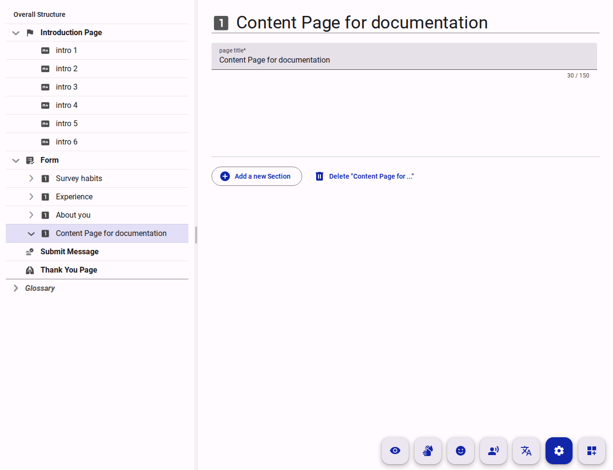

# How Does the Compose View Work?

The **Compose View** is the primary workspace where you build and organize the content of your survey. Unlike simple list-based editors, the Compose view uses a dual-pane architecture designed to handle the multi-layered [hierarchy](./understanding-survey-hierarchy.md) of modern, accessible surveys.

This document explains the conceptual model behind this interface and how it helps you manage complex questionnaires efficiently.

## The Dual-Pane Architecture

The Compose view is split into two functional areas that work in tandem: the **Tree View** (left) and the **Property/Content View** (right).

<figure>
  
  <figcaption>Screenshot of the Compose view showing the Tree View on the left and the Property/Content View on the right</figcaption>
</figure>

### 1. The Tree View (The "Where")

The left pane provides a visual representation of your survey's structural hierarchy. It shows the parent-child relationships between Pages, Sections, Questions, and Options.

* **Navigation:** It allows you to quickly jump between different parts of a large survey without scrolling through the entire form.
* **Organization:** You can expand or collapse branches to focus on specific sections, and drag-and-drop items to reorganize the survey's flow.
* **Context:** It always tells you exactly where the item you are currently editing sits within the broader questionnaire.

**Clicking** on any item in the Tree View loads its details into the right pane, allowing you to edit its properties or content.

**Right-clicking** on an item in the Tree View opens a context menu with options to add new items (e.g., add a new question under a section) or perform actions like duplication and deletion.

### 2. The Property and Content View (The "What")

The right pane is where the actual configuration happens. When you select an item in the Tree View, its details are loaded here. Depending on the selected "Mode," this pane serves two purposes:

The right pane is context-sensitive and changes based on the "Mode" you are in. The main modes are:

* **Settings Mode:** Used to configure technical properties, such as the question's unique code, validation rules (required, min/max), and [Logic Expressions](./understanding-form-logic.md).
* **Add Content Mode:** Add content to the form, such as the question text, help text, and options for multiple-choice questions.
* **Visibility Mode:** Focuses on the logic rules that determine when a question or section is shown to respondents. This is where you can set up complex branching and conditional flows without being distracted by content editing.

Some modes are only available when they are activated at the survey level:

* **Easy Read Mode:** Provides a simplified interface for creating Easy Read content, which is essential for accessibility.
* **Sign Language Mode:** Allows you to upload and manage sign language videos for questions, ensuring that your survey is accessible to Deaf respondents.
* **Read Aloud Mode:** Enables you to add audio recordings of questions for respondents who prefer auditory input.
* **Translation Mode:** Manage translations of your survey content for multilingual accessibility. Only available if the survey has been set to "Multilingual" in the survey settings.

## The Concept of Modes

The Compose view introduces "Modes" (like **Settings**, **Content**, and **Visibility**) to prevent interface clutter.

Instead of showing every possible configuration option at once—which would be overwhelming—the view filters the right pane to show only what is relevant to your current task. For example, when in "Visibility Mode," the right pane highlights only the logic rules, allowing you to debug the survey's flow without getting distracted by text formatting.

## The "Why" Behind the Design

We designed the Compose view this way for three key reasons:

1. **Scalability:** A simple list of questions becomes unmanageable once you have more than 20 items. The Tree View ensures that a survey with 200 questions is just as easy to navigate as one with 5.
2. **Separation of Concerns:** By separating the *structure* (left) from the *content* (right), we allow authors to think about the survey's logical flow independently of the specific wording of a question.
3. **Real-Time Sync:** The dual-pane setup provides immediate feedback. As you move a section in the tree, the underlying data model is updated instantly.

By understanding the relationship between the structural Tree View and the task-specific Property View, you can move more confidently through the survey creation process, handling complex accessibility and logic requirements with ease.
