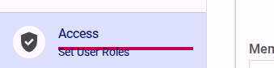
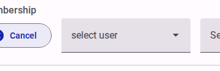
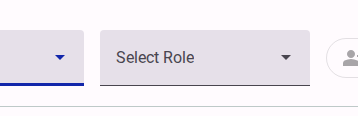

# How to set access rights for forms

As the creator (Owner) of a survey, you control who has access to view, edit, or translate your forms. By adding team members and assigning specific roles, you can collaborate securely.

> [!NOTE]
> Only the 'Owner' of a form can manage access rights. To be granted access, a user must already have an account on the application and be associated with your organization or program.

## Step 1: Navigate to the Access view

From the survey editor, navigate to the **Share** section in the top menu, then click on the **Access** option in the left-hand navigation menu.

<figure>
  
  <figcaption>Click the 'Access' button in the navigation menu.</figcaption>
</figure>

## Step 2: Set access rights for team members

In the Access view, you can assign permissions to different team members.

- Enter the email address of the user you want to add.

<figure>
  
  <figcaption>Add a team member.</figcaption>
</figure>

- Select the appropriate access level (e.g., read, write, or admin).

<figure>
  
  <figcaption>Select the user - All users from active Team appear here.</figcaption>
</figure>
<figure>
  
  <figcaption>Select the appropriate access level for the team member.</figcaption>
</figure>

- Click the **Add Access** button.

<figure>
  
  <figcaption>Add a team member's email, select their role, and click 'Add Access'.</figcaption>
</figure>

Once added, the user will appear in the 'User List' at the bottom of the page, and they will immediately be granted the specified permissions for the survey.

> [!TIP]
> A form 'Owner' can also assign their ownership rights entirely to another user using a similar process from this screen.

<!--  -->
> [!TIP]
> Refer to the **Customer App** reference to see how to add members to your team and manage their roles at the organization or program level, which is a prerequisite for granting them access to your survey forms.
