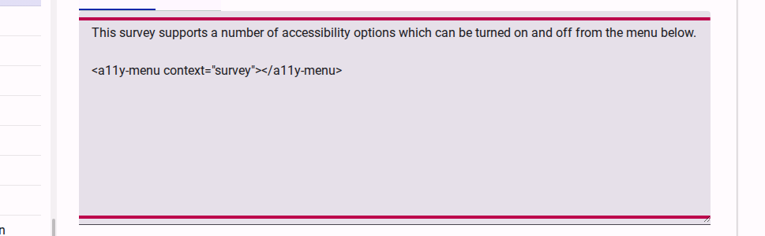
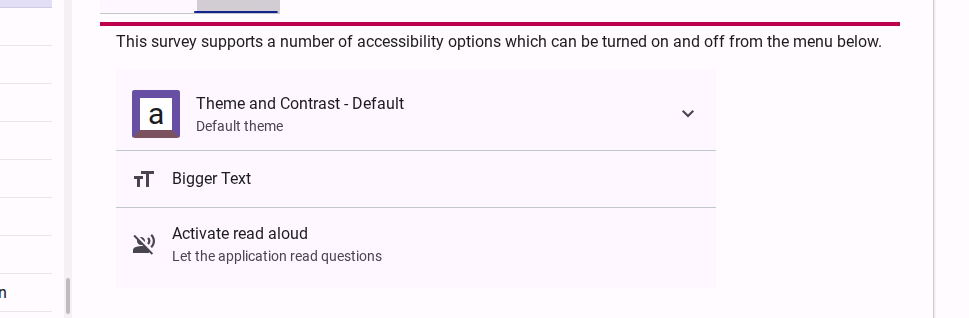

# Adding an accessibility menu

Adding an accessibility menu at the start of your survey or within specific sections helps make the accessibility options more prominent to survey respondents. While accessibility settings are always available in the top right corner of the screen, a dedicated menu ensures respondents are aware of the available assistance modes (like Easy Read, Sign Language, or Screen Reader optimizations) right from the start.

## Prerequisites

- You must have a survey created and be in the **Compose** mode of the survey builder.
- You should have already activated the desired accessibility modes in the **Behavior** settings of your survey.

## Steps

### 1. Focus on a Markdown Editor

In the **Compose** tab, navigate to the field where you want to add the accessibility menu. This is typically done in the **Survey Introduction** or a **Free Text** field.

Click on the text area to focus the markdown editor.

<figure><figcaption>Focus on the markdown editor to insert the accessibility menu tag.</figcaption></figure>

### 2. Insert the Accessibility Menu Tag

Add the following tag into the markdown content where you want the menu to appear:

```html
<a11y-menu ></a11y-menu>
```

> [!TIP]
> The menu is intelligent: it will only display the accessibility options that you have enabled for your survey in the Behavior settings.

### 3. Preview the Accessibility Menu

To verify how the menu will look for your respondents, click on the **Preview** tab of the field.

<figure><figcaption>The preview shows how the menu will be displayed to respondents, allowing them to toggle accessibility modes directly.</figcaption></figure>

## Alternative: Adding to the Landing Page

This short video show you how you can add an accessibility menu to a survey's 'Landing Page';

<lite-youtube videoid="jBdiUyD_dek"></lite-youtube>

## Next Steps

Once the menu is added, you can continue to customize your survey. Respondents will now see a clear set of options to tailor the survey experience to their needs.
