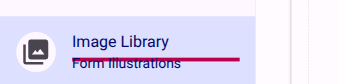
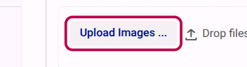

# How to add images to the image library

The Image Library provides a centralized repository for managing visual assets, such as Easy Read graphics, organization logos, and explanatory diagrams used throughout your survey. An image must first be added to the Image Library before it can be used in a form.

## Step 1: Navigate to the Image Library

From the main survey builder view, click on the **Image Library** option in the left-hand navigation menu.

<figure>
  
  <figcaption>Click the 'Image Library' button in the navigation menu.</figcaption>
</figure>

## Step 2: Upload your images

Once in the Image Library workspace, you can upload new images from your device.

<figure>
  
  <figcaption>Click the 'Upload Images' button to select and add files from your computer.</figcaption>
</figure>

> [!TIP]
> Ensure your images are consistently sized before uploading them. We recommend using square images (1:1 ratio) to accompany questions and keeping file sizes under 400KB so that surveys load quickly on all devices.

## Step 3: Manage your uploaded images

Once uploaded, your images will appear in a gallery format within the workspace. You can click on any image in the gallery to view its details, download it back to your device, or delete it from the library.
