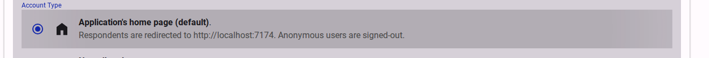
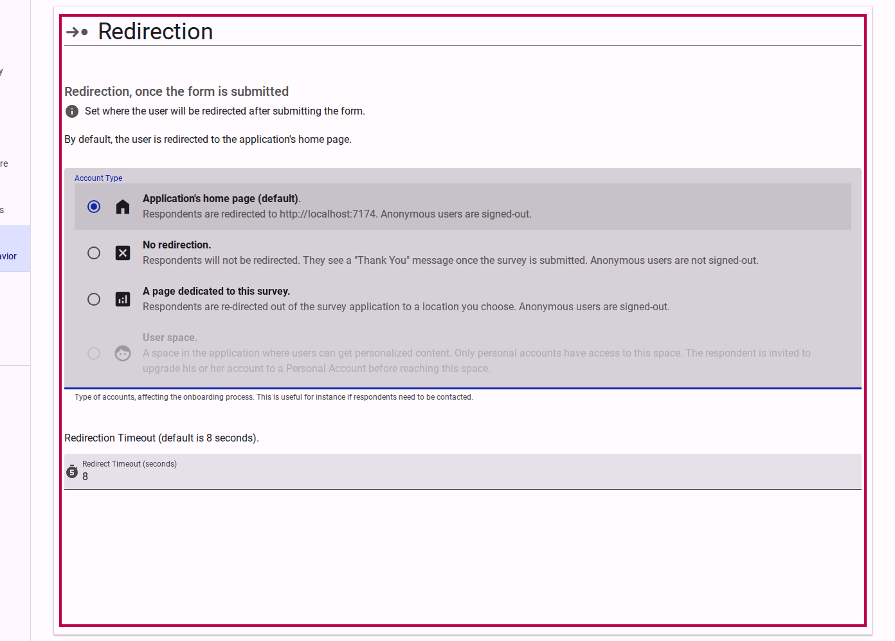
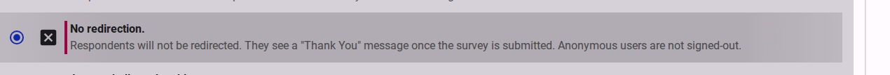
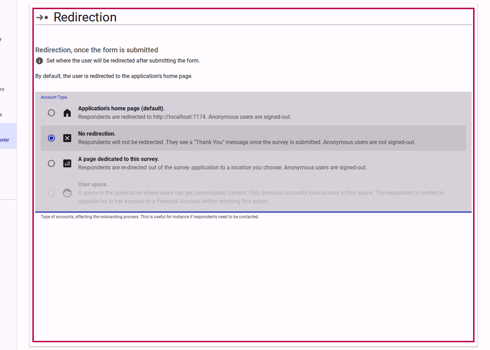
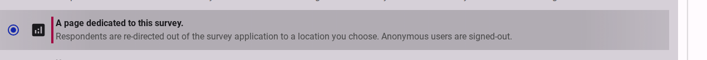
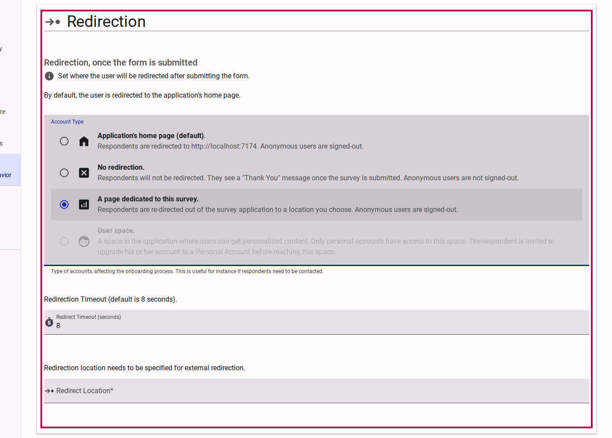

# Configuring Survey Redirection

By default, when a respondent finishes a survey, they must be directed somewhere. You can control this destination from the **Redirection** settings located in the **Distribute** section of the survey builder.

## Available Redirection Options

Navigate to the **Distribute** > **Redirection** menu to explore the following options:

### 1. Application's Home Page

This option redirects the respondent to the platform's main landing page (e.g., accessiblesurveys.com or your enterprise homepage). This is a good general option to conclude the survey process and introduce respondents to the platform.

<figure><figcaption>Click on Application's home page.</figcaption></figure>

<figure><figcaption>The Application home page option is now active.</figcaption></figure>

### 2. No Redirection

If you choose **No redirection**, respondents will simply stay on the final page of the survey after submitting their responses. This is useful if your final survey page contains a customized thank you message or important follow-up instructions.

<figure><figcaption>Select the No redirection option.</figcaption></figure>

<figure><figcaption>Respondents will remain on the survey's final page upon completion.</figcaption></figure>

### 3. A Page Dedicated to the Survey

This option redirects respondents to a dedicated page outside of the survey itself. In the future, this page can be configured to provide respondents with useful information about the survey, such as aggregate response statistics, next steps, or details on how their data will be used.

<figure><figcaption>Click on A page dedicated to this survey.</figcaption></figure>

<figure><figcaption>Respondents will be directed to a dedicated survey dashboard or info page.</figcaption></figure>

### 4. User Space (Upcoming)

*Note: This feature is currently in development.*

When released, this option will direct signed-in respondents to a personalized workspace where they can view follow-up actions, reports, or invitations to other surveys. Anonymous respondents will be invited to create an account before being directed to this space.
