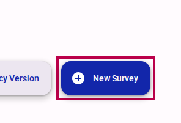
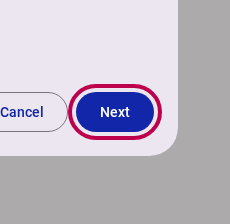
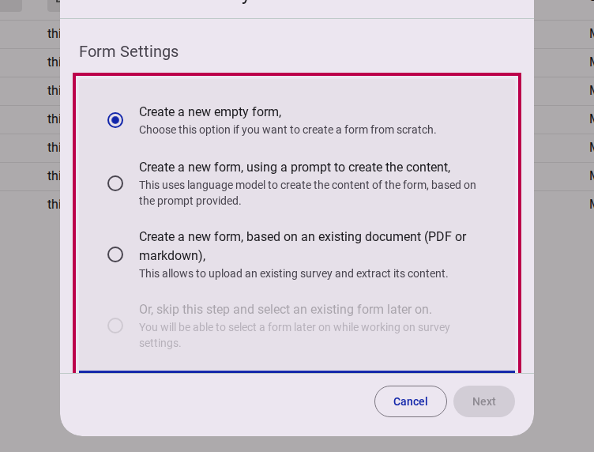
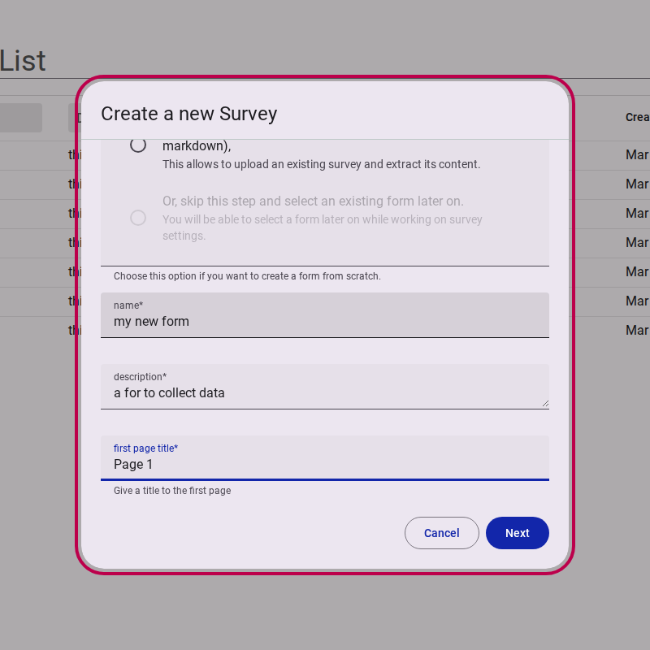
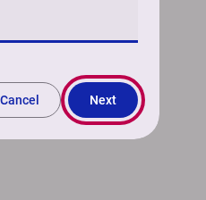
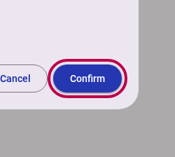

# Creating a new survey

::: info
A step by step guide to creating a new survey
:::

## Step 1: Start the creation process

Select **New Survey** on your survey workspace.

<figure>
  
  <figcaption>Click new survey button</figcaption>
</figure>

## Step 2: Provide survey details

Give your survey a **Name** and a brief **Description**.  The description is only for internal purposes and won't be displayed on the survey itself.  

<figure>
  
  <figcaption>Fill in name and description</figcaption>
</figure>

::: warning
You will not be able to move to the next step until the survey has a name and description.
:::

Then, select **Next**.

<figure>
  
  <figcaption>Press next button</figcaption>
</figure>

## Step 3: Choose or create a form

Surveys use **Forms** to collect data. On this step, you can decide how the form for your new survey should be created.

<figure>
  
  <figcaption>Choose type of form</figcaption>
</figure>

Select one of the following options:

### Option A: Create a new empty form

Choose this option if you want to create a form from scratch.

1. Select **Create a new empty form**.
2. Fill in the **Name**, **Description**, and **First page title** for the new form.

<figure>
  
  <figcaption>Fill in form details</figcaption>
</figure>

### Option B: Create a new form using a prompt

Choose this option to generate the content of the form using a natural language prompt.

1. Select **Create a new form, using a prompt to create the content**.
2. Write a detailed instruction prompt describing the pages and questions you want (e.g., *"Create 3 pages with 2 sections each. The first page should focus on weather..."*).

### Option C: Create a new form based on an existing document

Choose this option to upload an existing PDF or markdown document and extract its questions/content.

1. Select **Create a new form, based on an existing document (PDF or markdown)**.
2. Upload a file (up to 2MB) in PDF (`.pdf`) or Markdown (`.md`) format.

### Option D: Skip and select an existing form later

If you want to associate this survey with an existing form or select one later, select **Or, skip this step and select an existing form later on**.

Once your form configuration is selected and filled out, select **Next** to proceed.

<figure>
  
  <figcaption>Press next button</figcaption>
</figure>

## Step 4: Review and Confirm

On the summary page, you will be asked to confirm your choices and verify that you want to create the new survey with these settings.

<figure>
  
  <figcaption>Review survey details</figcaption>
</figure>

Click **Confirm**.

<figure>
  
  <figcaption>Press confirm button</figcaption>
</figure>

::: tip
Congratulations, you have successfully created a new survey! You will now be redirected to the survey editor.
:::

## Related Content

- [How to edit a survey](./editing-a-survey.md)
- [How to add content to a form](./adding-content-to-a-form.md)
- [How to publish and distribute a survey](./publishing-a-survey.md)
