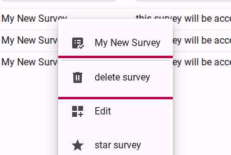
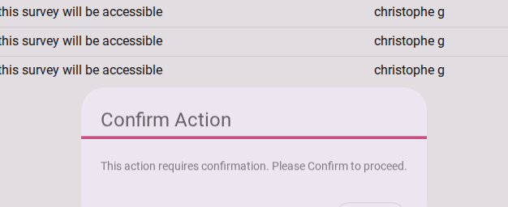
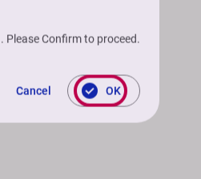

# Deleting a survey

::: danger
  Deleting a survey marks it as deleted. The survey will no longer be visible in the survey workspace.
:::

## Step 1: Open the survey context menu

From your survey workspace, locate the survey you wish to delete. Right-click on the survey row (or open the context menu) and select **Delete survey**.

<figure>
  
  <figcaption>Right click survey to open context menu and select delete</figcaption>
</figure>

## Step 2: Confirm the deletion

A confirmation dialog will appear warning you about the permanent nature of this action. Review the dialog to ensure you are deleting the correct survey.

<figure>
  
  <figcaption>Confirm action dialog</figcaption>
</figure>

Click the **Confirm Action** button to permanently delete the survey and all its associated data.

<figure>
  
  <figcaption>Click confirm action button</figcaption>
</figure>
