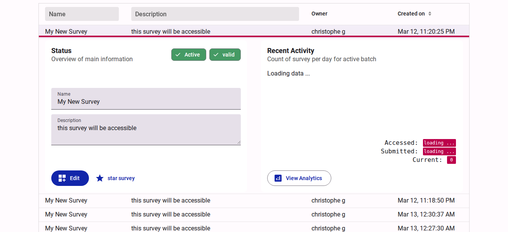
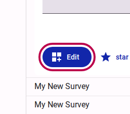
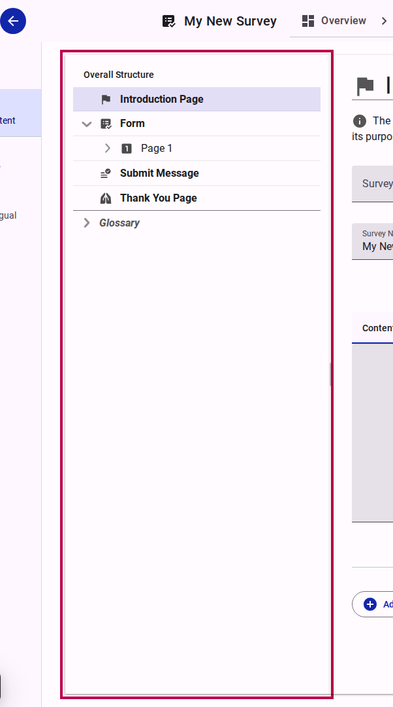
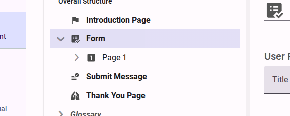
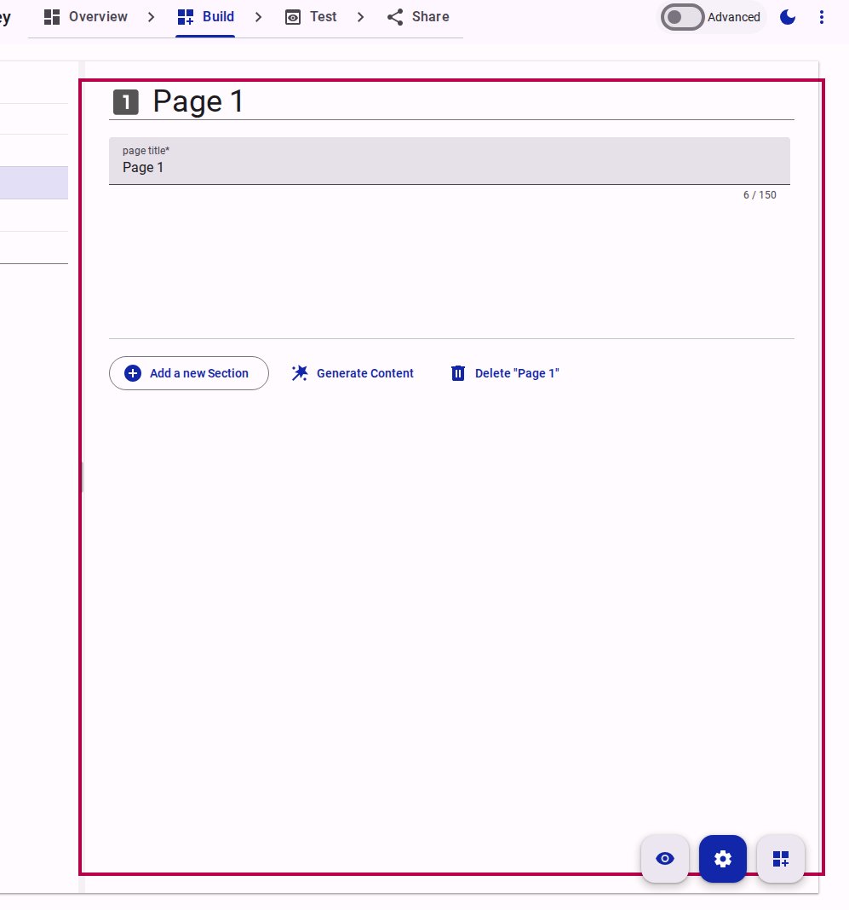
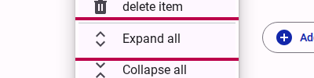
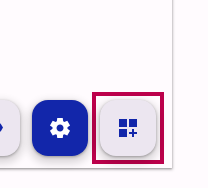

# Editing a survey

Once a survey has been created, you can edit its structure, logic, and settings at any time.

## Step 1: Open the Survey Editor

From your survey workspace, locate the survey you wish to edit. Click on the survey row to expand it and reveal the survey details panel.

<figure>
  
  <figcaption>Expand the survey row</figcaption>
</figure>

Within the expanded panel, click the **Edit** button.

<figure>
  
  <figcaption>Click the Edit button</figcaption>
</figure>

## Step 2: Navigate the Survey Structure

You are now in the Survey Editor. The editor displays the overall structure of your survey in a tree grid on the left side of the screen. This structure includes the Introduction Page, the Form itself, and the Thank You Page.

<figure>
  
  <figcaption>The survey structure tree grid</figcaption>
</figure>

To edit the content of your form, expand the "Form" node in the tree and click on a specific page (e.g., "Page 1").

<figure>
  
  <figcaption>Select a page to edit</figcaption>
</figure>

The right panel will update to show the settings and content for the selected page. You can edit the page title and other metadata here.

<figure>
  
  <figcaption>Edit the page title</figcaption>
</figure>

### Expand or collapse the whole structure

When a survey has many pages and sections, opening each node one by one to see what is inside is slow. The Tree View offers two shortcuts to open or close a whole branch at once.

Right-click the item you want to work with and choose:

- **Expand all** — opens that item and everything below it, down to the questions. This is a quick way to scan the full structure and see where content, logic, or accessibility features are attached.
- **Collapse all** — closes everything below that item again, returning the tree to a compact view.

<figure>
  
  <figcaption>Right-click a node to reveal "Expand all" and "Collapse all".</figcaption>
</figure>

When you use **Expand all**, the pages and sections open and their questions appear, but options stay hidden. Options are only shown when you expand a question yourself.

::: info
The two actions are available on the **Form**, **Survey**, **Page**, and **Section** items — the levels that contain other items. They do not appear on a question, a text item, or an option.
:::

## Step 3: Add Content Mode

To add actual questions to your page, you need to switch to **Add Content Mode**. Click the "Add Content Mode" button (typically located at the bottom right or in the view toolbar).

<figure>
  
  <figcaption>Click Add Content Mode</figcaption>
</figure>

This will open the interface that allows you to drag and drop new questions into your form sections. For more details on adding questions, refer to the [How to add content to a form](./adding-content-to-a-form.md) guide.

## Related Content

- [How to add content to a form](./adding-content-to-a-form.md)
- [Compose Reference](../reference/build/compose/index.md)
