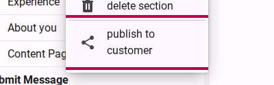
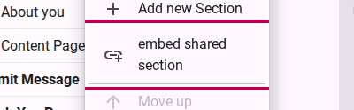
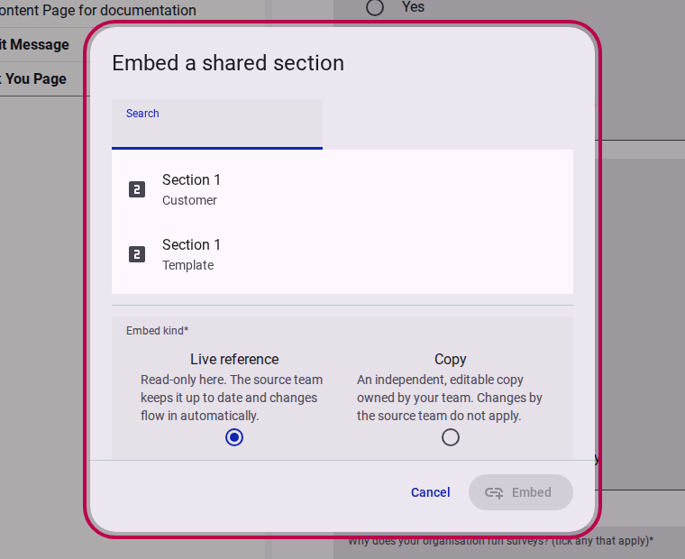
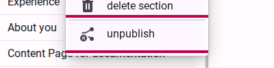

# How to share a section with other teams

When conducting research, you often need to ask the same standardized questions across different surveys—such as demographic details, consent forms, or standardized accessibility and health assessments like the **Washington Group Questions on Disability**.

Instead of rebuilding these sections from scratch—and re-recording Sign Language videos, creating Easy Read illustrations, and managing multiple translations each time—you can publish a section to your organization's **Section Library**. Other teams can then embed the section directly into their own surveys.

This provides two major advantages:

1. **Longitudinal and cross-survey comparison:** Data collected with identical question definitions and structure can be reliably aggregated and compared over time.
2. **Reduced respondent fatigue:** With respondent-level keying (`user`), respondents answer standardized sections once, and their answers automatically pre-fill subsequent surveys across your organization.

::: info
Sharing sections is an **Advanced Mode** feature. Enable the **Advanced Mode** toggle in the survey builder toolbar to access all sharing settings.
:::

## Step 1: Publish a section to your organization

1. In the **Compose** view, locate the section you want to share in the survey tree view.
2. Right-click on the section to open the context menu.
3. Select **Publish to customer**.

<figure><figcaption>Right-click the section and select 'publish to customer' from the context menu.</figcaption></figure>

1. An informative confirmation dialog will appear explaining how publishing works. Click **Publish** to confirm.

<figure><figcaption>Review the publishing scope and click 'Publish'.</figcaption></figure>

1. Once published, select the section and enable **Advanced Mode** to view the **Sharing** section in the settings panel. Here you can configure:
   - **Response Keying:** Choose `Per respondent` (answers store once and pre-fill across surveys) or `Per survey attempt (default)` (answers store per attempt).
   - **Prefill Mode:** Select how respondents meet pre-filled answers: `Quiet (default)` (filled in place with a banner), `Review` (collapsed summary card), or `Interstitial` (keep or update step).
   - **Freeze:** Toggle on to lock the section against accidental changes across your team and translations.

<figure><figcaption>The Sharing settings panel displaying the published status, response keying, prefill mode, and freeze controls.</figcaption></figure>

---

## Step 2: Browse the Section Library & embed a section

To use a shared section in another survey or form:

### Option A: Drag from the Section Library

1. In the survey editor toolbar, click **Add Content Mode**.
2. In the right-hand panel, browse the **Section Library** using the tabs:
   - **My team:** Sections created within your team.
   - **Customer:** Sections published by any team in your organization.
   - **Templates:** Standardized platform-wide templates.
3. Drag the desired section directly onto your form page canvas.

<figure><figcaption>Browse available sections across Team, Customer, and Template scopes in the Section Library.</figcaption></figure>

### Option B: Embed via the Page context menu

1. Right-click the **Page** where you want to insert the shared section.
2. Select **Embed shared section** from the context menu.

<figure><figcaption>Right-click a Page and select 'embed shared section'.</figcaption></figure>

1. In the dialog, browse or search for the section you want to embed and click on it.

<figure><figcaption>Search and select the shared section you wish to embed.</figcaption></figure>

---

## Step 3: Choose between a Live Reference or a Copy

When embedding a section, you can select how you want it to behave:

- **Live reference:** Creates a read-only link to the source section. Any updates made by the source team (such as improved wording, added language translations, or updated Sign Language videos) automatically flow into your survey.
- **Copy:** Creates an independent duplicate in your form with its own questions and translations. You can edit and modify it freely without affecting the original section.

<figure><figcaption>Select whether to embed as a synchronized Live reference or an independent Copy.</figcaption></figure>

::: tip
Customer-published sections default to **Live reference** to maintain synchronization, while Global Templates default to **Copy**. You can override the default choice for any embed.
:::

Click **Embed section** to add the section to your form.

---

## Step 4: Manage Live References

When a section is embedded as a **Live reference**:

- It is displayed with a `link` icon in the grid tree view to indicate it is linked to an external source.
- It is read-only in the design canvas—the source team maintains the content.
- If you no longer need the live reference, right-click the section and select **Remove embed**. Removing an embed disconnects it from your form without affecting the original section.

::: info Safe Deletion
If the source team ever deletes a published section that your survey references, Accessible Surveys automatically converts your live reference into an independent copy beforehand so your survey never breaks.
:::

---

## Step 5: Unpublish a section

If your team no longer wants a section to appear in the library for new embeds:

1. Right-click the published section in your tree view.
2. Select **Unpublish** from the context menu (or click **Unpublish** in the section's Sharing settings).

<figure><figcaption>Right-click the published section and select 'unpublish'.</figcaption></figure>

1. An explanation dialog confirms that unpublishing will remove the section from the library while keeping all existing live reference embeds functional.
2. Click **Unpublish** to confirm.

<figure><figcaption>Confirm unpublishing in the dialog.</figcaption></figure>

The section is now private to your team again. You can re-publish it at any time.

---

## Related Content

- [Understanding Section Sharing & Reusability](../explanation/understanding-section-sharing.md)
- [How to add content to a form](./adding-content-to-a-form.md)
- [How to share options across multiple questions](./sharing-options.md)
- [How to share logical expressions across multiple items](./sharing-logical-expressions.md)
- [How to publish and distribute a survey](./publishing-a-survey.md)
- [How to use Sign Language](./use-sign-language.md)
- [How to use Easy Read](./use-easy-read.md)
