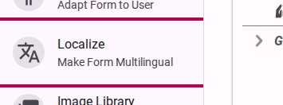
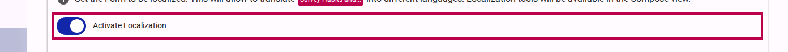
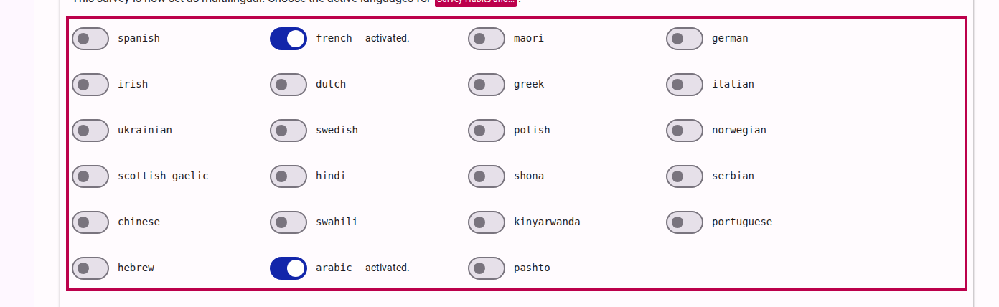
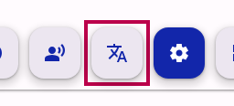
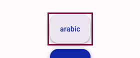
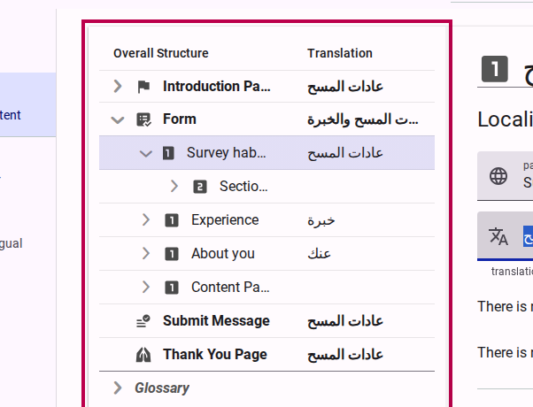
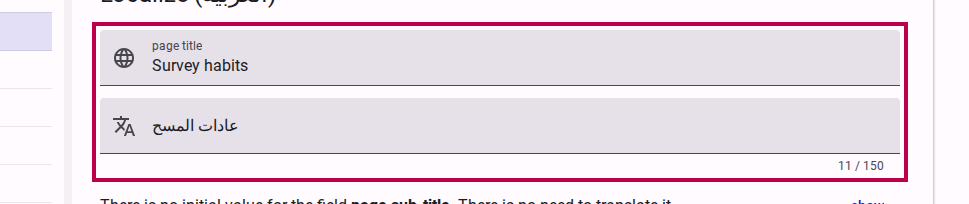
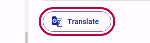
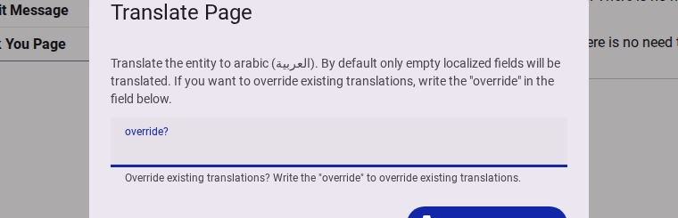

# Localizing a Survey

Accessible Surveys makes it easy to offer your survey in multiple languages. You can manually translate content, use bulk import/export for external translation, or leverage our AI-powered translation tool.

Unlike basic translation features that process questions individually and often lose context, our AI translator evaluates the survey holistically. By seeing the form in its entirety, it ensures consistency in tone and accurate contextual translation across all pages, questions, and options.

## Step 1: Activate Localization

To begin translating your survey, you must first enable localization and select your target languages.

1. Navigate to the **Make Form Multilingual** section in the sidebar.
2. Click to **Activate Localization**.
3. Select the target languages you wish to offer (e.g., Spanish, French, Arabic).

<figure>
  
  <figcaption>Navigate to the Make Form Multilingual section.</figcaption>
</figure>

<figure>
  
  <figcaption>Activate the localization feature.</figcaption>
</figure>

<figure>
  
  <figcaption>Select the languages you want to activate for the survey.</figcaption>
</figure>

## Step 2: Translating Content

Once languages are activated, return to the **Build, organize Content** view.

1. Click the **Localize Mode** button in the top toolbar to switch the editor into translation mode.
2. Select your target active language (e.g., Arabic) from the dropdown.

<figure>
  
  <figcaption>Switch to Localize Mode in the survey builder.</figcaption>
</figure>

<figure>
  
  <figcaption>Select the language you want to translate or review.</figcaption>
</figure>

When Localize Mode is active, the survey tree grid will display the original text alongside the translation for each activated language. This allows you to easily compare and edit translations inline.

<figure>
  
  <figcaption>The tree grid displays side-by-side text for easy comparison.</figcaption>
</figure>

### Option 1: Manual Translation

You can manually edit the text for each question or element directly. Simply click into the translation fields and provide the text for the active language.

<figure>
  
  <figcaption>Editing a specific translation field manually.</figcaption>
</figure>

### Option 2: AI-Powered Automatic Translation

Instead of translating line-by-line, you can use the AI translator. As mentioned, this tool analyzes the entire structure and context of your survey to provide highly accurate, contextual translations.

1. Click the **Translate** button in the toolbar.
2. A confirmation dialog will appear. You will need to confirm whether you want to translate only empty fields or if you want to override existing translations. Type override if you wish to replace everything.
3. Click **start translation**.

<figure>
  
  <figcaption>Click Translate to launch the AI translation tool.</figcaption>
</figure>

<figure>
  
  <figcaption>Confirm translation scope (empty fields vs override).</figcaption>
</figure>

<figure>
  
  <figcaption>Start the translation process.</figcaption>
</figure>

## Step 3: Review and Edit

After running the AI translation, it is important to review the results. While the holistic approach ensures high quality, nuance in language may still require manual adjustment.

1. Browse the survey tree to verify the translated text.
2. If necessary, edit specific fields directly in the tree grid.
3. You can also render the survey in **Test mode** and switch the active language to review the translation exactly as respondents will see it.
