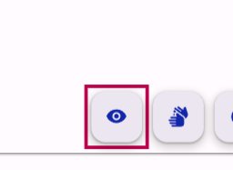
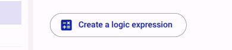
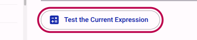
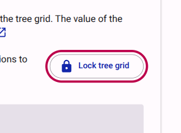
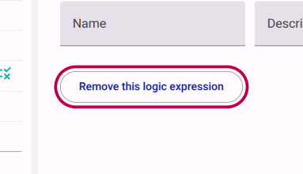

# How to use form logic

Adding logic to a form enables you to customize how your form behaves when respondents are filling it in. This guide shows you how to write, apply, and test logical expressions.

## What is a logical expression?

Logical expressions are mathematical expressions that return a result of either "True" or "False". A defined action is then applied depending on the result.

- For **Pages and Sections**, form logic is used to control whether they are visible or hidden.
- For **Questions**, 'required', 'invalid', and 'read-only' attributes can also be applied in addition to the 'hidden' attribute.

## Step-by-step: Writing a logical expression

Follow these steps to add logic to your form (e.g., hiding a follow-up question if the answer to a previous question is 'No').

### Step 1: Activate the visibility mode

In the Compose view, activate the relevant logic mode for your needs. For this example, we will use Visibility Mode to hide a question.

<figure>
  
  <figcaption>Click the 'Visibility Mode' button in the toolbar.</figcaption>
</figure>

### Step 2: Select the item

In the tree grid on the left, click on the specific item (Page, Section, or Question) that you want to apply the logic to.

### Step 3: Create the logical expression

Click the button to create a new logic expression for the selected item.

<figure>
  
  <figcaption>Click 'Create hidden logic' to begin writing your expression.</figcaption>
</figure>

### Step 4: Lock the tree grid

To avoid accidentally clicking on other items while dragging and dropping elements, lock the tree grid.

<figure>
  
  <figcaption>Click 'Lock tree grid' to secure your current selection.</figcaption>
</figure>

> [!IMPORTANT]
> Always select the option to lock the grid while editing logic to prevent losing your work.

### Step 5: Write the expression

Write the logic expression by dragging and dropping the different elements (e.g., a previous question and its answer options) from the tree grid into the expression field. You will see the expression being built in real-time.

- For example, drag the question 'Do you like fruit?' and the answer 'No'.
- Enter an equals sign (`==`) to set up the mathematical expression (i.e., `Do you like fruit? == No`).
- If the respondent answers 'No', the expression evaluates to 'True' and the item is hidden.

<figure>
  
  <figcaption>Drag and drop elements to build your logical expression.</figcaption>
</figure>

### Step 6: Test the logical expression

It is important to test your expression to ensure it gives the desired outcome. Click the 'Test the Current Expression' button. This will bring up a mock view of the questions referenced in your logic.

<figure>
  
  <figcaption>Click 'Test the Current Expression' to verify your logic.</figcaption>
</figure>

### Step 7: Finish and unlock

Once you are satisfied, unlock the grid so you can continue editing other parts of the form. If you made a mistake, you can remove the expression entirely.

<figure>
  
  <figcaption>Unlock the grid when finished.</figcaption>
</figure>

<figure>
  
  <figcaption>Use the 'Remove this logic expression' button to delete the logic if it is no longer needed.</figcaption>
</figure>

## Available Logic Operators

A wide range of logic options are available. The most commonly used are:

| Operator | Symbol |
| :--- | :--- |
| Equal | `==` |
| Not equal | `!=` |
| Greater than | `>` |
| Greater than or equal | `>=` |
| Less than | `<` |
| Less than or equal | `<=` |
| Element in array or string | `in` |
| Logical AND | `&&` |
| Logical OR | `\|\|` |
| Negate | `!` |

## Tips for applying form logic

- **Apply logic to the highest possible level:** If you have multiple questions that should follow the same logic, place them in a Section and apply the logic to the Section rather than each individual question.
- **Invert complex expressions:** When writing complex logic, it is sometimes easier to create an expression that evaluates to 'True' and then invert it using `!(expression)`.
- **Lock the grid:** Always lock the question while editing logic and unlock it when you are finished.

## Related Content

- [Understanding Form Logic](../explanation/understanding-form-logic.md)
- [Advanced Logic](../reference/content/logic-expression/index.md)
- [Understanding Survey Hierarchy](../explanation/understanding-survey-hierarchy.md)
