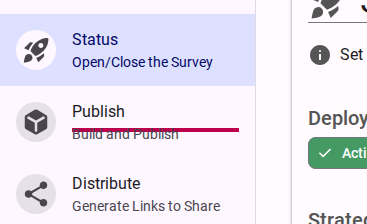
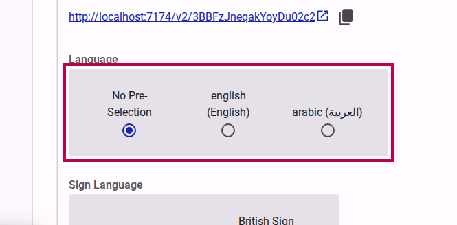
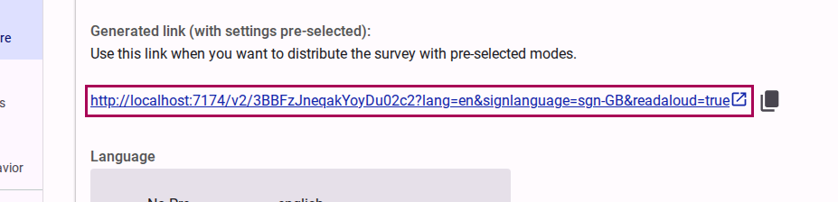

# Publishing a survey

::: info
A survey must be 'Published' and active before it can collect responses. If your form has changed, a new version must be built and published before the changes are seen by respondents.
:::

## Context

Respondents will access your survey using links. The **Link Builder** generates these links for you and provides extensive control over the respondent experience.

::: tip
Your survey links remain the same whenever a new version of the survey is published, so you never need to worry about updating shared links.
:::

## Step 1: Choose a Publishing Strategy

Before distributing the survey, you can set the strategy for making the survey active (e.g., immediate, manual, or scheduled). This determines when the survey becomes available to respondents.

<figure><figcaption>Select the strategy for making the survey active.</figcaption></figure>

## Step 2: Build a New Version

Before sharing, you must build a version of the form to ensure all recent changes are compiled and ready for production.

1. Navigate to the **Publish** tab.
   <figure><figcaption>Click on the Publish link.</figcaption></figure>

2. Click on the **Create a new Version of the...** button.
   <figure><figcaption>Click the Create a new Version button.</figcaption></figure>

3. You will be prompted to give the version a label (e.g., "A new version to share"). This helps you differentiate between different builds of the survey. Click to build the survey.
   <figure><figcaption>Provide a versioning message and confirm the build.</figcaption></figure>

## Step 3: Use the Link Builder

Once the survey is built, navigate to the **Distribute** section to access the Link Builder. This tool gives you granular control over the type of link you generate.

<lite-youtube videoid="6PJiKt2hE9Y"></lite-youtube>

### Test vs. Production Modes

- **Test Mode**: Generates a link used to preview the survey. Respondents' answers are **not** saved to the database. You can optionally skip the landing page while testing.
- **Production Mode**: Generates the link you share to collect real responses. Answers are saved to the database automatically.

### Advanced Survey Options

- **Survey Name**: You can use the default system ID in your link or opt for a readable "alias" (see the guide on *Creating alias survey links* for more details).
- **Force Latest Version**: Available in Production mode, this option forces respondents to use the newly published version of the survey, even if they have already started answering a previous version. By default, respondents stay on the version they started with.

<figure><figcaption>Click the Display Link for Production button to get the real URL.</figcaption></figure>

## Step 4: Preselect Options (Optional)

When generating the link, you have the option to preconfigure certain settings so the respondent gets a tailored experience immediately upon opening the link. These options include:

- **Select a language:**
  <figure><figcaption>Preselect the default language for the survey link.</figcaption></figure>

- **Select a sign language:**
  <figure><figcaption>Preselect the default sign language.</figcaption></figure>

- **Select accessibility modes:**
  <figure><figcaption>Preselect specific accessibility modes like Read Aloud or Easy Read.</figcaption></figure>

## Step 5: Copy the Link to Share

Once you have configured the desired options (Test/Production, options, and accessibility pre-selections), copy the generated link and distribute it to your audience. You can share it via your website, email, or social media.

<figure><figcaption>Copy the final production link and share it.</figcaption></figure>

::: warning Link Shorteners
If you are using a link shortener to share your survey, be aware that some services do not handle URL parameters properly. Because features like language selection and accessibility modes rely on these parameters, always test your shortened link to ensure the survey loads correctly and your intended settings are preserved.
:::
