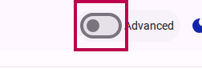
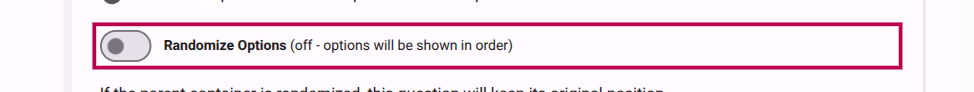
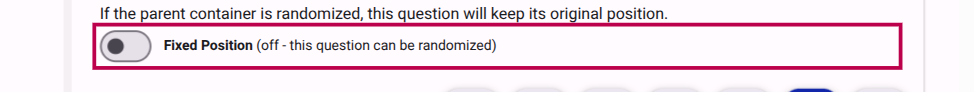

# How to randomize survey items

Order bias occurs when the order in which items are presented influences how respondents answer. Randomizing the order of options, questions, or sections helps mitigate this bias.

In Accessible Surveys, randomization is **stable** for each respondent: once an order is determined for a user (based on their unique ID), it remains the same throughout their session.

::: info
Randomization is only active in **built forms**. It will not be visible when testing the form in the design/compose mode.
:::

## Steps to randomize items

### 1. Activate Advanced Mode

Randomization settings are considered advanced features. To see them, you must first toggle **Advanced Mode** on.

<figure><figcaption>Activate Advanced Mode in the builder toolbar.</figcaption></figure>

### 2. Enable Randomization on a Container

Randomization is set on the "container" item (the parent).

- To randomize **options**, enable it on the **Question**.
- To randomize **questions**, enable it on the **Section**.
- To randomize **sections**, enable it on the **Page**.
- To randomize **pages**, enable it on the **Form**.

Select the container item and toggle the **Randomize** switch.

<figure><figcaption>Toggle "Randomize Options" on a Question to shuffle its choices.</figcaption></figure>

### 3. (Optional) Fix specific items in place

Sometimes you want certain items to remain in their original position, such as a "None of the above" option at the end of a list, or an introductory text at the start of a section.

Select the item you want to pin and toggle the **Fixed Position** switch.

<figure><figcaption>Enable "Fixed Position" to exclude an item from randomization.</figcaption></figure>

## Related Content

- [Understanding Randomization](../explanation/understanding-randomization.md)
