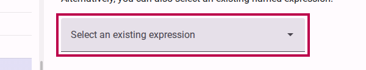

# Sharing Logical Expressions

When you build complex surveys, you may find yourself using the same visibility rules or logical conditions for multiple questions or sections. Instead of rebuilding the same logic each time, you can name a logical expression to make it "shared", allowing you to easily reuse it elsewhere in your form.

## Step 1: Create and Name a Logical Expression

First, navigate to an item that already has the logical expression you want to share.

1. Select the item (e.g., a question) in the Compose view.
2. Activate **Visibility Mode** by clicking the Visibility Mode button in the toolbar.
3. In the logic editor, provide a **Name** for your expression. This action automatically makes the expression available to other items.

<figure><figcaption>Set a name to share your logical expression.</figcaption></figure>

You can also optionally provide a description to help you and your team understand the purpose of this logic later.

<figure><figcaption>Add a description for more clarity.</figcaption></figure>

## Step 2: Reuse the Logical Expression

Now that your logic is shared, you can apply it to any other item.

1. Select the item where you want to apply the same logic.
2. Ensure **Visibility Mode** is active.
3. Instead of creating new logic, click on the **Select an existing expression** dropdown menu.
4. Choose the named expression you created in Step 1.

<figure><figcaption>Select the shared expression from the dropdown to apply it to the new item.</figcaption></figure>

> [!TIP]
> Changes made to a shared expression will affect all items that use it. This makes it very efficient to update your survey logic from a single place.
