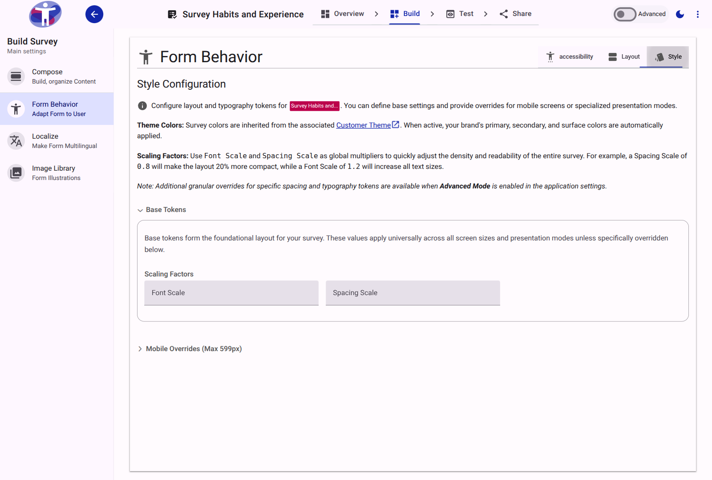

# How to configure survey styles

Accessible Surveys allows you to fine-tune the layout and typography of your surveys without writing code. While core theme colors are inherited automatically from your organization's Customer Theme, you have full control over spacing, padding, margins, and font sizes directly within the survey builder.

This guide explains how to use the Style Configuration tab to set base styles and responsive overrides.

## Accessing the Style Configuration

1. In the survey builder, navigate to the **Behavior** section from the left-hand menu.
2. Select the **Style** tab at the top of the content area.

<figure>
  
  <figcaption>The Style Configuration tab allows you to configure layout and typography tokens.</figcaption>
</figure>

## Understanding Tokens and Units

The styling engine uses "tokens"—standardized variables that apply consistently across your survey. 

> [!NOTE]
> If you leave a token field empty, the system will automatically fall back to its default value (which is displayed faintly in the placeholder text of the input field).

### Layout & Spacing Tokens
Tokens for Page, Section, and Field spacing (such as Padding Inline or Margin Block) accept standard CSS units. You can use:
* px (Pixels - e.g., 24px)
* rem or em (Relative to font size - e.g., 1.5rem)
* % (Percentages - e.g., 100%)

### Typography Tokens
Font size tokens (such as Input Font Size or Label Font Size) are strictly used to adjust the scale of text elements. 

> [!IMPORTANT]
> To ensure consistent accessibility and reliable zooming for visually impaired respondents, **font size tokens must use rem units** (e.g., 1.2rem, 0.875rem). Pixels are not permitted for these fields.

## Configuring Overrides

The Style Configuration is divided into three collapsible panels, allowing you to define a cascading hierarchy of styles.

<figure>
  
  <figcaption>Expand the panels to configure Base Tokens and specific overrides.</figcaption>
</figure>

### 1. Base Tokens
Start by configuring your **Base Tokens**. These values form the foundational layout for your survey. 

Settings defined here apply universally across all screen sizes and all presentation modes, unless you specifically override them in the panels below.

### 2. Mobile Overrides (Max 599px)
Surveys are frequently taken on mobile phones. What looks like good padding on a desktop monitor might feel cramped on a small screen.

Open this panel to provide mobile-specific values. Any value entered here will automatically override the Base Token whenever the respondent's screen is 599px wide or smaller. 

> [!TIP]
> You only need to define the tokens you want to change. For example, if you only want to reduce the Page Padding Inline for mobile phones, fill in that specific field and leave the rest blank.

### 3. One Question At A Time Overrides
If your survey's Presentation Mode is set to "One question at a time" (configured in the Layout tab), you might want a specialized, distraction-free design.

Tokens defined in this panel apply *only* when this presentation mode is active. This is highly useful for removing heavy section margins or centralizing content specifically for single-question flows.

## Tracking Configured Tokens

To help you manage complex styling setups at a glance, the summary header of each panel will automatically display a badge indicating how many custom tokens have been configured within it.
