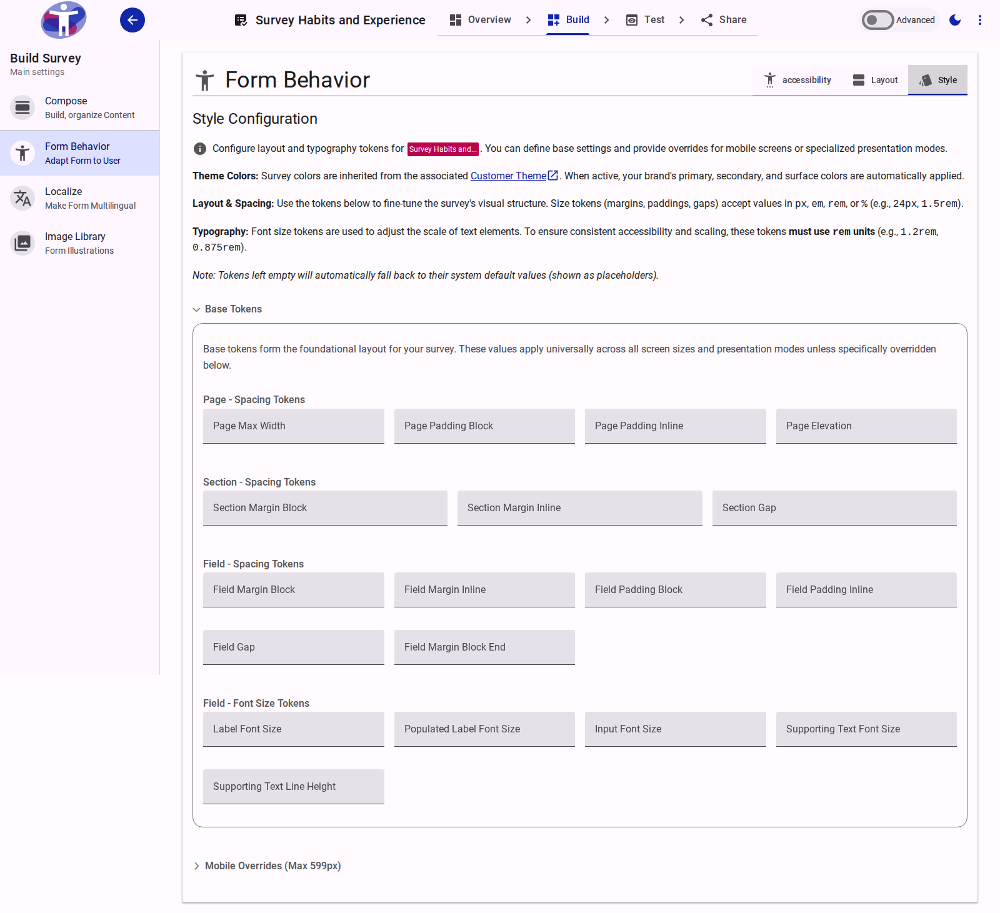

# How to configure survey styles

Accessible Surveys lets you customize the scale, layout, and typography of your surveys without writing code. Core theme colors are inherited automatically from your organization's Customer Theme, and the survey's **Base Font Size** and **Spacing Scale** also inherit from it by default. You can override both per survey and, in Advanced Mode, fine-tune individual tokens.

This guide explains how to use the Style Configuration tab to set the master scale settings and responsive overrides.

## Accessing the Style Configuration

1. In the survey builder, navigate to the **Behavior** section from the left-hand menu.
2. Select the **Style** tab at the top of the content area.

<figure>
  
  <figcaption>The Style Configuration tab allows you to configure the scale and typography of your survey.</figcaption>
</figure>

## The master scale settings

One setting rules all. At the top of the Style tab, two cards control the overall scale of your survey:

<figure>
  
  <figcaption>The Base Font Size and Spacing Scale cards are always visible.</figcaption>
</figure>

### Base Font Size

The **Base Font Size** controls all typography in the survey — headings, question labels, input text, and supporting text all derive from this single value.

* Use the slider (or the Small/Normal/Large/X-Large presets) to adjust the size.
* The live preview shows how question labels, inputs, and supporting text will look.
* The value is expressed in `rem` units, so it scales reliably with respondents' accessibility settings.

### Spacing Scale

The **Spacing Scale** is a multiplier applied to all spacing in the survey — margins, paddings, and gaps. It does not affect the page width or elevation.

* Use the slider (or the Compact/Default/Roomy presets) to make the layout denser or roomier.
* The live preview shows how the gap between questions changes.

> [!NOTE]
> If you leave a master setting at its default, the survey inherits the value from your [Customer Theme](../../customer/reference/customer/theme.md). Values you set here override the theme for this survey only.

## Fine-tuning individual tokens (Advanced Mode)

When **Advanced Mode** is enabled, a fourth collapsible section of individual tokens appears below the master cards. Tokens are organized into groups:

### 1. Base Tokens
Start by configuring your **Base Tokens**. These values form the foundational layout for your survey.

Settings defined here apply universally across all screen sizes and all presentation modes, unless you specifically override them in the groups below.

### 2. Mobile Overrides
Surveys are frequently taken on mobile phones. What looks like good padding on a desktop monitor might feel cramped on a small screen.

Open this group to provide mobile-specific values. Any value entered here will automatically override the Base Token whenever the respondent's screen is narrow.

> [!TIP]
> You only need to define the tokens you want to change. For example, if you only want to reduce the Page Padding Inline for mobile phones, fill in that specific field and leave the rest blank.

### 3. One Question At A Time Overrides
If your survey's Presentation Mode is set to "One question at a time" (configured in the Layout tab), you might want a specialized, distraction-free design.

Tokens defined in this group apply *only* when this presentation mode is active. When both apply, One Question At A Time overrides win over Mobile overrides.

### 4. Easy Read Overrides
If Easy Read mode is activated for the form (see [How to use Easy Read](./use-easy-read.md)), this group applies only when Easy Read is active, and it is the highest-priority group. Its Base Font Size defaults to a larger, easy-read-friendly value.

## Understanding Tokens and Units

### Layout & Spacing Tokens
Tokens for Page, Section, and Field spacing (such as Padding Inline or Margin Block) accept standard CSS units. You can use:

* px (Pixels - e.g., 24px)
* rem or em (Relative to font size - e.g., 1.5rem)
* % (Percentages - e.g., 100%)

For a deeper understanding of how these units work and which to choose, read our [Explanation of CSS Units](../explanation/understanding-css-units.md).

### Typography Tokens
Font size tokens (such as Input Font Size or Label Font Size) are strictly used to adjust the scale of text elements.

> [!IMPORTANT]
> To ensure consistent accessibility and reliable zooming for visually impaired respondents, **font size tokens must use rem units** (e.g., 1.2rem, 0.875rem). Pixels are not permitted for these fields.

## Tracking Configured Tokens

To help you manage complex styling setups at a glance, the summary header of each group will automatically display a badge indicating how many custom tokens have been configured within it.
