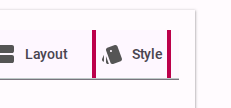
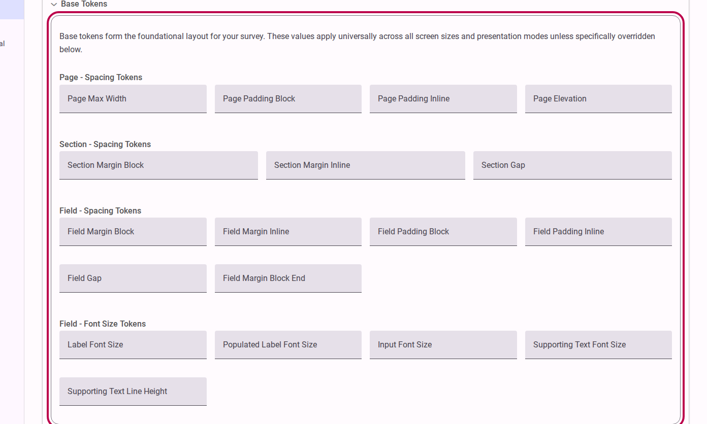

# Styling a Survey

Accessible Surveys provides a robust styling engine that allows you to customize the look and feel of your survey to match your brand while maintaining strict accessibility standards. 

Because respondents can switch between high-contrast, dark, and light modes via the accessibility menu, the styling tools are designed to adapt automatically. This ensures your survey remains beautiful and legible regardless of the active accessibility mode.

## Step 1: Navigate to the Style Tab

To access the styling options, you need to open the survey builder's **Behavior** section.

1. Go to the **Behavior** view in the sidebar.
2. Click the **Style** tab at the top of the interface.

<figure>
  
  <figcaption>Click the Style tab to access the visual customization tools.</figcaption>
</figure>

## Step 2: Configure Styling Options

The styling panel gives you access to various customization parameters. 

1. Expand the styling sections to access the configuration tools.
2. Adjust the settings to match your desired aesthetic.

<figure>
  
  <figcaption>Expand the styling sections to customize colors, fonts, and layout.</figcaption>
</figure>

### Available Styling Controls
While exact options may vary based on your plan, you typically have control over:
*   **Primary Colors**: Set the main brand color used for buttons, active states, and highlights.
*   **Typography**: Choose a base font family that is legible and web-safe.
*   **Layout Elements**: Control spacing, borders, and general alignment.

::: tip
**Accessibility First**
When you select a primary color, the platform automatically calculates appropriate contrast ratios for text and backgrounds to ensure compliance with WCAG standards. This means your survey will remain accessible even if respondents switch to dark or high-contrast themes.
:::

## Step 3: Responsive Overrides (Optional)

You can also provide specific styling overrides based on how the respondent interacts with the survey. 

For example, you can adjust padding or layout styles specifically for **small screens** (mobile devices), or define how the layout behaves when the survey is set to display **one question per page**. These overrides ensure the user experience is optimized for every context.

## How Theming Works

By default, the styles applied to a survey inherit their baseline properties from your overarching **Customer Theme**. When you adjust styling options here in the survey builder, you are defining survey-specific overrides that take precedence over the customer-wide settings. This hierarchical approach ensures brand consistency by default, while still giving you the flexibility to customize individual surveys as needed.

## Previewing Your Styles

Always switch to the **Test** view to see how your styles look in a real environment. We strongly recommend using the Test view's accessibility menu to preview your survey in Dark Mode and High Contrast Mode to ensure your styling choices work well across all themes.

## References

For more detailed technical information on how styling properties are managed and applied behind the scenes, please refer to:
- [Reference: Behavior Settings](../reference/build/behavior.md)
- [Reference: Customer Theme](../../customer/reference/customer/theme.md)
- [Explanation: Understanding CSS Variables](../explanation/understanding-css-variables.md)
