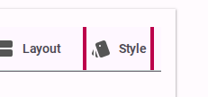
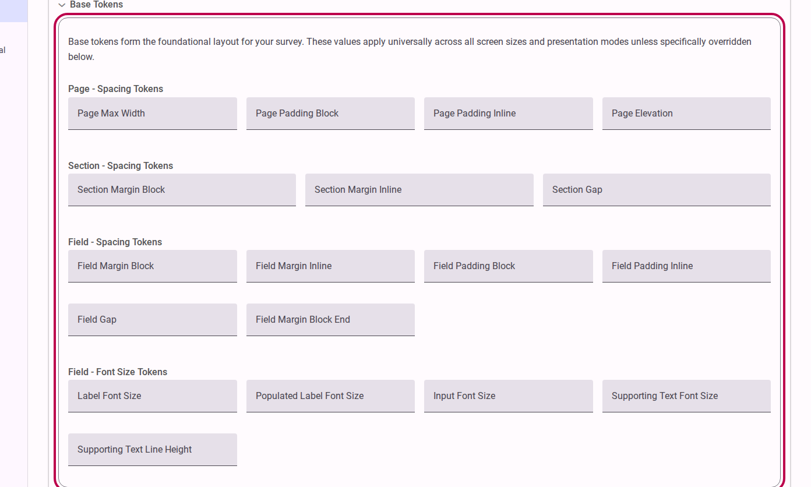

# Styling a Survey

Accessible Surveys provides a robust styling engine that allows you to customize the look and feel of your survey to match your brand while maintaining strict accessibility standards.

Because respondents can switch between high-contrast, dark, and light modes via the accessibility menu, the styling tools are designed to adapt automatically. This ensures your survey remains beautiful and legible regardless of the active accessibility mode.

## Step 1: Navigate to the Style Tab

To access the styling options, you need to open the survey builder's **Behavior** section.

1. Go to the **Behavior** view in the sidebar.
2. Click the **Style** tab at the top of the interface.

<figure>
  
  <figcaption>Click the Style tab to access the visual customization tools.</figcaption>
</figure>

## Step 2: Configure the Master Scale Settings

::: tip
**Design Standards**
Default styling tokens respect **Material Design 3** specifications. If you choose to deviate from these defaults, ensure you test your design across multiple screen sizes (mobile, tablet, desktop) to maintain a high-quality respondent experience.
:::

The most efficient way to adjust your survey's density and readability is through the two **master scale settings**, shown as cards at the top of the Style tab:

1. **Base Font Size** (Default: `1rem`): Controls all typography — headings, question labels, input text, and supporting text all scale from this single value. Use the slider or the Small/Normal/Large/X-Large presets.
2. **Spacing Scale** (Default: `1`): A multiplier for all spacing (margins, paddings, gaps). Lower values (e.g., `0.75`) create a more compact design, while higher values (e.g., `1.25`) add more white space. Use the slider or the Compact/Default/Roomy presets.

Both cards show a live preview of the effect. Leave a master at its default to inherit the value from your **Customer Theme**; values you set here apply to this survey only.

<figure>
  
  <figcaption>Use the master scale settings for quick, global adjustments to look and feel.</figcaption>
</figure>

## Step 3: Advanced Styling (Optional)

For more granular control, you can enable **Advanced Mode** in the application settings. This reveals individual tokens for:

* **Margins and Paddings**: Fine-tune spacing at the page, section, and field levels.
* **Typography Details**: Set specific font sizes for labels, inputs, and options.

Size tokens accept values in `px`, `em`, `rem`, or `%`. However, typography tokens **must use `rem` units** to ensure they scale correctly with accessibility settings.

::: tip
**Accessibility First**
When you select a primary color, the platform automatically calculates appropriate contrast ratios for text and backgrounds to ensure compliance with WCAG standards. This means your survey will remain accessible even if respondents switch to dark or high-contrast themes.
:::

## Responsive Overrides

You can also provide specific styling overrides for different contexts:

* **Mobile Overrides**: Adjust the layout specifically for narrow screens.
* **Easy Read**: Customize the appearance when Easy Read mode is active (highest priority).

One Question At A Time has no override group of its own — the Base Tokens apply in that presentation mode, with a larger default Base Font Size (`1.5rem`).

## How Theming Works

By default, the styles applied to a survey inherit their baseline properties from your overarching **Customer Theme**. When you adjust styling options here in the survey builder, you are defining survey-specific overrides that take precedence over the customer-wide settings. This hierarchical approach ensures brand consistency by default, while still giving you the flexibility to customize individual surveys as needed.

## Previewing Your Styles

Always switch to the **Test** view to see how your styles look in a real environment. We strongly recommend using the Test view's accessibility menu to preview your survey in Dark Mode and High Contrast Mode to ensure your styling choices work well across all themes.

## References

For more detailed technical information on how styling properties are managed and applied behind the scenes, please refer to:

* [Reference: Behavior Settings](../reference/build/behavior.md)
* [Reference: Customer Theme](../../customer/reference/customer/theme.md)
* [Explanation: Understanding CSS Variables](../explanation/understanding-css-variables.md)
