# Testing a form

::: info
The 'Test' feature provides an easy way for you to see how your form will appear to respondents. You can try out any changes and make edits directly from the test page.
:::

## Step 1: Navigate to the Test View

In the form builder, select the **test** option in the top menu. This renders the form as a respondent would see it, in a separate environment that allows you to test accessibility modes without affecting the form being edited.

<figure>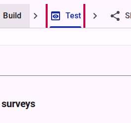<figcaption>Click the test link in the top menu.</figcaption></figure>

The form will open in a new tab, and you can interact with it as if you were a respondent. This allows you to experience the form from the respondent's perspective and identify any issues or areas for improvement:

<figure>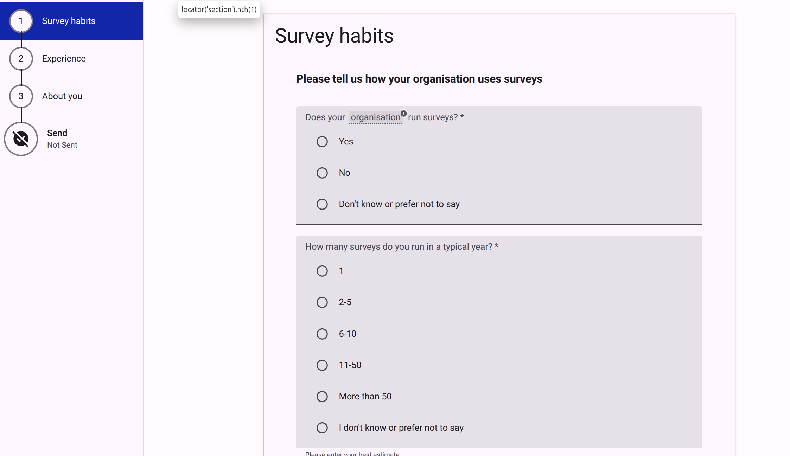<figcaption>Test view of the form, simulating the respondent's experience.</figcaption></figure>

## Step 2: Using the Test Toolbar

While in Test mode, you will see a toolbar that provides several options to simulate different environments and test functionalities:

<figure>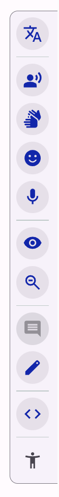<figcaption>Test toolbar with various options to simulate different environments.</figcaption></figure>

| Feature | Description | Screenshot |
|---------|-------------|------------|
| Test the form in different languages | Preview your form in any language you have activated. | 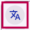 |
| Activate Read Aloud | Test the text-to-speech functionality. | 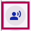 |
| Activate Sign Language | Test the sign language videos. | 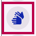 |
| Activate Easyread emulate mode | Preview the simplified interface. |  |
| Activate Voice Recording | Test the audio response inputs. | 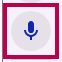 |
| View all items | Display all questions and content regardless of logic conditions. |  |
| Adjust zoom level | See more of the form in a single view. | 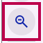 |
| Activate edit mode | Edit the form structure directly from the test view. | 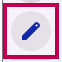 |
| View form data | See how the data being collected is structured in the background. | 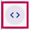 |
| Open accessibility menu | Preview the global accessibility settings available to the respondent. | 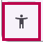 |

## Step 3: Edit the form directly from the Test view

If you notice any issues or want to make changes while testing, you can click on the **edit** icon in the test toolbar. This will take you directly to the form builder where you can make edits.

<figure>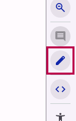<figcaption>Activate Edit mode in the test toolbar to make changes directly from the test view.</figcaption></figure>

<figure>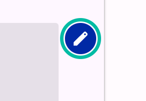<figcaption>Edit a question directly from the test view.</figcaption></figure>

A modal dialog opens to allow you to edit the question:

<figure>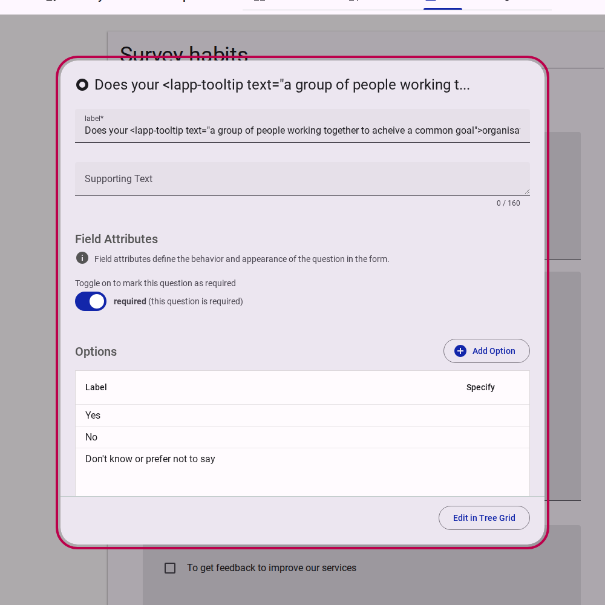<figcaption>Edit question dialog opened directly from the test view.</figcaption></figure>

## Step 4: Build and Publish a Test Version

To share the form with team members for feedback, you must first build and publish a test version.

1. Click on the **share** link.
   <figure>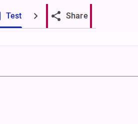<figcaption>Click on the share link.</figcaption></figure>
2. Go to the **Publish** tab.
   <figure><figcaption>Click on the Publish tab.</figcaption></figure>
3. Click on **Create a new Version of the...**.
   <figure>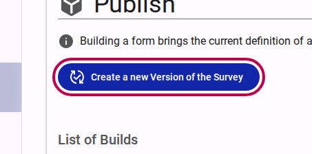<figcaption>Click on Create a new Version.</figcaption></figure>
4. Provide a version message (e.g., "New test version") and build the survey.
   <figure>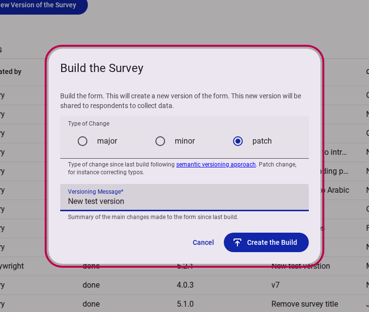<figcaption>Fill out the versioning message and build.</figcaption></figure>

## Step 5: Generate Links for Testing

Once the form is published, you can generate a specific test link to distribute to your team.

1. Navigate to the **Distribute** section.
   <figure>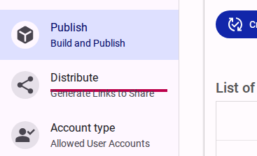<figcaption>Click on the Distribute section.</figcaption></figure>
2. Click on **Display Link for Test**.
   <figure>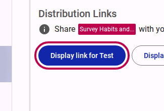<figcaption>Click on Display Link for Test.</figcaption></figure>
3. Copy the displayed test link and share it with your team members.
   <figure>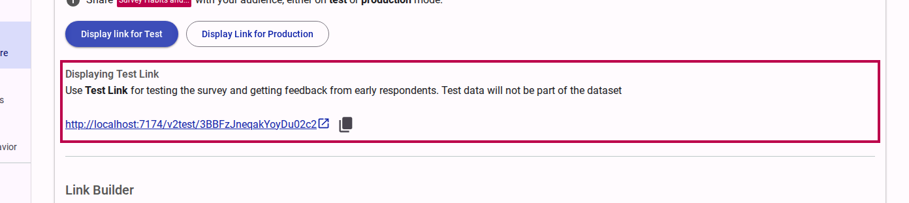<figcaption>Copy the displayed test link.</figcaption></figure>
