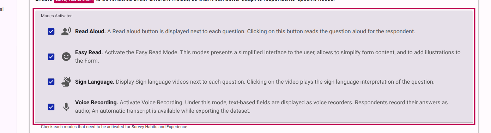
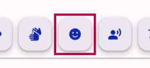
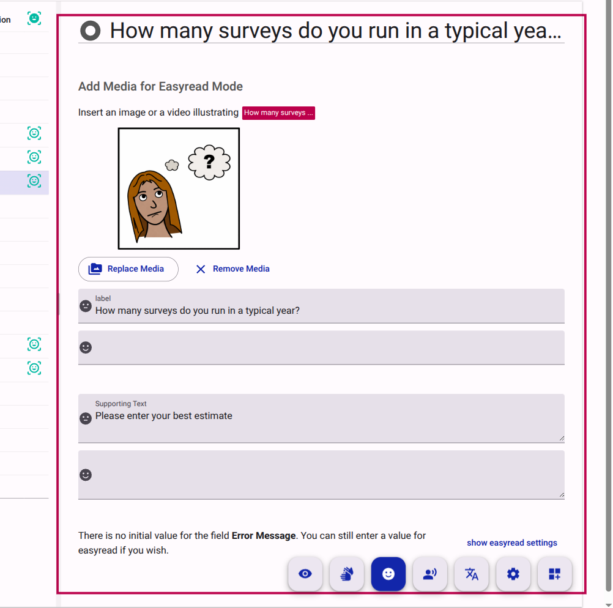
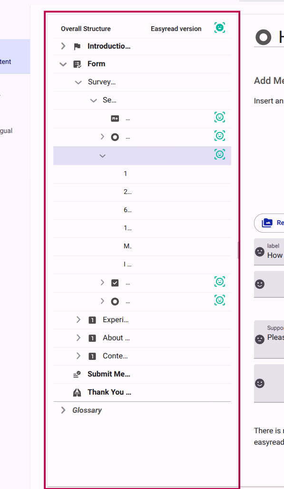
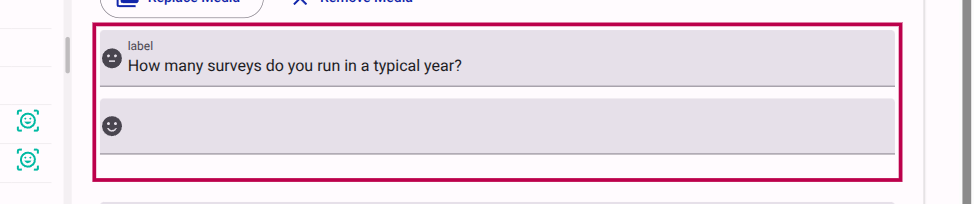
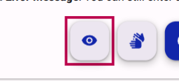
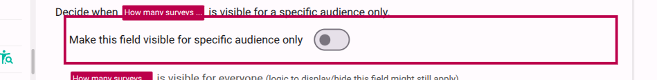

# Using Easy Read

Easy Read is a specialized accessibility mode designed to make information easier to understand for people with intellectual or cognitive disabilities. It focuses on simplified text (Plain Language) and visual aids (images or videos) to complement the content.

## Prerequisites: Enable Easy Read Mode

Before you can add Easy Read content, you must ensure that the **Easy Read** mode is activated for your survey.

1. Navigate to the **Behavior** settings of your survey.
2. In the **Modes Activated** list, ensure that **Easy Read** is selected.

<figure><figcaption>Activating Easy Read mode in the survey settings.</figcaption></figure>

## Step 1: Activate Easy Read Editing Mode

To start editing the Easy Read version of your survey, you need to switch to the Easy Read editing mode in the survey builder.

1. In the survey builder top bar, click the **Easy Read Mode** button (represented by a specialized icon).
2. The interface will adapt to show Easy Read specific editing fields alongside the standard content.

<figure><figcaption>Switching to Easy Read mode in the editor.</figcaption></figure>

## Step 2: Adding Visual Aids (Media)

Easy Read relies heavily on visual support. You can add specific images or videos that will only appear when the respondent is using Easy Read mode.

1. Select a question or page in the structure tree.
2. Look for the **Add Media for Easyread Mode** section in the editor.
3. Upload an image or provide a YouTube link.

<figure><figcaption>Adding visual aids specifically for the Easy Read version.</figcaption></figure>

## Step 3: Identifying Easy Read Content

You can easily identify which items in your survey have Easy Read specific content by looking at the structure tree.

Items with Easy Read visual aids or simplified text are marked with a specific icon in the tree view.

<figure><figcaption>The Easy Read icon indicates items with specialized content.</figcaption></figure>

## Step 4: Simplified Text (Optional)

While it is best practice to use plain language for all survey content, you can provide an even simpler version of labels and questions specifically for Easy Read mode.

1. With Easy Read mode active, edit the labels marked as **easyread version**.
2. These changes will only affect the Easy Read presentation.

<figure><figcaption>Providing simplified text for Easy Read mode.</figcaption></figure>

## Step 5: Conditional Visibility (Advanced)

Sometimes you may want to show or hide specific fields or sections only when the respondent is in Easy Read mode.

1. Activate the **Visibility Mode** using the button in the top bar.
2. Toggle on **Advanced** mode if it's not already active.
3. In the visibility settings for a field, you can select which modes the field should be visible for.

<figure><figcaption>Enabling Visibility Mode to manage conditional display.</figcaption></figure>

<figure><figcaption>Advanced mode provides granular control over visibility settings.</figcaption></figure>

4. Select **Easy Read** in the "Make this field visible for" list to ensure it only shows in that mode (or unselect it to hide it).

<figure><figcaption>Configuring a field to be visible only in Easy Read mode.</figcaption></figure>

::: info
Using conditional visibility allows you to create a shorter or more streamlined version of your survey for Easy Read users without affecting the standard experience.
:::

## Best Practices for Easy Read

- **Use Plain Language:** Avoid jargon, metaphors, and complex sentence structures.
- **One Idea per Sentence:** Keep it simple and direct.
- **Consistent Visuals:** Use images that clearly illustrate the concept being discussed.
- **Test with Users:** If possible, test your Easy Read version with people who have cognitive disabilities to ensure it is effective.
