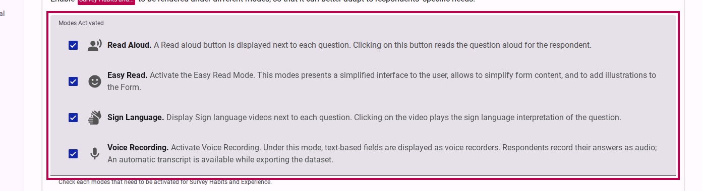
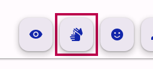
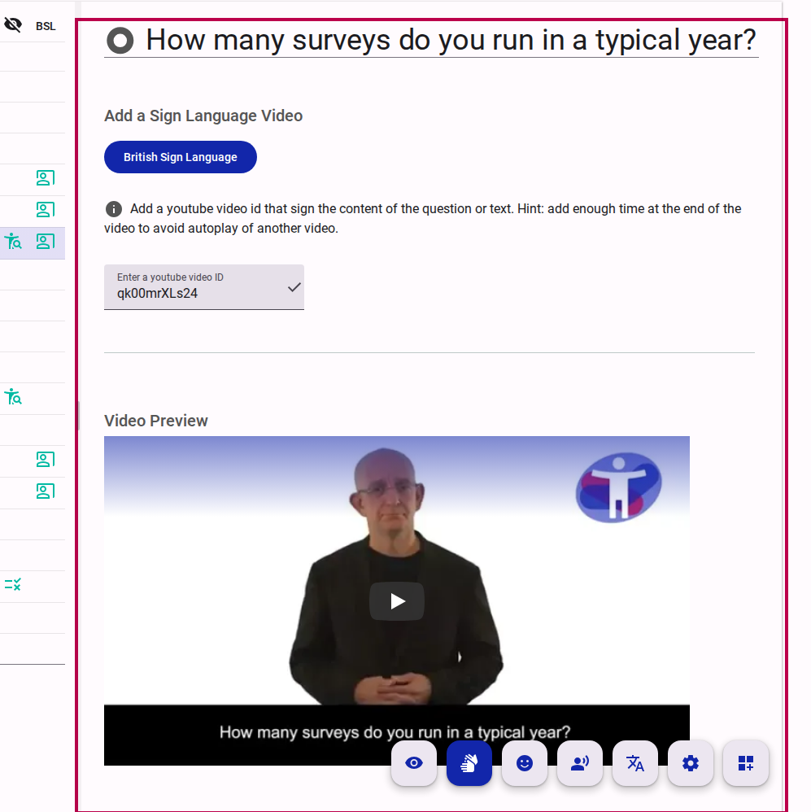
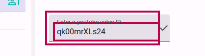
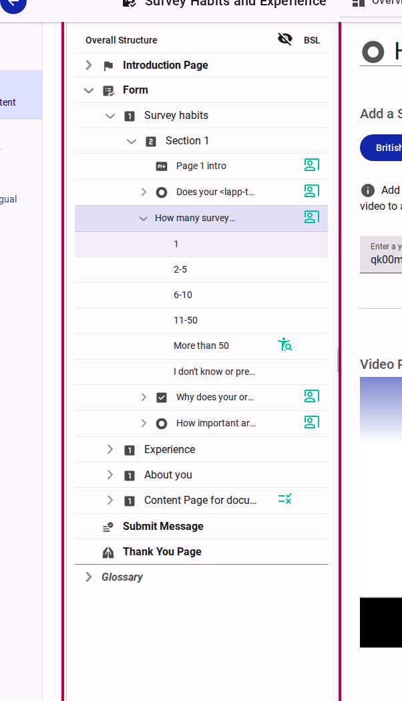
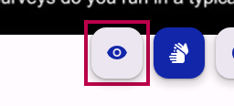
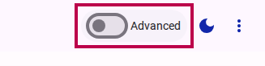
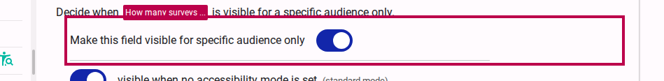

# Use Sign Language

Accessible Surveys allows you to include sign language videos for every question in your survey. This ensures that respondents who use sign language as their primary mode of communication can access your survey content in their preferred format.

## Enabling Sign Language in your Survey

Before you can add sign language videos to your questions, you must enable the sign language mode in your survey's behavior settings.

1. Navigate to the **Behavior** tab of your survey.
2. In the **Modes Activated** section, ensure that **Sign Language** is selected.

<figure>
  
  <figcaption>Enabling Sign Language mode in Behavior settings</figcaption>
</figure>

## Activating Sign Language Mode in the Editor

Once enabled, you can switch the editor to Sign Language mode to start adding content.

1. In the **Compose** view, click the **Sign Language Mode** button in the accessibility toolbar.

<figure>
  
  <figcaption>Activating Sign Language Mode in the editor</figcaption>
</figure>

## Adding Sign Language Videos

With Sign Language mode active, you can now associate a video with each question or content element.

1. Select a question or content element from the survey tree.
2. In the content editor, click **Add a Sign Language Video**.
3. Select the sign language you want to provide (if multiple languages are activated).
4. Enter the **YouTube Video ID** for the sign language translation.

<figure>
  
  <figcaption>Adding a sign language video</figcaption>
</figure>

<figure>
  
  <figcaption>Setting the YouTube Video ID</figcaption>
</figure>

::: tip
You can easily identify which items already have sign language content by looking for the sign language icon in the survey tree.
:::

<figure>
  
  <figcaption>Sign language icon in the survey tree</figcaption>
</figure>

## Bulk Uploading Sign Language Videos (Import/Export)

If you have many sign language videos to add, you can bulk-edit them using the Survey Definition export/import feature. 

1. Go to the **Distribute** tab and select **Import/Export**.
2. Click **Export Survey Definition** and select the language you want to export. Click **Create the Export** to download the survey structure in JSON format.
3. Open the downloaded file and add or update the `videoId` properties for your questions with their corresponding YouTube Video IDs.
4. Return to the **Import/Export** section, click **Import Survey Definition**, and upload your modified file. The new Video IDs will be mapped back to your questions automatically.

## Advanced Visibility for Sign Language

In some cases, you might want to show or hide specific content only when the respondent is using the sign language mode.

1. Click the **Visibility Mode** button.
2. Toggle **Advanced Mode**.
3. In the visibility settings for a field, you can now specify that it should only be visible for the **Sign Language** mode.

<figure>
  
  <figcaption>Activating Visibility Mode</figcaption>
</figure>

<figure>
  
  <figcaption>Toggling Advanced Visibility Mode</figcaption>
</figure>

<figure>
  
  <figcaption>Setting Sign Language specific visibility</figcaption>
</figure>

