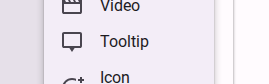
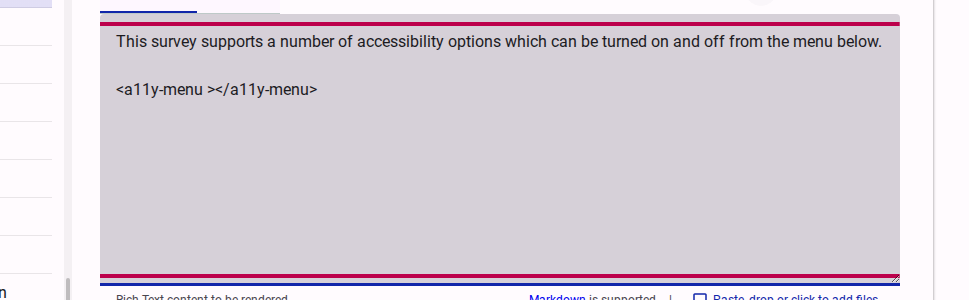
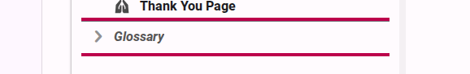
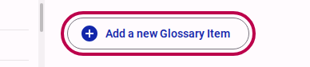
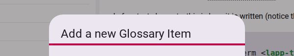

# Use Tooltips and the Glossary

Tooltips are a powerful way to provide definitions for complex or technical terms without cluttering your survey's main content. When a respondent hovers over or clicks a term with a tooltip, a small box appears with the explanation you provided.

Accessible Surveys offers two ways to manage tooltips:

1. **Standalone Tooltips:** Quick, one-off explanations embedded directly in the text.
2. **Glossary Items:** Centralized definitions that can be reused consistently across your survey and easily localized.

## Method 1: Standalone Tooltips

If you only need to explain a term once, you can add a tooltip directly to the text using the formatting toolbar.

1. Select the text you want to explain in the content editor.
2. Click the **Add Content** icon in the toolbar.
3. Select **Tooltip** from the menu.

<figure>
  
  <figcaption>Adding a tooltip via the Add Content menu</figcaption>
</figure>

The editor will insert a tag into your Markdown text: `<lapp-tooltip text="tooltip message">label</lapp-tooltip>`.

<figure>
  
  <figcaption>The tooltip syntax in the Markdown editor</figcaption>
</figure>

Replace `label` with your term and `tooltip message` with the explanation. While this method is quick, it can be difficult to manage if the same term appears multiple times, especially when translating the survey.

## Method 2: Using the Glossary

For terms that appear multiple times or when your survey requires translation, using the **Glossary** is highly recommended. It allows you to define a term once and reference it anywhere.

### Step 1: Create a Glossary Item

1. In the survey tree on the left, navigate to and select the **Glossary** section.

<figure>
  
  <figcaption>Selecting the Glossary in the survey tree</figcaption>
</figure>

1. Click the **Add a new Glossary Item** button.

<figure>
  
  <figcaption>Clicking the button to add a new Glossary item</figcaption>
</figure>

1. A dialog will appear. Provide a short **Name** for the term (which you will use to reference it later) and the full **Definition**.
2. The **Name** must be unique for a form and only include letter and numbers.  Spaces and special characters will not be accepted.

<figure>
  
  <figcaption>Defining the name and definition in the Glossary item dialog</figcaption>
</figure>

### Step 2: Use the Glossary Definition in a Tooltip

Once a term is defined in the Glossary, you can reference it anywhere in your survey's Markdown content (such as in introduction pages or question labels) using the `term` attribute instead of the `text` attribute.

```html
<lapp-tooltip term="accessibility">digital accessibility</lapp-tooltip>
```

When respondents encounter this tooltip, the survey will automatically look up the definition for "accessibility" in the Glossary and display it. If the survey is translated, it will automatically show the localized definition.

::: warning
The `term` attribute can only contain alphanumeric/text characters. It **cannot** contain spaces, special characters, Markdown formatting, or HTML tags.
:::

## Tooltip Accessibility

Accessible Surveys is designed with accessibility as a core feature. The tooltip component (`<lapp-tooltip>`) is built to be fully accessible out-of-the-box, but you should keep the following guidelines in mind to ensure a great experience for all respondents:

### Keyboard Navigation & Screen Readers

* **Focusable by default:** Every tooltip is automatically keyboard-focusable. Keyboard and screen reader users can navigate to the term using the `Tab` key to trigger the tooltip overlay and hear the definition.
* **Avoid bypassing focus:** Unless you have a specific, advanced layout requirement, do not use the `skipFocus` attribute. Bypassing focus makes the tooltip completely inaccessible to keyboard-only and screen reader users.

### Touch-Screen Devices

* **Longpress to activate:** On touch-screen devices, tooltips are activated by a longpress (pressing and holding the term). This interaction model ensures that scrolling and other touch gestures are not accidentally interrupted by tooltips appearing unexpectedly, providing a better accessible experience for touch users.

### Visual Indicators

* **Clear visual cues:** By default, tooltips display with a dotted underline and a small "info" icon (`i`). These cues help users with cognitive or learning disabilities recognize that a term is interactive and has an explanation.
* **Use discrete mode carefully:** The `discrete` attribute removes the dotted underline and icon, rendering the term as plain text. Only use this when it is highly obvious from the context that a term is interactive, as removing these cues makes the tooltip much harder to discover.

### Keep Explanations Clear & Concise

* **Keep definitions short:** Since screen readers read the full definition when the tooltip is focused, keep your descriptions short and written in plain, easy-to-understand language.
* **Avoid overloading:** If an explanation requires multiple paragraphs or detailed formatting, do not use a tooltip. Instead, add the explanation directly in the main text of the survey or use an expandable section.

## Testing Your Tooltips

You can verify that your tooltips work as expected in both the **Preview** and **Test** views.

1. **Preview**: Use the **Preview** tab in the content editor to see a real-time rendering of the tooltip.
2. **Test**: Switch to the **Test** view of the survey to see how the tooltip behaves in the actual survey interface.

::: tip
Use tooltips sparingly. If a word is so complex that most respondents won't understand it, consider using simpler language instead.
:::

## Related Content

* [Training Course Session 2: Adding Accessibility Options](../tutorial/session-2-adding-accessibility-options.md)
* [How-to: Use Easy Read](use-easy-read.md)
* [How-to: Use Sign Language](use-sign-language.md)
* [How-to: Activating Accessibility Modes](activating-accessibility-modes.md)
