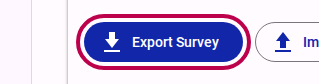
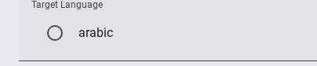
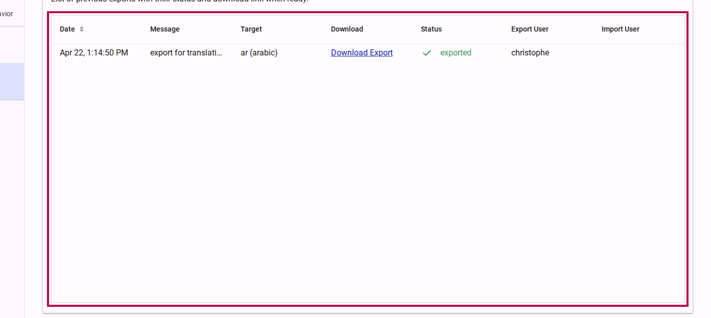
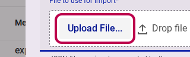
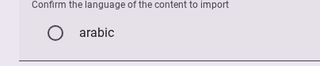
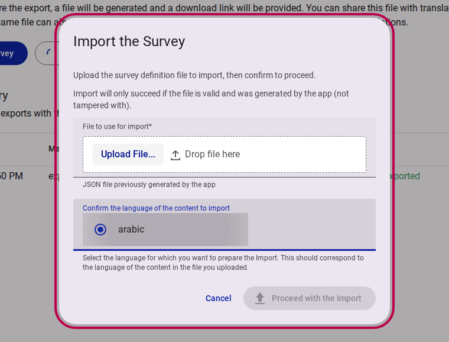

# How to use import/export to translate forms

This guide explains how to translate a survey form by exporting its content, translating it offline, and importing the translated file back into the platform.

## Step 1: Export the survey definition

First, export your existing survey form to generate a file containing all translatable content.

1. In the survey's **Import/Export** settings page, click the **Export Survey Definition** button.

<figure>
  
  <figcaption>Export Survey Definition button</figcaption>
</figure>

1. Select the target language for the translation (e.g., Arabic).

<figure>
  
  <figcaption>Select the target language</figcaption>
</figure>

1. Confirm your selection by clicking **Create the Export**. The platform will generate a JSON file containing your survey structure ready for translation.

<figure>
  
  <figcaption>Create the Export</figcaption>
</figure>

## Step 2: Translate the content

Open the exported JSON file and translate the form's text (such as titles, questions, and option labels) into the chosen target language.

<figure>
  
  <figcaption>Example of a translated file</figcaption>
</figure>

::: info
Ensure you preserve the file structure and only edit the translatable text strings, or the import might fail.
:::

## Step 3: Import the translated form

Once translation is complete, you can import the file back into Accessible Surveys to apply the new languages.

1. Navigate back to the **Import/Export** settings and click the **Import Survey Definition** button.

<figure>
  
  <figcaption>Import Survey Definition button</figcaption>
</figure>

1. Click **Upload File...** to select your translated JSON file.

<figure>
  
  <figcaption>Upload the translated file</figcaption>
</figure>

1. Confirm the language that corresponds to the content in the file (e.g., Arabic).

<figure>
  
  <figcaption>Select language for import</figcaption>
</figure>

1. Review the details in the import dialogue and confirm the action to update your survey with the translated text.

<figure>
  
  <figcaption>Confirm the import survey dialogue</figcaption>
</figure>

Your survey form is now updated with the translated content.
