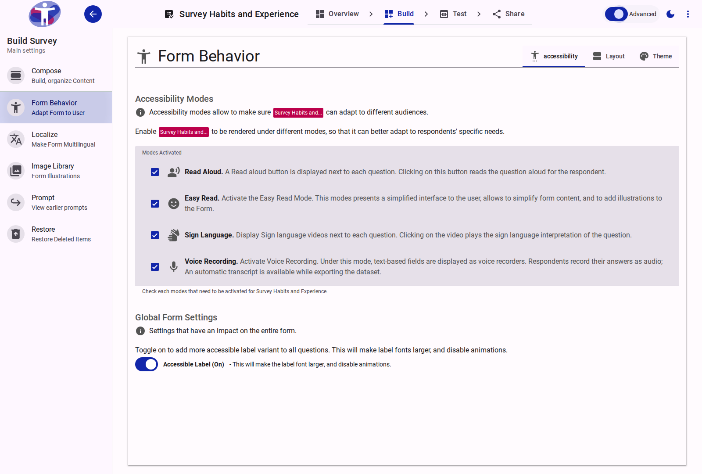

# Behavior Reference

The Behavior tool manages global settings that affect how the survey functions for respondents. This includes accessibility modes, layout preferences, and core form logic.

<figure>
  
  <figcaption>The standard view of the Behavior settings.</figcaption>
</figure>

## Advanced Settings

Toggling advanced mode reveals additional configuration options for form logic and behavior.

<figure>
  
  <figcaption>The advanced view of the Behavior settings.</figcaption>
</figure>

## Key Capabilities

- **Accessibility Modes**: Enable specialized modes such as Easy Read, Sign Language, or Voice Recording.
- **Layout Preferences**: Determine how media and text are positioned globally.
- **Form Logic**: Configure mathematical and logical expressions to show/hide elements, require specific inputs, or validate answers dynamically based on respondent input.
