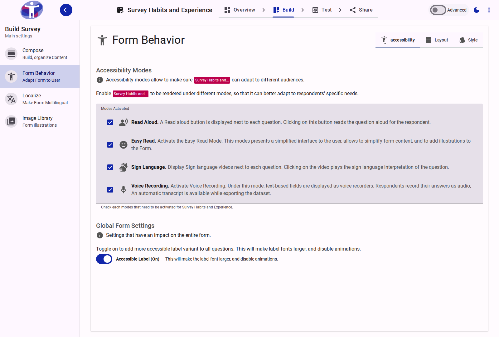
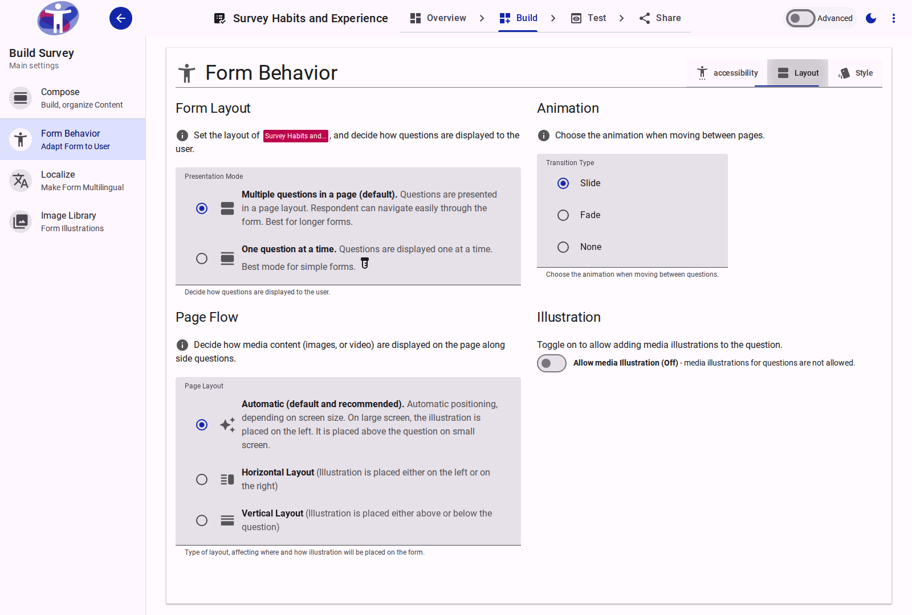
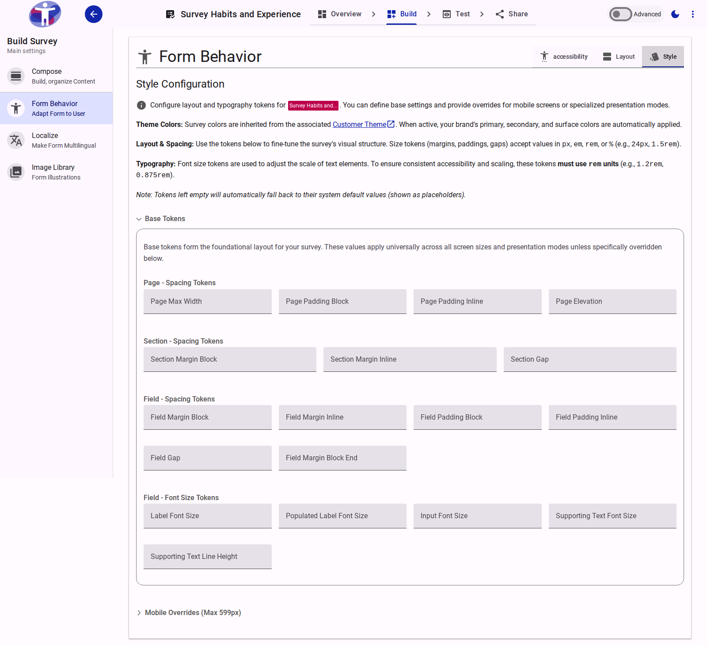

# Behavior Reference

The **Behavior** configuration manages the global settings that dictate how a survey functions and appears to respondents. The interface is divided into three primary tabs: **Accessibility**, **Layout**, and **Style**.

## Accessibility

The Accessibility tab governs the specialized interaction modes available to respondents.

<figure>
  
  <figcaption>The Accessibility configuration tab.</figcaption>
</figure>

### Modes Activated
Defines which optional accessibility adaptations are available for respondents to toggle:
- **Read Aloud**: Enables text-to-speech functionality for survey questions and responses.
- **Easy Read**: Activates a simplified interface designed to reduce cognitive load, supporting simpler text and illustrations.
- **Sign Language**: Enables the display of embedded sign language video interpretations for each question.
- **Voice Recording**: Replaces standard text inputs with an audio recorder, allowing respondents to reply verbally.

### Global Form Settings
- **Accessible Label**: Toggles a high-visibility, accessible variant for all form labels. Activating this increases the label font size and disables related animations to improve readability.

## Layout

The Layout tab determines the structural flow and media presentation of the survey.

<figure>
  
  <figcaption>The Layout configuration tab.</figcaption>
</figure>

### Form Layout
- **Presentation Mode**: 
  - *Multiple questions in a page (default)*: Presents standard, scrolling page layouts. Best for longer forms.
  - *One question at a time*: Displays a single question per screen to minimize distraction.
- **Transition Type**: Defines the animation used when navigating between questions or pages (Slide, Fade, or None).

### Page Flow & Illustration
- **Page Layout**: Determines the automatic or explicit positioning (Horizontal or Vertical flow) of illustrative media relative to the question text.
- **Allow media Illustration**: Enables the capability to attach images or videos to individual questions.
- **Preserve Media Space**: When enabled, the layout reserves empty space for media even on questions without illustrations, ensuring consistent vertical alignment across the form.

## Style

The Style tab provides a token-based design system to fine-tune the survey's layout and typography. Styling is organized into three hierarchical levels: **Base Tokens**, **Mobile Overrides** (applied below 600px viewport width), and **One Question At A Time Overrides** (applied only when that specific presentation mode is active).

<figure>
  
  <figcaption>The Style configuration tab with expanded token panels.</figcaption>
</figure>

### Available Style Tokens

The following layout and typography tokens can be configured. Size tokens accept standard CSS units (px, em, rem, %). Typography (font size) tokens strictly require the rem unit.

#### Form Tokens

| Token | Description |
| :--- | :--- |
| **Form Margin Inline** | The horizontal (left and right) margin applied to the entire form container. |

#### Page Tokens

| Token | Description |
| :--- | :--- |
| **Page Max Width** | The maximum allowable width of the survey page container. |
| **Page Padding Block** | The vertical (top and bottom) padding inside the page container. |
| **Page Padding Inline** | The horizontal (left and right) padding inside the page container. |
| **Page Elevation** | The depth/shadow level of the page container. Accepts integer values from 0 to 5. |

#### Section Tokens

| Token | Description |
| :--- | :--- |
| **Section Margin Block** | The vertical margin separating distinct sections. |
| **Section Margin Inline** | The horizontal margin applied to sections. |
| **Section Gap** | The spacing between elements within a section. |

#### Field Spacing Tokens

| Token | Description |
| :--- | :--- |
| **Field Margin Block** | The vertical margin applied outside individual fields. |
| **Field Margin Inline** | The horizontal margin applied outside individual fields. |
| **Field Padding Block** | The vertical padding applied inside the boundary of a field. |
| **Field Padding Inline** | The horizontal padding applied inside the boundary of a field. |
| **Field Gap** | The internal spacing between distinct elements inside a field (e.g., between the label and the input). |
| **Field Margin Block End** | The explicit bottom margin applied below fields to separate them from the next element. |

#### Field Typography Tokens

| Token | Description |
| :--- | :--- |
| **Label Font Size** | The size of the primary question label text. |
| **Populated Label Font Size** | The size of the label text when the field is populated or actively focused (typically smaller than the base label). |
| **Input Font Size** | The size of the text typed into input fields or displayed as answer options. |
| **Supporting Text Font Size** | The size of helper text or error messages displayed below the field. |
| **Supporting Text Line Height** | The line height applied to multi-line supporting text to ensure readability. |
