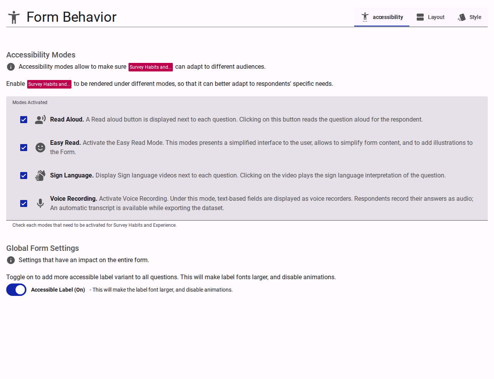
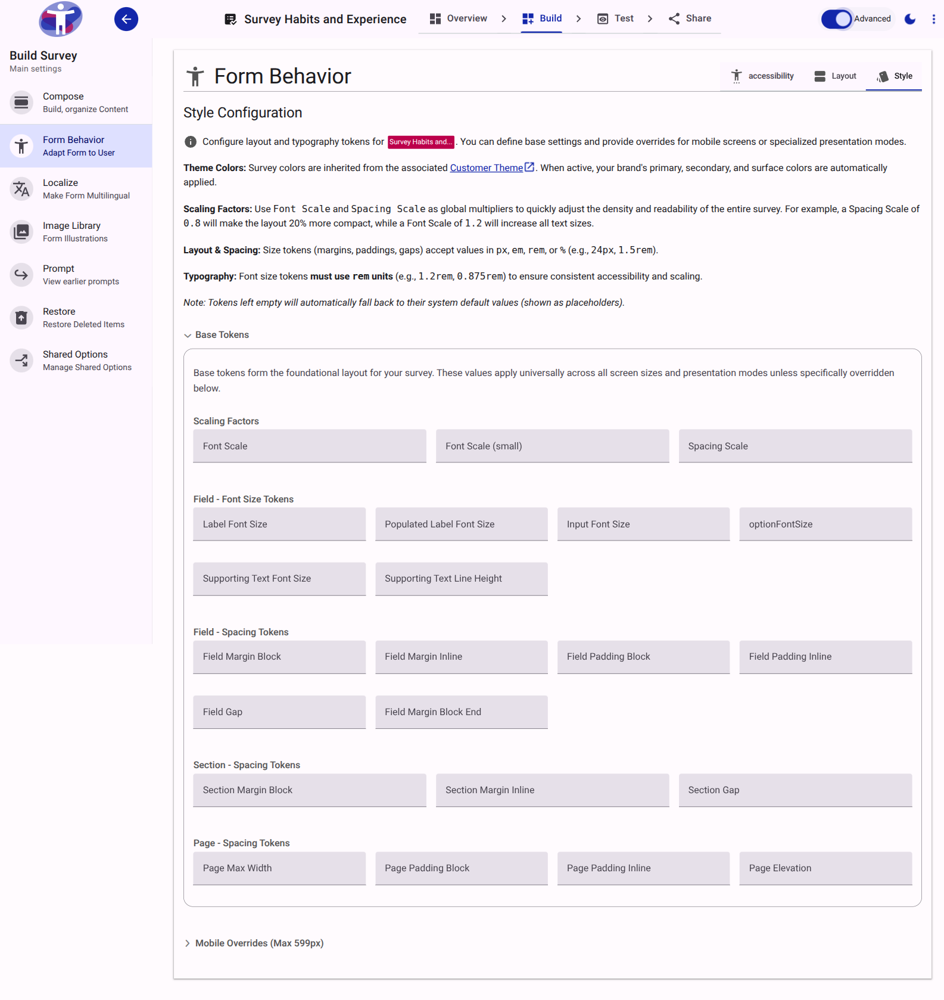

# Behavior Reference

The **Behavior** configuration manages the global settings that dictate how a survey functions and appears to respondents. The interface is divided into three primary tabs: **Accessibility**, **Layout**, and **Style**.

## Accessibility

The Accessibility tab governs the specialized interaction modes available to respondents.

<figure>
  
  <figcaption>The Accessibility configuration tab.</figcaption>
</figure>

### Modes Activated
Defines which optional accessibility adaptations are available for respondents to toggle:

- **Read Aloud**: Enables text-to-speech functionality for survey questions and responses.
- **Easy Read**: Activates a simplified interface designed to reduce cognitive load, supporting simpler text and illustrations.
- **Sign Language**: Enables the display of embedded sign language video interpretations for each question.
- **Voice Recording**: Replaces standard text inputs with an audio recorder, allowing respondents to reply verbally.

### Global Form Settings

- **Scroll Page Before Next**: When enabled, requires respondents to scroll to the bottom of the current page before the "Next" button becomes active. This is only enforced on their first visit to the page.
- **Accessible Label**: Toggles a high-visibility, accessible variant for all form labels. Activating this increases the label font size and disables related animations to improve readability.

### Research & Integrity

- **Behavioral Tracking**: Enables the collection of anonymized behavioral signals (e.g., time spent on questions, focus events, interaction frequency). This data is used to calculate the [Confidence Index](../../explanation/confidence-index.md) and perform interaction analysis.
- **Monitor Drop-off**: When enabled, the system automatically analyzes stale sessions to identify where respondents abandon the survey.
  - **Summary Generation**: A summary of progress and behavioral patterns is generated when a respondent is inactive for more than 2 hours.
  - **Auto-Integration**: After 3 days, "dropped off" surveys are automatically integrated into the main survey dataset (similar to a "forced submit"). These entries are marked with a `isDropOff` flag for researchers to identify them.

## Layout

The Layout tab determines the structural flow and media presentation of the survey.

<figure>
  
  <figcaption>The Layout configuration tab.</figcaption>
</figure>

### Form Layout

- **Presentation Mode**:
  - *Multiple questions in a page (default)*: Presents standard, scrolling page layouts. Best for longer forms.
  - *One question at a time*: Displays a single question per screen to minimize distraction.
- **Transition Type**: Defines the animation used when navigating between questions or pages (Slide, Fade, or None).

### Page Flow & Illustration

- **Page Layout**: Determines the automatic or explicit positioning (Horizontal or Vertical flow) of illustrative media relative to the question text.
- **Allow media Illustration**: Enables the capability to attach images or videos to individual questions.
- **Preserve Media Space**: When enabled, the layout reserves empty space for media even on questions without illustrations, ensuring consistent vertical alignment across the form.

## Style

The Style tab provides a token-based design system to fine-tune the survey's layout and typography. Styling is organized into three hierarchical levels: **Base Tokens**, **Mobile Overrides** (applied below 600px viewport width), and **One Question At A Time Overrides** (applied only when that specific presentation mode is active).

<figure>
  
  <figcaption>The Style configuration tab. Scaling Factors are always visible at the top of each section.</figcaption>
</figure>

::: info
**Advanced Mode**
While Scaling Factors are always visible, more granular controls for specific spacing and typography tokens are only accessible when **Advanced Mode** is enabled in the application settings.
:::

<figure>
  
  <figcaption>The expanded Style configuration view in Advanced Mode, showing granular spacing and typography tokens.</figcaption>
</figure>

### Available Style Tokens

The following layout and typography tokens can be configured. Size tokens accept standard CSS units (px, em, rem, %). For an in-depth look at how these behave, see [Understanding CSS Units](../../explanation/understanding-css-units.md). Typography (font size) tokens strictly require the rem unit.

::: tip
**Design Standards**
Default tokens are calibrated to respect **Material Design 3** specifications. While you can adjust these, we recommend testing your survey on various screen sizes (mobile, tablet, and desktop) to ensure the layout remains functional and legible.
:::

#### Scaling Factors
Scaling factors are global multipliers that affect all related tokens simultaneously. They are the most efficient way to adjust the overall density and readability of your survey.

| Token | Default | Description |
| :--- | :--- | :--- |
| **Font Scale** | `1` | A multiplier applied to all font sizes (e.g., `1.2` increases text size by 20%). |
| **Spacing Scale** | `1` | A multiplier applied to all margins, paddings, and gaps (e.g., `0.8` makes the layout 20% more compact). |
| **Small Font Scale** | `1` | A multiplier applied specifically to smaller text elements (e.g., `1.2` increases the size of supporting text and labels while keeping main labels at the default size). |

#### Form Tokens (Advanced Mode)

| Token | Description |
| :--- | :--- |
| **Form Margin Inline** | The horizontal (left and right) margin applied to the entire form container. |

#### Page Tokens (Advanced Mode)

| Token | Description |
| :--- | :--- |
| **Page Max Width** | The maximum allowable width of the survey page container. |
| **Page Padding Block** | The vertical (top and bottom) padding inside the page container. |
| **Page Padding Inline** | The horizontal (left and right) padding inside the page container. |
| **Page Elevation** | The depth/shadow level of the page container. Accepts integer values from 0 to 5. |

#### Section Tokens (Advanced Mode)

| Token | Description |
| :--- | :--- |
| **Section Margin Block** | The vertical margin separating distinct sections. |
| **Section Margin Inline** | The horizontal margin applied to sections. |
| **Section Gap** | The spacing between elements within a section. |

#### Field Spacing Tokens (Advanced Mode)

| Token | Description |
| :--- | :--- |
| **Field Margin Block** | The vertical margin applied outside individual fields. |
| **Field Margin Inline** | The horizontal margin applied outside individual fields. |
| **Field Padding Block** | The vertical padding applied inside the boundary of a field. |
| **Field Padding Inline** | The horizontal padding applied inside the boundary of a field. |
| **Field Gap** | The internal spacing between distinct elements inside a field (e.g., between the label and the input). |
| **Field Margin Block End** | The explicit bottom margin applied below fields to separate them from the next element. |

#### Field Typography Tokens (Advanced Mode)

| Token | Description |
| :--- | :--- |
| **Label Font Size** | The size of the primary question label text. |
| **Populated Label Font Size** | The size of the label text when the field is populated or actively focused. |
| **Input Font Size** | The size of the text typed into input fields. |
| **Option Font Size** | The size of the text for choice options (checkboxes, radio buttons). |
| **Supporting Text Font Size** | The size of helper text or error messages displayed below the field. |
| **Supporting Text Line Height** | The line height applied to multi-line supporting text. |
