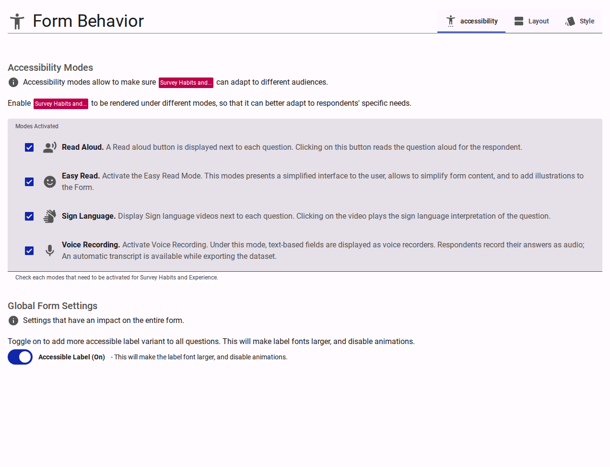
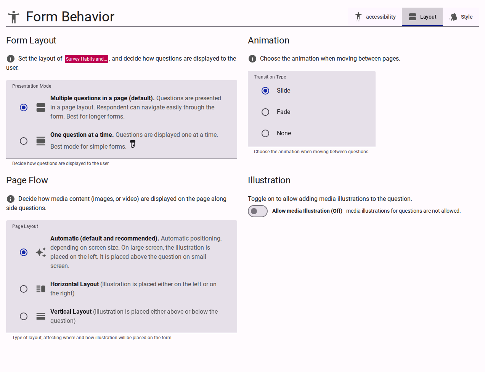
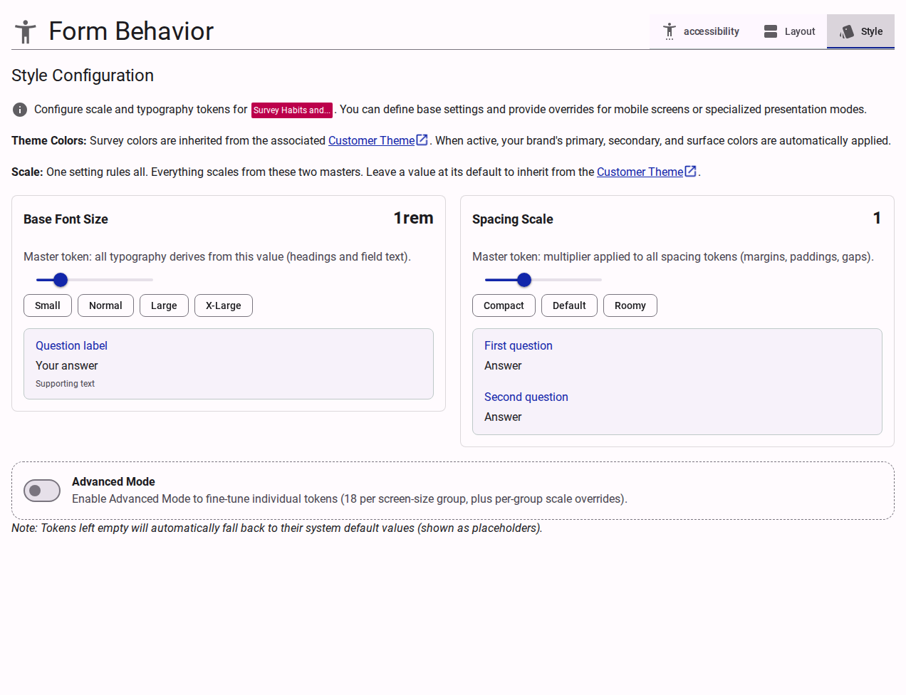
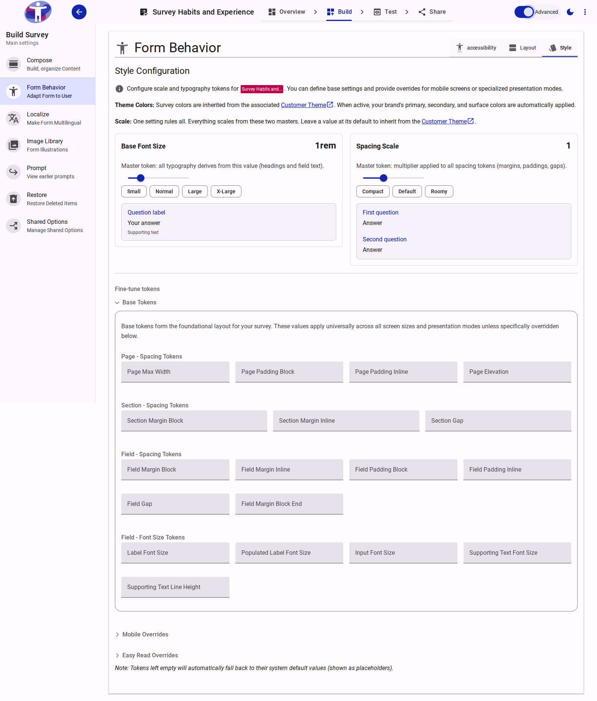

# Form Behavior Reference

The **Form Behavior** workspace manages the global settings that determine how a survey adapts to respondents, structures question presentation and transitions, and controls layout and typography styling.

The interface is organized into three tabs:

- **Accessibility**: Specialized interaction modes and global interaction rules.
- **Layout**: Pagination style, transition animations, page flow, and media illustration rules.
- **Style**: Master scale controls and fine-grained design tokens for layout and typography.

## Accessibility

The Accessibility tab defines the interaction adaptations available to respondents and sets global accessibility rules for the form.

<figure>
  
  <figcaption>The Accessibility configuration tab.</figcaption>
</figure>

### Accessibility Modes

The **Modes Activated** checklist specifies which optional interaction adaptations respondents can toggle during their session:

| Mode | Icon | Description |
| :--- | :--- | :--- |
| **Read Aloud** | `record_voice_over` | Displays a text-to-speech button next to each question, allowing respondents to have question text read aloud. |
| **Easy Read** | `sentiment_satisfied` | Activates Easy Read mode, presenting a simplified layout designed to reduce cognitive load, with support for simplified text and illustrative imagery. |
| **Sign Language** | `sign_language` | Displays embedded sign language interpretation video players alongside each question. |
| **Voice Recording** | `mic` | Replaces standard text inputs with an audio recorder, enabling respondents to record spoken answers. Automatic speech-to-text transcripts are generated during dataset export. |

### Global Form Settings

Global settings apply across all questions and pages in the survey:

- **Scroll Page Before Next**: When enabled, respondents must scroll to the bottom of the current page before the "Next" button becomes active.
- **Accessible Label**: Toggles a high-visibility accessible variant for all question labels. Enabling this increases label font size and disables floating label animations to improve legibility.

::: warning
When **Accessible Label** is off, question labels are limited to **80 characters** — the field stops accepting more input without showing a counter. Toggle **Accessible Label** on to remove the limit and allow labels of any length.
:::

## Layout

The Layout tab controls pagination, navigation transitions, and the positioning of media illustrations relative to question content.

<figure>
  
  <figcaption>The Layout configuration tab.</figcaption>
</figure>

### Form Layout

- **Presentation Mode**:
  - **Multiple questions in a page (default)**: Renders standard scrolling pages containing multiple questions. Recommended for longer forms and complex surveys.
  - **One question at a time (Beta)**: Displays a single question per screen with dedicated pagination. Recommended for simple surveys to maximize focus and reduce cognitive burden.

### Animation

- **Transition Type**: Defines the transition animation applied when moving between questions or pages:
  - **Slide** (default): Slides content horizontally during page transitions.
  - **Fade**: Fades content in and out between steps.
  - **None**: Immediate transition without animation.

### Page Flow

- **Page Layout**: Dictates how media content (images or videos) is arranged relative to question text:
  - **Automatic (default and recommended)**: Automatically adapts positioning based on screen size. On large screens, illustrations appear on the left; on smaller screens, illustrations appear above the question.
  - **Horizontal Layout**: Places illustrations side-by-side with question text.
    - *Horizontal Flow*: `unset` (default, illustration on left) or `reverse` (illustration on right).
  - **Vertical Layout**: Places illustrations in a vertical column with question text.
    - *Vertical Flow*: `unset` (default, illustration above question) or `reverse` (illustration below question).

### Illustration

- **Allow media Illustration**: Enables authors to attach image or video illustrations to individual questions.
- **Preserve Media Space**: When enabled, the layout reserves empty container space for media even on questions without illustrations, ensuring consistent vertical alignment across pages.

## Style

The Style tab provides a token-based design system to fine-tune survey typography, margins, paddings, and page dimensions.

<figure>
  
  <figcaption>The Style configuration tab. Master scale cards provide instant global adjustments with live previews.</figcaption>
</figure>

### Theme and Scale Inheritance

- **Theme Colors**: Color palettes (primary, secondary, surface) are inherited from the associated [Customer Theme](../../../customer/reference/customer/theme.md).
- **Scale Hierarchy**: "One setting rules all." All spacing and typography tokens derive from the two master controls. Unset tokens automatically inherit default values from the Customer Theme.

### Master Scale Settings

The two master scale controls provide immediate adjustment of survey density and typography scale:

| Setting | Default | Range | Presets | Description |
| :--- | :--- | :--- | :--- | :--- |
| **Base Font Size** | `1rem` | `0.875rem` – `1.5rem` (step: `0.125rem`) | Small (`0.875rem`), Normal (`1rem`), Large (`1.25rem`), X-Large (`1.5rem`) | Master token from which all survey typography (headings, labels, inputs, supporting text) derives. |
| **Spacing Scale** | `1` | `0.75` – `1.5` (step: `0.25`) | Compact (`0.75`), Default (`1`), Roomy (`1.25`) | Multiplier applied to all spacing tokens (margins, paddings, gaps). Page width and elevation are not affected. |

### Advanced Mode

::: info
Granular token overrides are available when **Advanced Mode** is enabled via the toggle switch or the top application bar.
:::

<figure>
  
  <figcaption>The expanded Style configuration view in Advanced Mode, showing fine-tune token groups.</figcaption>
</figure>

When Advanced Mode is active, tokens are organized into three hierarchical groups applied in order of specificity (highest priority wins):

1. **Base Tokens**: Universal baseline values applied across all screen sizes and presentation modes.
2. **Mobile Overrides**: Applied on narrow viewports (`max-width: 599px`) to optimize display for mobile devices.
3. **Easy Read Overrides**: Applied only when Easy Read mode is active. This group has the highest priority; base font size defaults to `22px` (`1.375rem`).

::: tip
Tokens left empty automatically fall back to their system default values (displayed as placeholders in input fields).
:::

### Scale Tokens (Overrides Only)

Available in the **Mobile Overrides** and **Easy Read Overrides** groups to override master scales for specific contexts:

| Token | Schema Key | Description |
| :--- | :--- | :--- |
| **Base Font Size** | `fontSizeBase` | Context-specific override for the base typography scale (e.g., `1.25rem`). |
| **Spacing Scale** | `spacingScale` | Context-specific multiplier applied to spacing tokens. |

### Page Spacing Tokens

| Token | Schema Key | Default | Description |
| :--- | :--- | :--- | :--- |
| **Page Max Width** | `pageMaxWidth` | `800px` (`950px` in Easy Read) | Maximum width of the survey page container. |
| **Page Padding Block** | `pagePaddingBlock` | `20px * spacingScale` (`6px * spacingScale` on mobile) | Vertical padding (top and bottom) inside the page container. |
| **Page Padding Inline** | `pagePaddingInline` | `20px * spacingScale` (`6px * spacingScale` on mobile) | Horizontal padding (left and right) inside the page container. |
| **Page Elevation** | `pageElevation` | `1` | Depth/shadow level of the page container. Accepts integer values from `0` to `5`. |

### Section Spacing Tokens

| Token | Schema Key | Default | Description |
| :--- | :--- | :--- | :--- |
| **Section Margin Block** | `sectionMarginBlock` | `0 36px * spacingScale` (`0 20px * spacingScale` on mobile) | Vertical margin separating distinct sections. |
| **Section Margin Inline** | `sectionMarginInline` | `0` | Horizontal margin applied to sections. |
| **Section Gap** | `sectionGap` | `20px * spacingScale` | Spacing between elements within a section. |

### Field Spacing Tokens

| Token | Schema Key | Default | Description |
| :--- | :--- | :--- | :--- |
| **Field Margin Block** | `fieldMarginBlock` | `0` | Vertical margin applied outside individual fields. |
| **Field Margin Inline** | `fieldMarginInline` | `0` (`42px 0` on mobile when Read Aloud is active) | Horizontal margin applied outside individual fields. |
| **Field Padding Block** | `fieldPaddingBlock` | `0` | Vertical padding applied inside the boundary of a field. |
| **Field Padding Inline** | `fieldPaddingInline` | `38px * spacingScale` (`6px * spacingScale` on mobile) | Horizontal padding applied inside the boundary of a field. |
| **Field Gap** | `fieldGap` | `20px * spacingScale` (`10px * spacingScale` on mobile) | Internal spacing between distinct elements within a field (e.g., label and input). |
| **Field Margin Block End** | `fieldMarginBlockEnd` | `48px * spacingScale` (`20px * spacingScale` on mobile) | Bottom margin applied below fields to separate them from subsequent elements. |

### Field Typography Tokens

| Token | Schema Key | Description |
| :--- | :--- | :--- |
| **Label Font Size** | `labelFontSize` | Size of the primary question label text. |
| **Populated Label Font Size** | `populatedLabelFontSize` | Size of the label text when the field is populated or actively focused. |
| **Input Font Size** | `inputFontSize` | Size of the text typed into input fields. |
| **Supporting Text Font Size** | `supportingTextFontSize` | Size of helper text or validation messages displayed below the field. |
| **Supporting Text Line Height** | `supportingTextLineHeight` | Line height applied to multi-line supporting text. |

## Related Content

- [Survey Builder Overview](./index.md): Introduction to builder workspaces and navigation.
- [Compose Reference](./compose/section.md): Adding and organizing pages, sections, and questions.
- [Activating Accessibility Modes](../../how-to/activating-accessibility-modes.md): Step-by-step guide to configuring accessibility options.
- [Using Easy Read Mode](../../how-to/use-easy-read.md): How to structure content and illustrations for Easy Read mode.
- [Customer Theme Reference](../../../customer/reference/customer/theme.md): Configuring customer-wide color palettes and typography defaults.
- [Survey Distribution & Deploy](../share/index.md): Setting up survey links, campaigns, and behavioral tracking.
