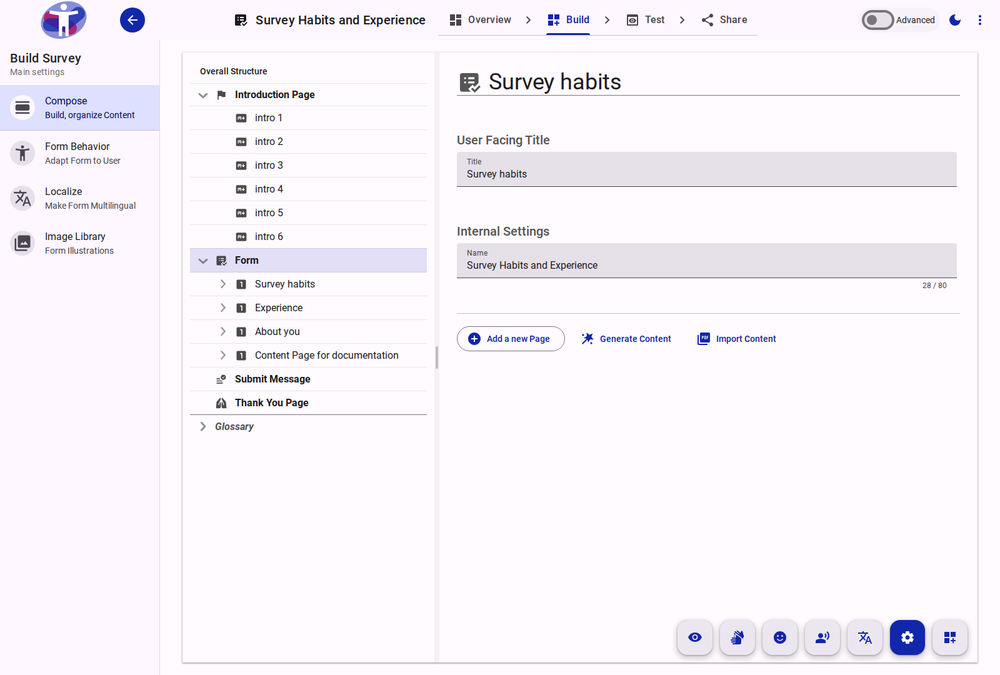

# Form Reference

The Form is the root container element for the entire survey. It encapsulates all Pages, Sections, and Questions, and defines the global identity of the questionnaire.

<figure>
  
  <figcaption>The standard view of the Form element at the top of the Compose tree.</figcaption>
</figure>

## Form Identity

The Form configuration determines the public-facing identity of the survey:
- **Name**: The internal identifier used for administrative and database purposes (not visible to respondents).
- **Title**: The main public title displayed at the top of the survey.
- **Subtitle**: An optional description or introductory text displayed below the title.
