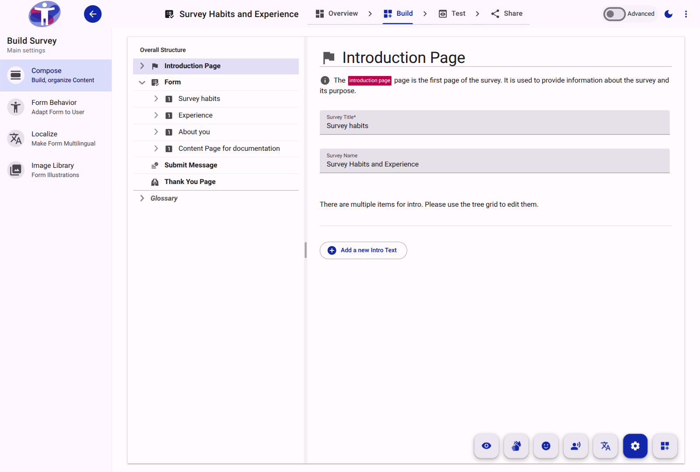

# Compose Reference

The Compose tool is the structural editor for a survey form. It enables the creation and arrangement of hierarchical elements, including pages, sections, and individual questions.

## Interface Elements

The Compose view consists of a navigation tree for structure management and an editing pane for configuring the selected element.

<figure>
  
  <figcaption>The main view of the Compose tool.</figcaption>
</figure>

<figure>
  
  <figcaption>The structural tree grid used to navigate and arrange form elements.</figcaption>
</figure>

<figure>
  
  <figcaption>The toolbar for switching between different editing modes or views.</figcaption>
</figure>

## Supported Element Types

The following elements can be added and configured within the Compose tool:
- **[Form](./form/index.md)**: The root container for the survey.
- **[Text Page](./text-page/index.md)**: Non-interactive pages for information, such as introductions or thank-you messages.
- **[Page](./page/index.md)**: A structural container representing a single screen or logical division of the survey.
- **[Section](./section/index.md)**: A subgrouping element within a page to organize related questions.
- **[Question](./question/index.md)**: Interactive data collection fields (e.g., text, multiple choice, rating).
