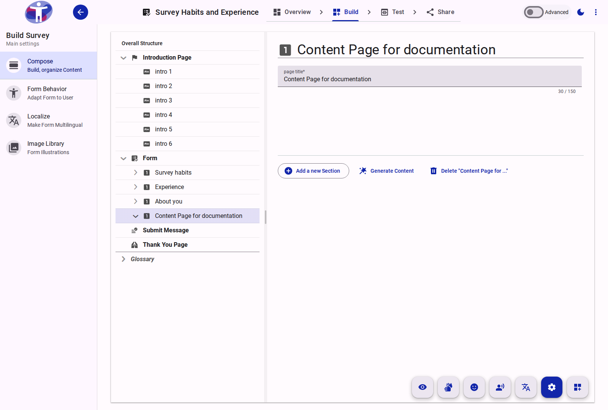

# Page Reference

A Page is a top-level structural element within the survey form, representing a single screen or logical division of the questionnaire. 

<figure>
  
  <figcaption>The standard view of a Page in the Compose tool.</figcaption>
</figure>

## Key Capabilities

- **Pagination**: Breaking a survey into multiple pages prevents respondent fatigue and improves navigation.
- **Section Grouping**: Pages serve as containers for one or more Sections.
- **Logic Application**: Form logic can be applied at the Page level to show, hide, or skip entire sections of the survey based on previous answers.
