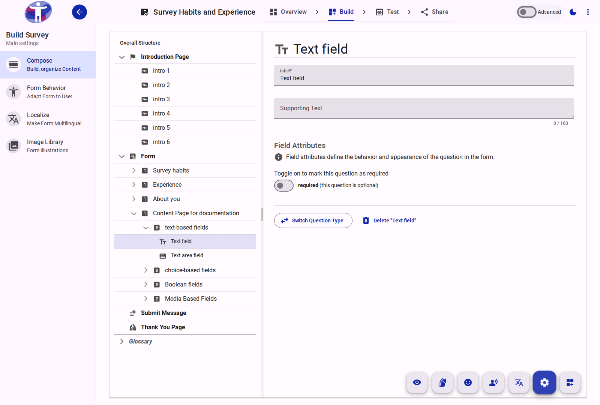
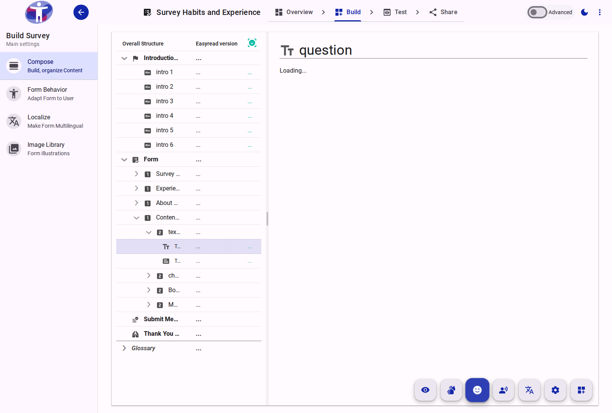
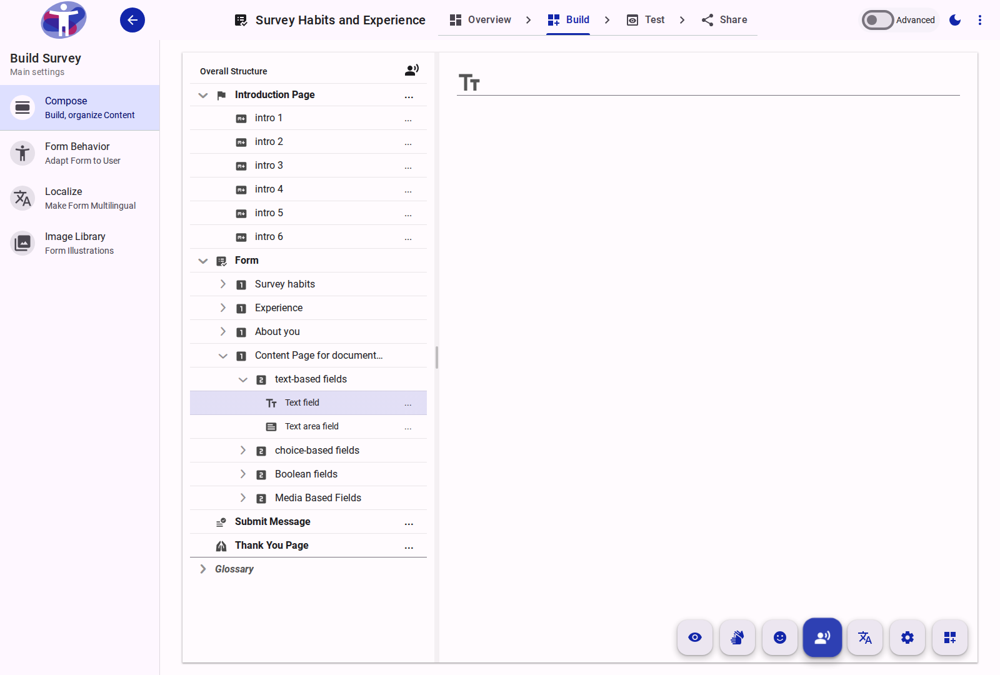
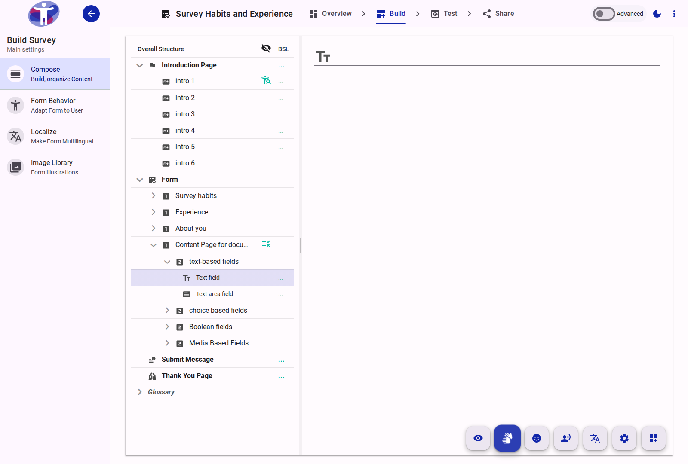
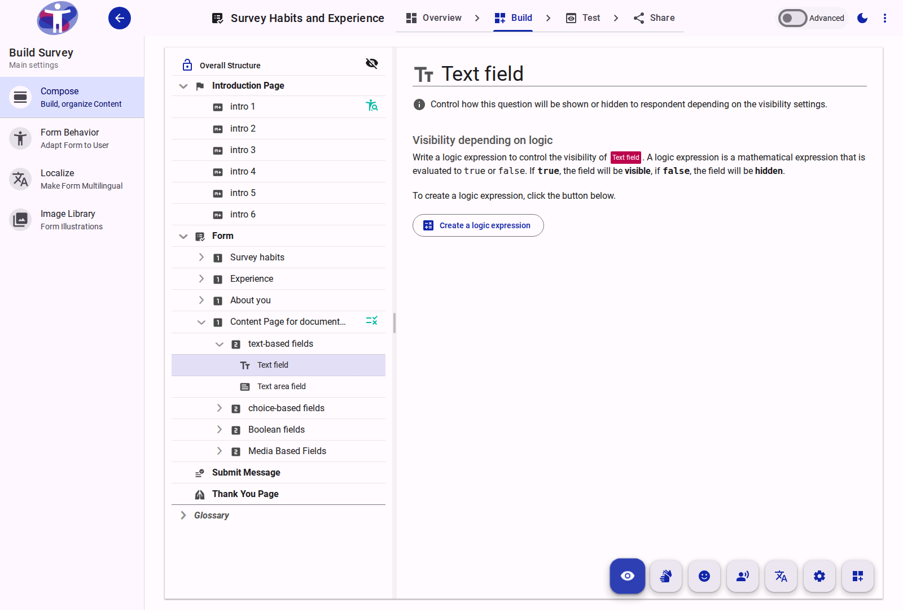

# Question Reference

Questions are the interactive data collection elements within a survey. The builder provides a wide variety of question types and extensive configuration options for each.

<figure>
  
  <figcaption>The primary interface for configuring a survey question.</figcaption>
</figure>

## Specialized Configurations

Questions can be enhanced with various accessibility and logic configurations:

<figure>
  
  <figcaption>Settings for adding Easy Read imagery and simplified text to a question.</figcaption>
</figure>

<figure>
  
  <figcaption>Settings for configuring the Read Aloud behavior for a question.</figcaption>
</figure>

<figure>
  
  <figcaption>Settings for linking Sign Language videos to a question.</figcaption>
</figure>

<figure>
  
  <figcaption>Settings for defining logical expressions that control when the question is visible to the respondent.</figcaption>
</figure>

## Question Types

The application supports various question field types, including:
- **Text-based fields**: Short text, text area.
- **Choice-based fields**: Radio groups, checkbox groups, dropdowns.
- **Boolean fields**: Checkboxes, switches.
- **Media fields**: File upload capabilities.
- **Scale fields**: Ratings, rankings.
