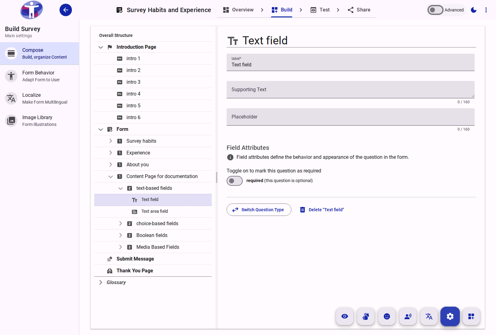
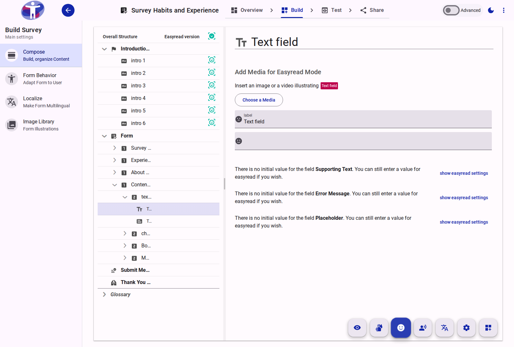
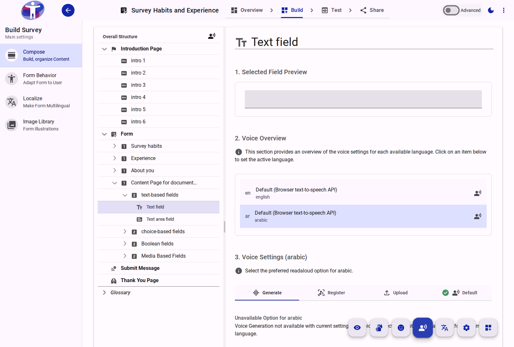
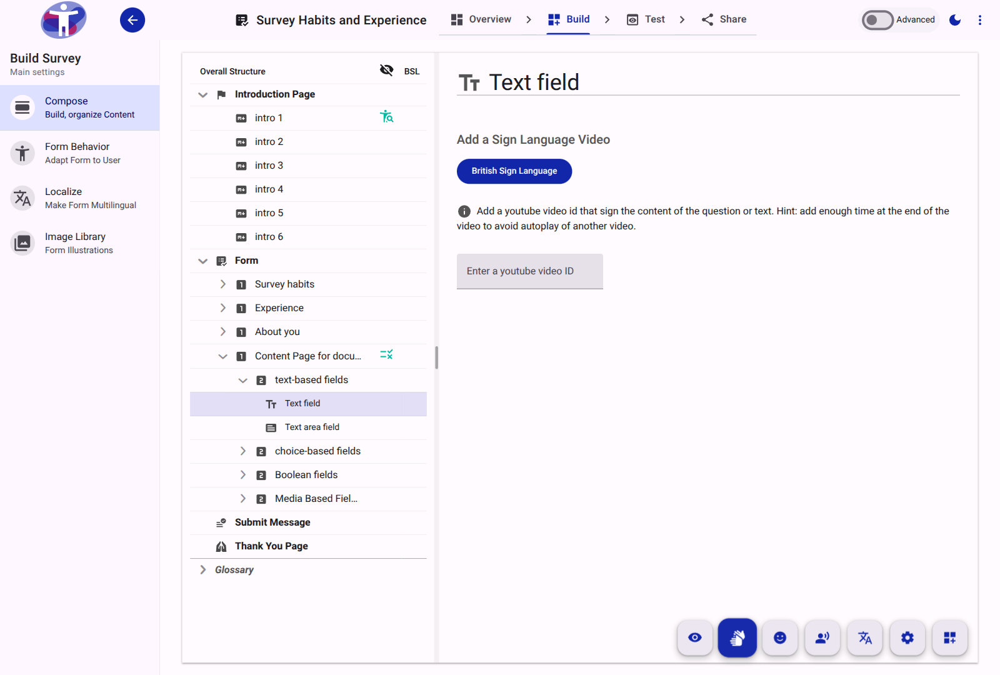
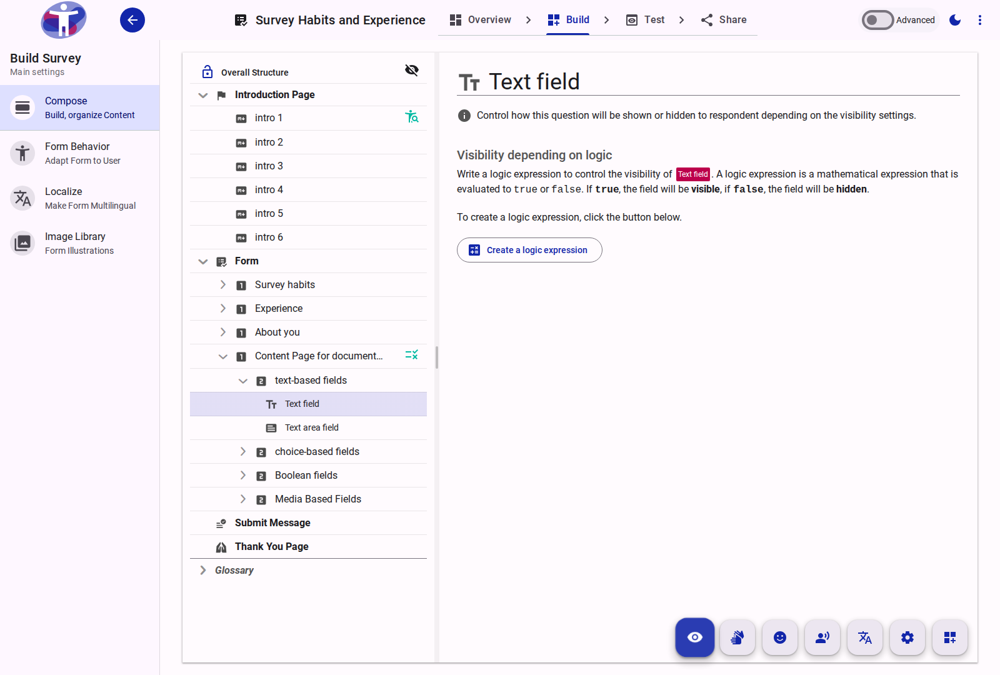

# Question Reference

Questions are the interactive data collection elements within a survey. The builder provides a wide variety of question types and extensive configuration options for each.

<figure>
  
  <figcaption>The primary interface for configuring a survey question.</figcaption>
</figure>

## Specialized Configurations

Questions can be enhanced with various accessibility and logic configurations:

<figure>
  
  <figcaption>Settings for adding Easy Read imagery and simplified text to a question.</figcaption>
</figure>

<figure>
  
  <figcaption>Settings for configuring the Read Aloud behavior for a question.</figcaption>
</figure>

<figure>
  
  <figcaption>Settings for linking Sign Language videos to a question.</figcaption>
</figure>

<figure>
  
  <figcaption>Settings for defining logical expressions that control when the question is visible to the respondent.</figcaption>
</figure>

## Question Types

The application supports various question field types, including:

- **Text-based fields**: Short text, text area.
- **Choice-based fields**: Radio groups, checkbox groups, dropdowns.
- **Boolean fields**: Checkboxes, switches.
- **Media fields**: File upload capabilities.
- **Scale fields**: Ratings, rankings.
- **[Account Email](./account-email.md)**: Specialized field for identity synchronization.

## Field Attributes & Validation Rules

Field attributes define the validation and input behavior of questions when presented to respondents. These settings are configured under the **Settings** tab in the question builder.

<figure>
  
  <figcaption>Configuring question settings and validation rules.</figcaption>
</figure>

### General Settings

- **Required**: When toggled on, respondents must answer this question before they can proceed or submit the survey.
- **Label**: The text shown to respondents requesting the information. It is limited to **80 characters** when the form-level [Accessible Label](../behavior.md) setting is off; enabling Accessible Label removes the limit. The limit is applied silently (no character counter is shown).

::: tip
**Best practice — keep labels short.** Write the label as a single, clear phrase asking for exactly one piece of information — ideally under 80 characters. This keeps labels readable on small screens and safely within the 80-character limit while **Accessible Label** is off. Put longer context, examples, or formatting instructions in the **helper text** rather than the label.
:::

### Character & Number Constraints

- **Min Length / Max Length**: Applied to text fields (Short Text and Text Area). Sets the minimum and maximum number of characters allowed in the response.
- **Min / Max**: Applied to numeric fields. Sets the acceptable range for numeric inputs.
- **Step**: Applied to numeric fields. Defines the allowed granularity (e.g., a step of `1` allows integers only, while `0.1` allows decimal points up to one digit).

### Pattern Validation

The **Pattern** field allows you to define a regular expression (regex) to validate respondent answers for short text, text area, and telephone fields.

- **HTML5 Compliance**: The regular expression is applied directly as the native HTML5 `pattern` attribute on the input field.
- **Implicit Anchoring**: The browser implicitly anchors the pattern with `^(?:` and `)$`, meaning the pattern must match the entire input, not just a substring.
- **Authoring-Time Validation**: When configuring a pattern, the survey builder strictly validates that your regex is structurally correct. It compiles and tests the regex using the browser's standard unicodeSets (`v`) flag (introduced in ES2024 to provide stricter character class processing and improved unicode support).
- **Instant Feedback**: If you enter an invalid regular expression (e.g., unclosed brackets or mismatched parenthesis), an error message is shown immediately on blur, and the form cannot be saved until the expression is corrected.

::: info
**Unicode Sets (v-flag) Syntax**
Modern browsers use the strict `v` regex flag for `pattern` validation. In `v` mode, parentheses `(` and `)` inside character classes `[...]` are reserved for set operations. To match literal parentheses inside a character class, they **must** be escaped (for example, `[0-9\-\(\)]`). Unescaped parentheses inside `[...]` (like `[0-9\-()]`) will trigger a syntax error.
:::
