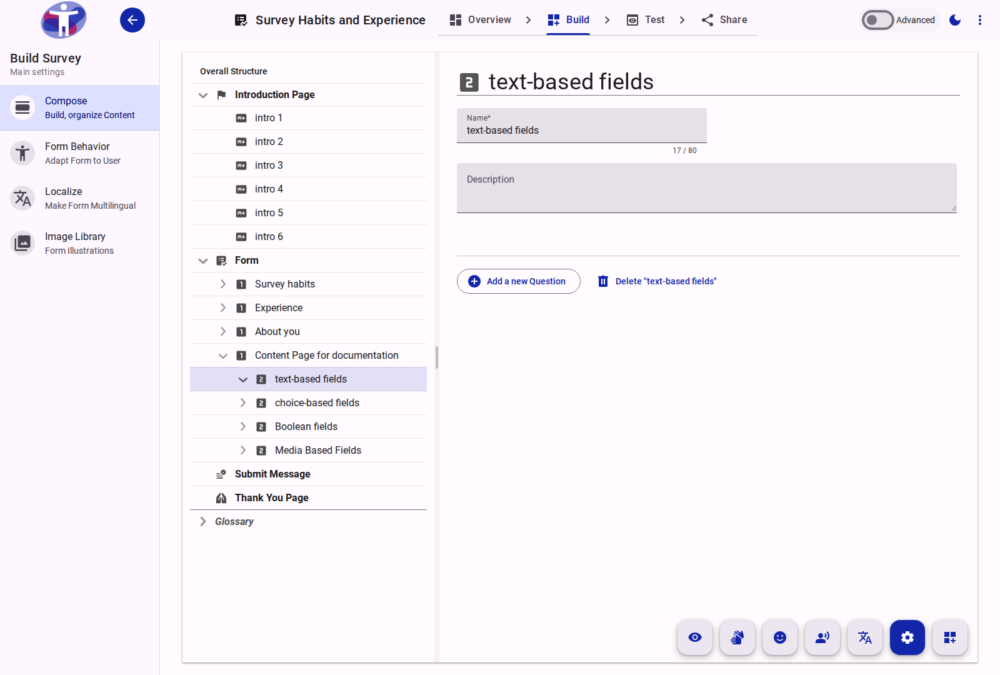

# Section Reference

A Section is a structural container within a Page used to group related questions logically. Grouping questions into sections improves survey organization and enables the application of visibility logic to multiple questions at once.

<figure>
  
  <figcaption>The standard view of a Section in the Compose tool.</figcaption>
</figure>

## Key Capabilities

- **Organization**: Keeps the survey hierarchy clean and groups thematically related data collection fields.
- **Logic Application**: Form logic (e.g., visibility rules) applied at the Section level cascades to all questions contained within it.
- **Titles and Subtitles**: Sections can have visible titles and descriptive text to provide context to the respondent.
