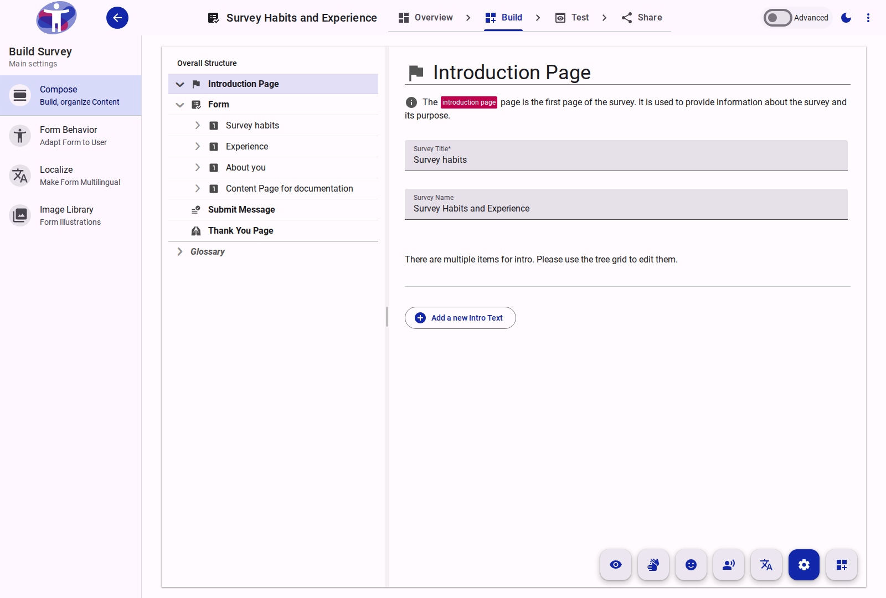
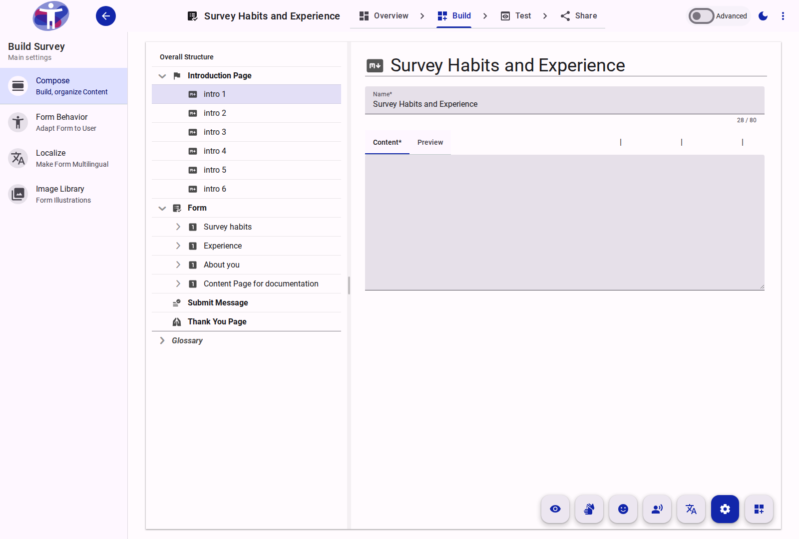

# Text Page Reference

A Text Page is a structural element used to present informational content to respondents rather than collecting data. Common use cases include Introduction pages, terms of service, or Thank You pages.

<figure>
  
  <figcaption>The standard view of a Text Page in the Compose tool.</figcaption>
</figure>

## Page Elements

Text Pages can contain individual informational items, often represented as rich text or markdown blocks.

<figure>
  
  <figcaption>Selecting a specific content block within a Text Page.</figcaption>
</figure>

