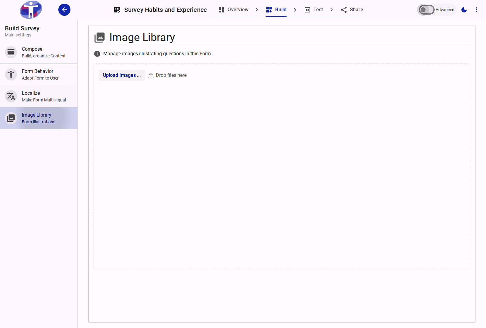
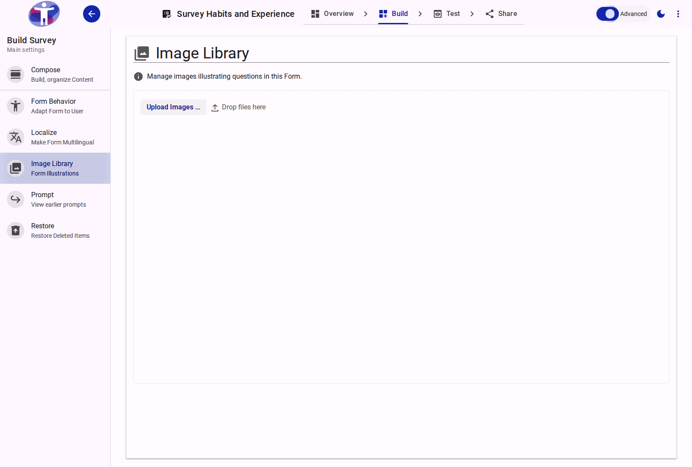

# Image Library Reference

The Image Library provides a centralized repository for managing visual assets, such as Easy Read graphics, organization logos, and explanatory diagrams used throughout the survey.

<figure>
  
  <figcaption>The primary view of the Image Library, displaying available assets.</figcaption>
</figure>

## Advanced View

Advanced mode displays additional metadata associated with uploaded images, such as raw storage paths and file identifiers.

<figure>
  
  <figcaption>The advanced view of the Image Library tool.</figcaption>
</figure>

## Asset Requirements

Images uploaded to the library should be optimized for web delivery. It is recommended to use standard formats (PNG, JPG) and enforce size limits (e.g., under 400KB) to ensure rapid loading for respondents on varying network speeds.
