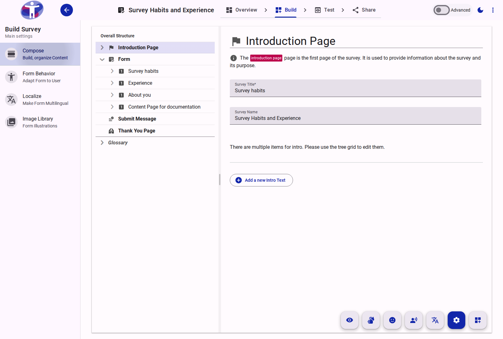
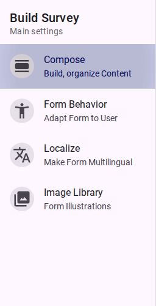

# Survey Builder Reference

The Survey Builder is the primary workspace for creating, structuring, and customizing survey forms. It provides tools for defining the content, logic, and accessibility features of a survey.

## Overview

The interface provides access to various tools required for survey creation:
- **Compose**: Structure the survey by adding pages, sections, and questions.
- **Behavior**: Define overall settings, such as accessibility modes and form logic.
- **Image Library**: Manage image assets for the survey.
- **Localize**: Manage translations and multilingual support.
- **Prompt**: Manage additional instructions or context for questions.
- **Restore**: Recover deleted items.

<figure>
  
  <figcaption>The Survey Builder interface displaying the main editing workspace.</figcaption>
</figure>

<figure>
  
  <figcaption>The navigation menu for accessing different tools within the Builder.</figcaption>
</figure>

## Activating a Survey

A survey must be marked as active to collect responses. This requires configuring batch settings with valid date ranges (a "from date" in the past and a "to date" in the future or empty) and publishing the survey.
