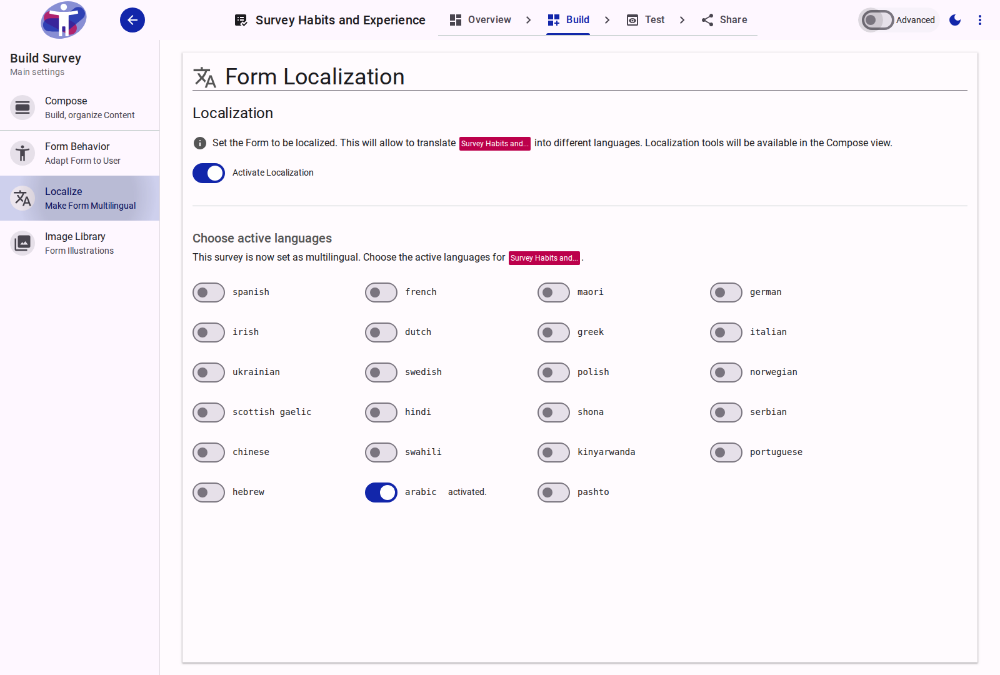
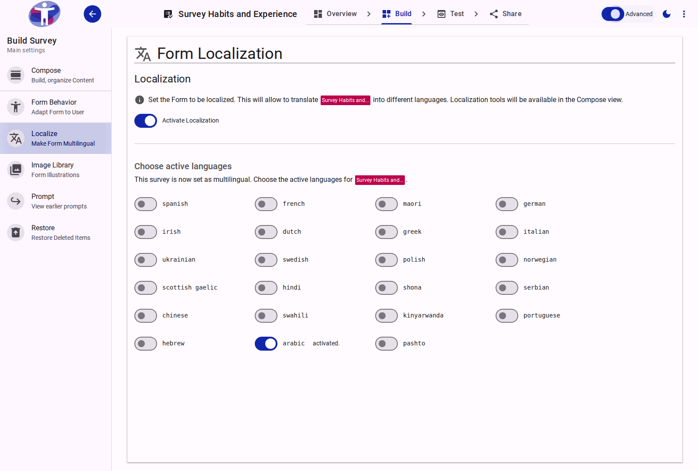

# Localize Reference

The Localize tool manages the translation of the survey into multiple languages. It allows administrators to review, manage, and import/export translations for form fields, labels, and pages.

<figure>
  
  <figcaption>The main view for managing survey translations.</figcaption>
</figure>

## Advanced Configuration and Export

In advanced mode, administrators have access to deeper technical controls, including the ability to export translation templates as JSON files for external processing and import completed translations back into the platform.

<figure>
  
  <figcaption>The advanced view of the Localize tool.</figcaption>
</figure>

## Translation Process

The tool supports automatic base translation for empty fields and manual overrides. Content can also be securely exported to a structured JSON format, handed off to professional translation services, and safely re-imported.
