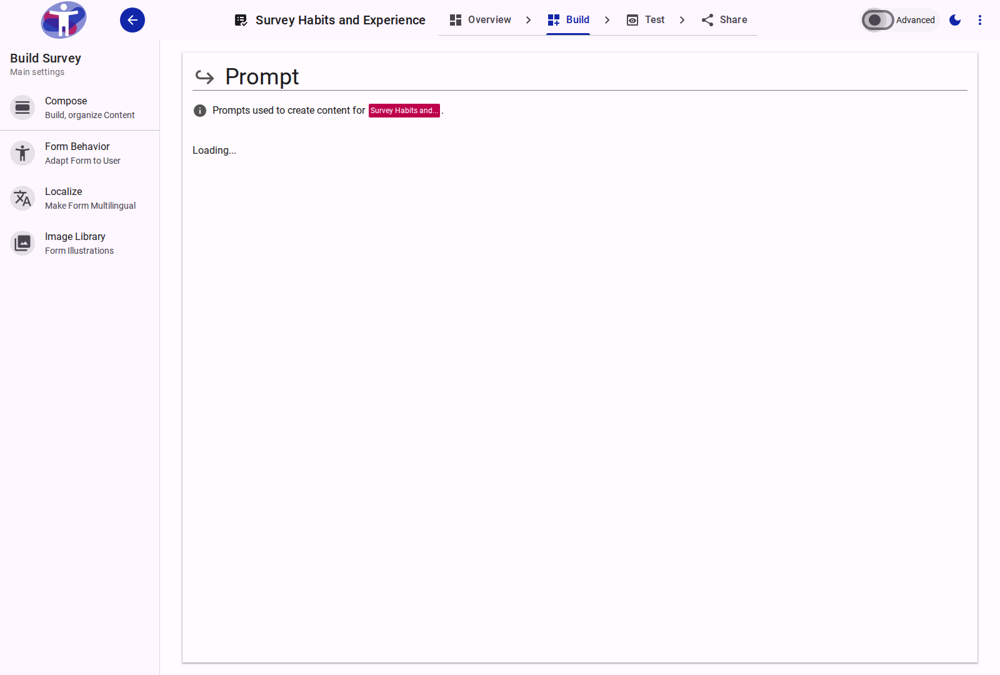
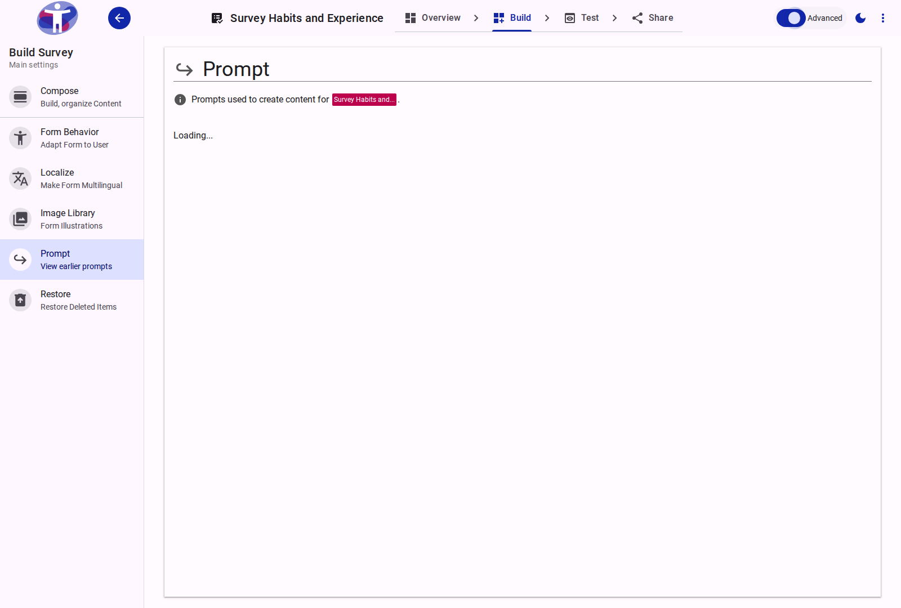

# Prompt Reference

The Prompt tool allows administrators to manage and configure contextual tooltips, guidance, and additional descriptive information for questions within the survey.

<figure>
  
  <figcaption>The main view for managing survey prompts.</figcaption>
</figure>

## Advanced Settings

Toggling advanced mode exposes technical configuration options, such as raw identifiers and more granular settings.

<figure>
  
  <figcaption>The advanced view of the Prompt tool.</figcaption>
</figure>

## Formatting and Display

Prompts can be attached to complex or specialized terminology. When configured, respondents can interact with an icon or underlined text to display the descriptive tooltip inline without disrupting the survey flow.
