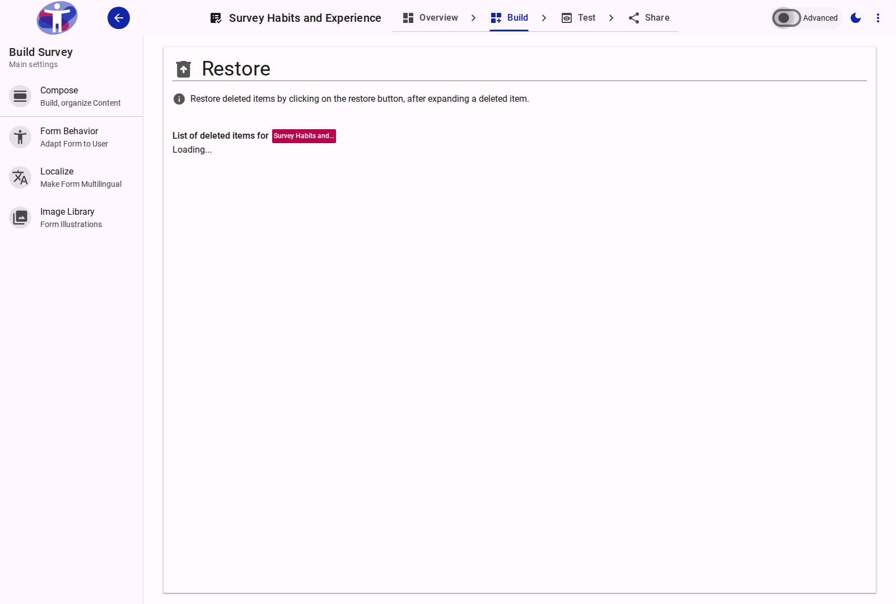
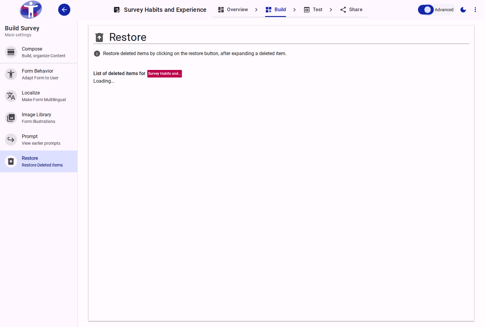

# Restore Reference

The Restore tool provides an interface for recovering survey elements (such as questions, sections, or pages) that have been deleted during the current or past editing sessions.

<figure>
  
  <figcaption>The primary view of the Restore tool, listing deleted elements.</figcaption>
</figure>

## Advanced Mode

Advanced mode provides additional technical details and filtering capabilities for managing deleted items.

<figure>
  
  <figcaption>The advanced view of the Restore tool.</figcaption>
</figure>

