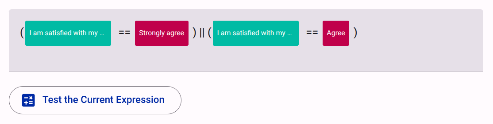
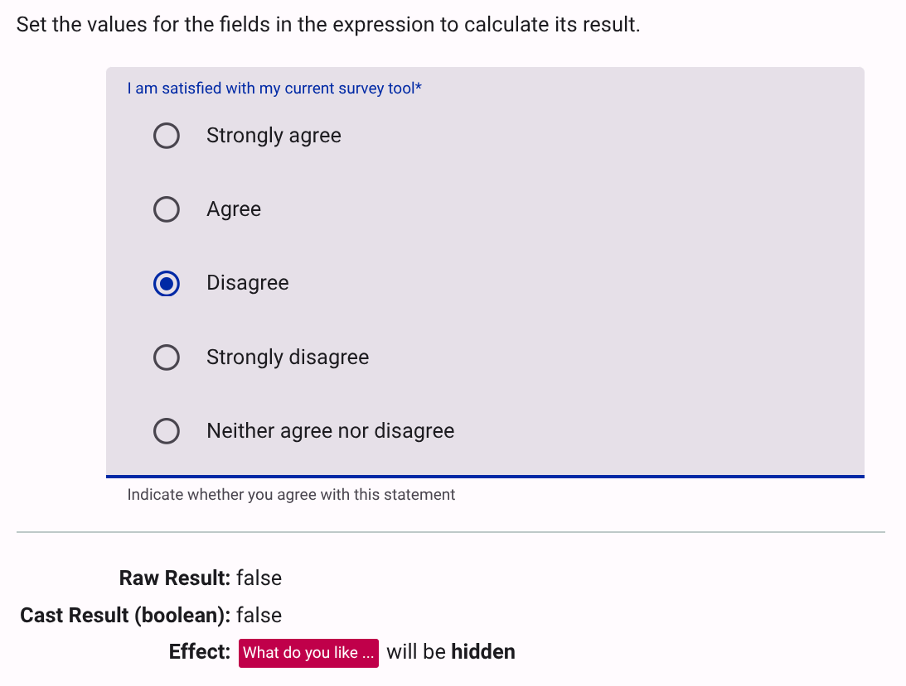

# Introduction to Logic Expressions

Logical expressions are mathematical expressions which return a result of either `true` or `false`. In Accessible Surveys, these expressions are primarily used to dynamically show or hide pages, sections, or questions.

This reference provides the basic syntax and operators you need to build logic into your forms.

## Basic Syntax

Expressions evaluate the user's answers against specific conditions. The engine evaluates the value of a logical expression and assigns it to its bound attribute (e.g., `visible`).

### Binding Survey Fields

To evaluate a respondent's answer within your logical expression, you must bind the relevant survey field (or answer) to the expression as a variable.

This is done by dragging and dropping items from the structure tree on the left directly into the logic editor field:

* **For free text or numeric questions:** Drag and drop the question item itself into the expression field.
* **For choice questions (e.g., dropdowns, checkboxes):** Expand the question in the tree and drag and drop the specific **option** into the expression field.

<figure><figcaption>Drag and drop items from the tree view to bind them as variables in your expression.</figcaption></figure>

### Hiding Items

When the expression evaluates to `true`, the field is **visible**. When the expression evaluates to `false`, the field is **hidden**. This means that you should write the condition for hiding an item, not showing it.

Example: If you want to show a question only when "Do you like fruit? (Yes/No)" is answered with "Yes", you would:

1. drag the question `Do you like fruit?` into the expression field, then
2. enter `==` in the field, and finally
3. drag the option `Yes` to the left of the expression:

``` md
  `Do you like fruit?` == `Yes`
```

Here, the expression `answer == "Yes"` evaluates to `true` when the respondent selects `Yes`, which means the item will be visible. If the respondent selects `No` or leaves it unanswered, the expression evaluates to `false`, and the item will be hidden.

## Comparison Operators

Use these operators to compare values in your form data:

| Operator                   | Symbol | Description |
| -------------------------- | ------ | ----------- |
| Equal                      | `==`     | True if the left and right values are exactly the same. |
| Not equal                  | `!=`     | True if the values are different. |
| Greater than               | `>`      | True if the left value is strictly larger. |
| Greater than or equal      | `>=`     | True if the left value is larger or equal. |
| Less than                  | `<`      | True if the left value is strictly smaller. |
| Less than or equal         | `<=`     | True if the left value is smaller or equal. |
| Element in array or string | `in`     | True if the left value is found within the right value (e.g., in a string or list of checkbox answers). |

## Logical Operators

Use logical operators to combine multiple conditions:

| Operation   | Symbol | Description |
| ----------- | ------ | ----------- |
| Logical AND | `&&`   | True only if **both** sides are true. |
| Logical OR  | `\|\|` | True if **at least one** side is true. |
| Negate      | `!`    | Inverts a boolean value (e.g., `!(expression)`). |

> [!TIP]
> **Hiding with OR:** If you want to hide an item when either condition A or condition B is met, use `||`. Using `&&` would only hide the item if both conditions were met simultaneously.

### Question Types and Data Storage

The way an answer is stored depends on the question type, which determines the correct operator to use in your expression:

* **Radio Groups and Dropdowns:** These store a single answer as a **String**. You can use standard equality operators like `==` or `!=` (e.g., `favorite_fruit == "apple"`).
* **Group Questions (Checkboxes):** These store multiple selected answers in an **Array**. Because an array can contain several values, you **MUST** use the `in` operator to check if a specific option was selected (e.g., `"apple" in fruits_checked`).

## Testing the Expression

The logic editor provides a "Test Expression" feature that allows you to simulate how the expression evaluates based on different answers. This is a crucial step to ensure your logic behaves as expected before deploying the survey. You can input various values for the bound variables and see the resulting evaluation of the expression in real-time. This helps you identify any logical errors or misunderstandings about how the operators work with different data types.

For example the following expression checks whether respondent `Strongly agrees` or `Agrees` to the question `I am satisfied with my survey tool`:

<figure><figcaption>Logic Expression Field checking respondent's satisfaction</figcaption></figure>

Clicking on "Test Expression" allows you to simulate different responses and see how the expression evaluates, ensuring that your logic is correctly set up to show or hide items based on the respondent's answers:

<figure><figcaption>Logic Expression Test simulating different responses</figcaption></figure>
